# Домашнее задание к занятию 11 «Teamcity»

## Подготовка к выполнению

1. В Yandex Cloud создайте новый инстанс (4CPU4RAM) на основе образа `jetbrains/teamcity-server`.
2. Дождитесь запуска teamcity, выполните первоначальную настройку.
3. Создайте ещё один инстанс (2CPU4RAM) на основе образа `jetbrains/teamcity-agent`. Пропишите к нему переменную окружения `SERVER_URL: "http://<teamcity_url>:8111"`.
4. Авторизуйте агент.
5. Сделайте fork [репозитория](https://github.com/aragastmatb/example-teamcity).
6. Создайте VM (2CPU4RAM) и запустите [playbook](./infrastructure).

### Решение:

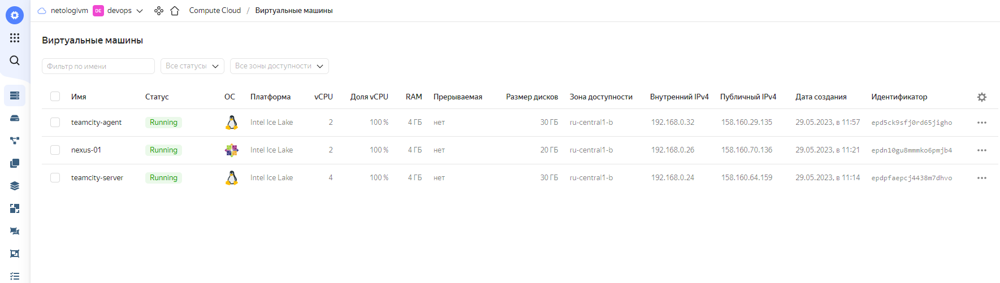

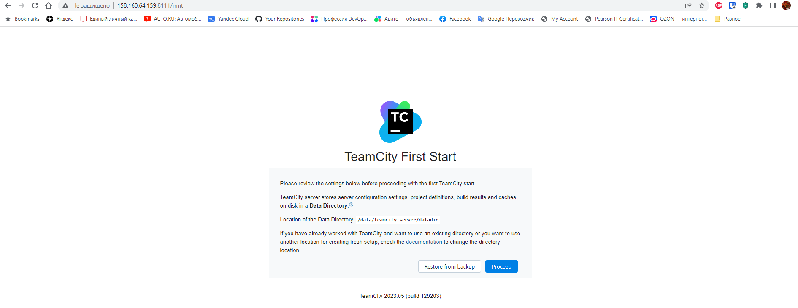

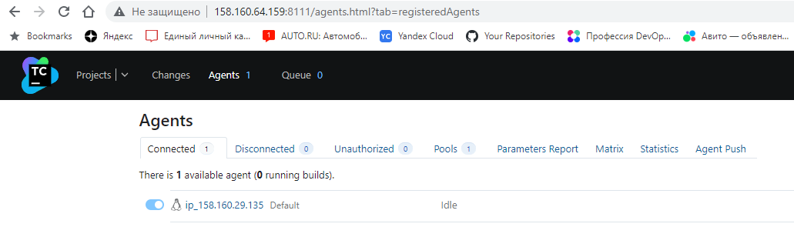

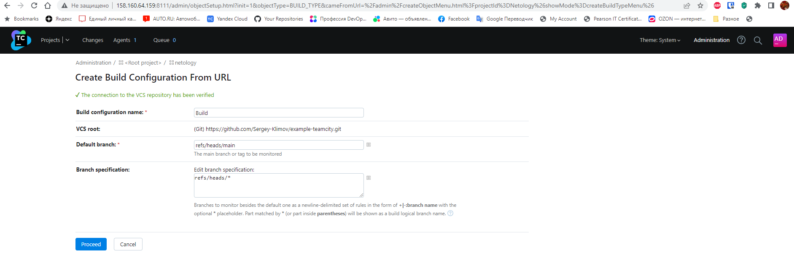

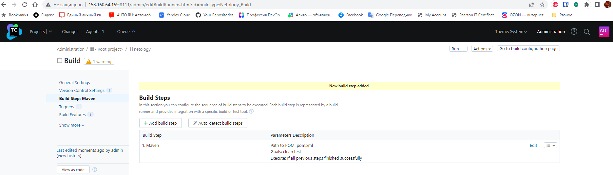

<details><summary>vagrant@vagrant:~/share/09-ci-05-teamcity/infrastructure$ ansible-playbook -i inventory/cicd/hosts.yml site.yml</summary>

```console
vagrant@vagrant:~/share/09-ci-05-teamcity/infrastructure$ ansible-playbook -i inventory/cicd/hosts.yml site.yml

PLAY [Get Nexus installed] ********************************************************************************************************************************************************************************************************************************
TASK [Gathering Facts] ********************************************************************************************************************************************************************************************************************************
ok: [nexus-01]

TASK [Create Nexus group] ********************************************************************************************************************************************************************************************************************************
changed: [nexus-01]

TASK [Create Nexus user] ********************************************************************************************************************************************************************************************************************************
changed: [nexus-01]

TASK [Install JDK] ********************************************************************************************************************************************************************************************************************************
changed: [nexus-01]

TASK [Create Nexus directories] ********************************************************************************************************************************************************************************************************************************
changed: [nexus-01] => (item=/home/nexus/log)
changed: [nexus-01] => (item=/home/nexus/sonatype-work/nexus3)
changed: [nexus-01] => (item=/home/nexus/sonatype-work/nexus3/etc)
changed: [nexus-01] => (item=/home/nexus/pkg)
changed: [nexus-01] => (item=/home/nexus/tmp)

TASK [Download Nexus] *******************************************************************************************************************************************************************************************************************************
[WARNING]: Module remote_tmp /home/nexus/.ansible/tmp did not exist and was created with a mode of 0700, this may cause issues when running as another user. To avoid this, create the remote_tmp dir with the correct permissions manually
changed: [nexus-01]

TASK [Unpack Nexus] *******************************************************************************************************************************************************************************************************************************
changed: [nexus-01]

TASK [Link to Nexus Directory] *******************************************************************************************************************************************************************************************************************************
changed: [nexus-01]

TASK [Add NEXUS_HOME for Nexus user] *******************************************************************************************************************************************************************************************************************************
changed: [nexus-01]

TASK [Add run_as_user to Nexus.rc] *******************************************************************************************************************************************************************************************************************************
changed: [nexus-01]

TASK [Raise nofile limit for Nexus user] ****************************************************************************************************************************************************************************************************************************
changed: [nexus-01]

TASK [Create Nexus service for SystemD] *****************************************************************************************************************************************************************************************************************************
changed: [nexus-01]

TASK [Ensure Nexus service is enabled for SystemD] ******************************************************************************************************************************************************************************************************************
changed: [nexus-01]
TASK [Create Nexus vmoptions] *******************************************************************************************************************************************************************************************************************************
changed: [nexus-01]

TASK [Create Nexus properties] *******************************************************************************************************************************************************************************************************************************
changed: [nexus-01]

TASK [Lower Nexus disk space threshold] *****************************************************************************************************************************************************************************************************************************
skipping: [nexus-01]

TASK [Start Nexus service if enabled] *******************************************************************************************************************************************************************************************************************************
changed: [nexus-01]

TASK [Ensure Nexus service is restarted] ****************************************************************************************************************************************************************************************************************************
skipping: [nexus-01]

TASK [Wait for Nexus port if started] *******************************************************************************************************************************************************************************************************************************

ok: [nexus-01]

PLAY RECAP *******************************************************************************************************************************************************************************************************************************
nexus-01                   : ok=17   changed=15   unreachable=0    failed=0    skipped=2    rescued=0    ignored=0 

```
</details>

## Основная часть

1. Создайте новый проект в teamcity на основе fork.
2. Сделайте autodetect конфигурации.
3. Сохраните необходимые шаги, запустите первую сборку master.
4. Поменяйте условия сборки: если сборка по ветке `master`, то должен происходит `mvn clean deploy`, иначе `mvn clean test`.
5. Для deploy будет необходимо загрузить [settings.xml](./teamcity/settings.xml) в набор конфигураций maven у teamcity, предварительно записав туда креды для подключения к nexus.
6. В pom.xml необходимо поменять ссылки на репозиторий и nexus.
7. Запустите сборку по master, убедитесь, что всё прошло успешно и артефакт появился в nexus.
8. Мигрируйте `build configuration` в репозиторий.
9. Создайте отдельную ветку `feature/add_reply` в репозитории.
10. Напишите новый метод для класса Welcomer: метод должен возвращать произвольную реплику, содержащую слово `hunter`.
11. Дополните тест для нового метода на поиск слова `hunter` в новой реплике.
12. Сделайте push всех изменений в новую ветку репозитория.
13. Убедитесь, что сборка самостоятельно запустилась, тесты прошли успешно.
14. Внесите изменения из произвольной ветки `feature/add_reply` в `master` через `Merge`.
15. Убедитесь, что нет собранного артефакта в сборке по ветке `master`.
16. Настройте конфигурацию так, чтобы она собирала `.jar` в артефакты сборки.
17. Проведите повторную сборку мастера, убедитесь, что сбора прошла успешно и артефакты собраны.
18. Проверьте, что конфигурация в репозитории содержит все настройки конфигурации из teamcity.
19. В ответе пришлите ссылку на репозиторий.


### Решение:

1. Создайте новый проект в teamcity на основе fork.
2. Сделайте autodetect конфигурации.

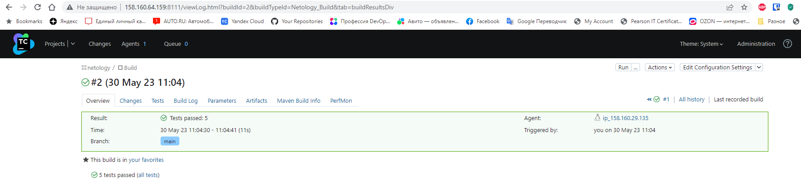

3. Сохраните необходимые шаги, запустите первую сборку master.

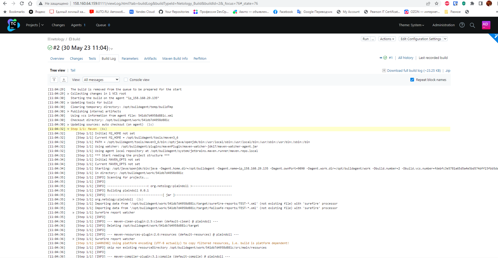

4. Поменяйте условия сборки: если сборка по ветке `master`, то должен происходит `mvn clean deploy`, иначе `mvn clean test`.

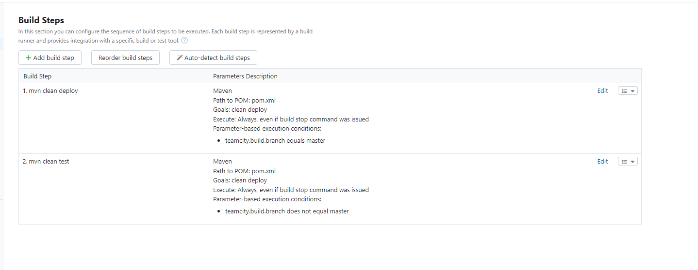

5. Для deploy будет необходимо загрузить settings.xml в набор конфигураций maven у teamcity, предварительно записав туда креды для подключения к nexus.

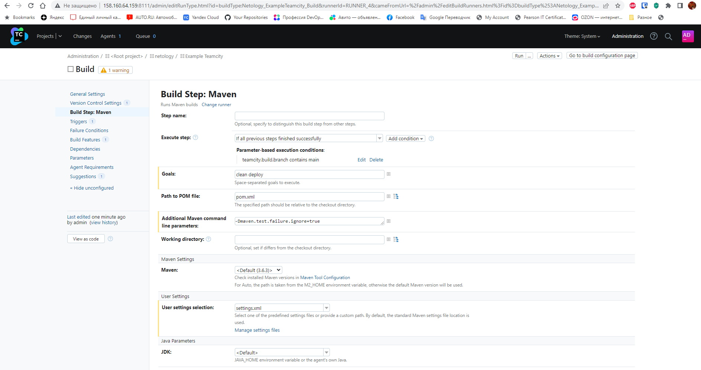

6. В pom.xml необходимо поменять ссылки на репозиторий и nexus.

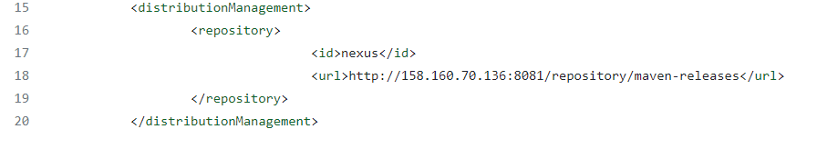

7. Запустите сборку по master, убедитесь, что всё прошло успешно и артефакт появился в nexus.

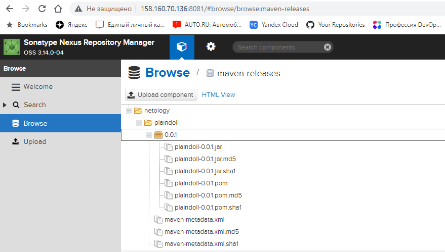

8. Мигрируйте `build configuration` в репозиторий.

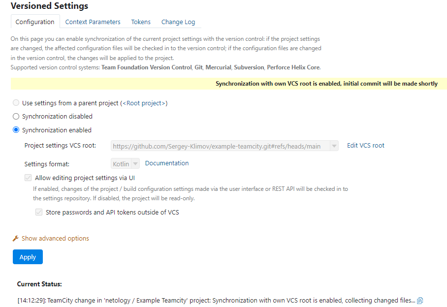

9. Создайте отдельную ветку `feature/add_reply` в репозитории.
10. Напишите новый метод для класса Welcomer: метод должен возвращать произвольную реплику, содержащую слово `hunter`.
11. Дополните тест для нового метода на поиск слова `hunter` в новой реплике.
12. Сделайте push всех изменений в новую ветку репозитория.
13. Убедитесь, что сборка самостоятельно запустилась, тесты прошли успешно.

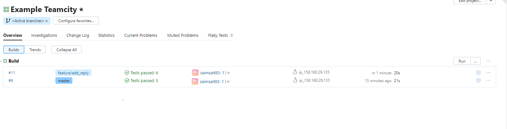

14. Внесите изменения из произвольной ветки `feature/add_reply` в `master` через `Merge`.

15. Убедитесь, что нет собранного артефакта в сборке по ветке `master`.

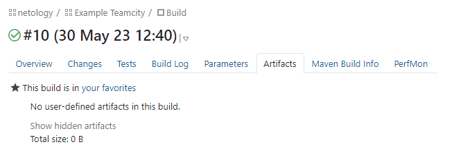

16. Настройте конфигурацию так, чтобы она собирала `.jar` в артефакты сборки.
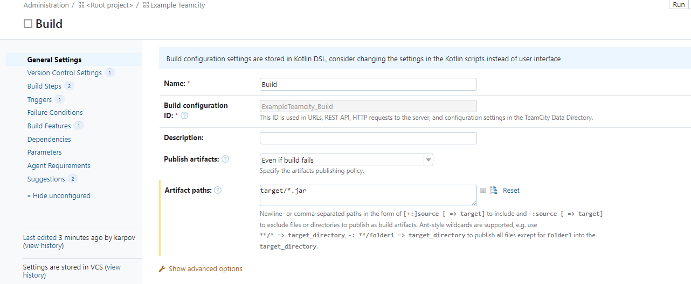

17. Проведите повторную сборку мастера, убедитесь, что сбора прошла успешно и артефакты собраны.

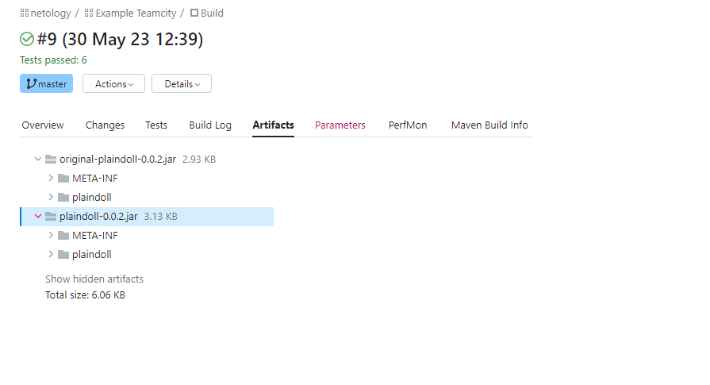

18. Проверьте, что конфигурация в репозитории содержит все настройки конфигурации из teamcity.

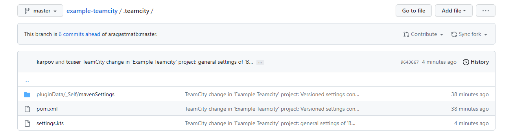
19. В ответе пришлите ссылку на репозиторий.

<a href='https://github.com/Sergey-Klimov/example-teamcity'>https://github.com/Sergey-Klimov/example-teamcity.git</a>

---
