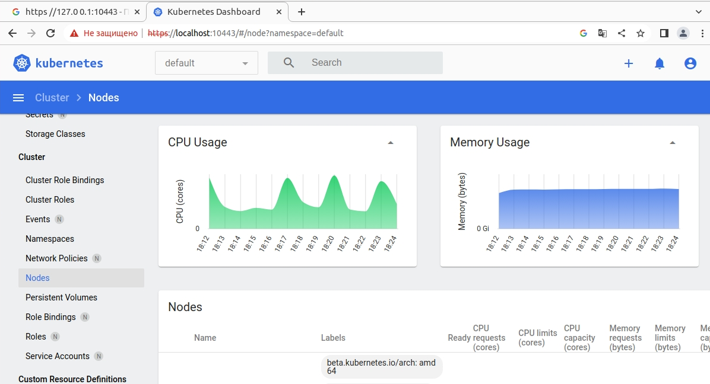
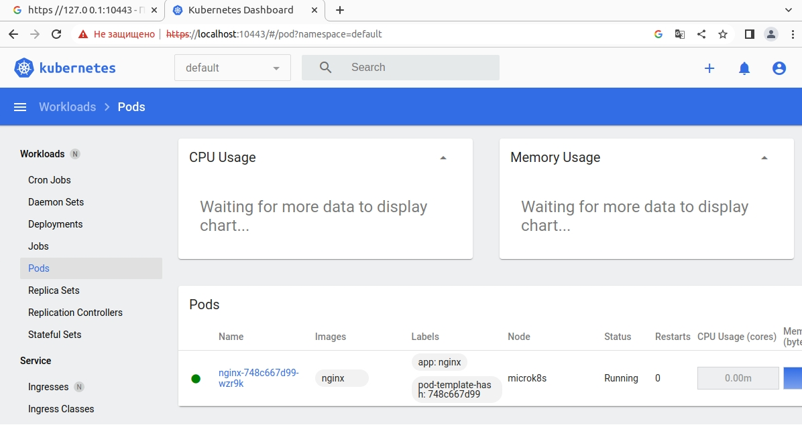

# Домашнее задание к занятию «Kubernetes. Причины появления. Команда kubectl»

### Цель задания

Для экспериментов и валидации ваших решений вам нужно подготовить тестовую среду для работы с Kubernetes. Оптимальное решение — развернуть на рабочей машине или на отдельной виртуальной машине MicroK8S.

------

### Задание 1. Установка MicroK8S

1. Установить MicroK8S на локальную машину или на удалённую виртуальную машину.
2. Установить dashboard.
3. Сгенерировать сертификат для подключения к внешнему ip-адресу.

### Решение:

<details><summary>vagrant@vagrant:~$ microk8s status --wait-ready</summary>

```bash
vagrant@vagrant:~$ microk8s status --wait-ready
microk8s is running
high-availability: no
  datastore master nodes: 127.0.0.1:19001
  datastore standby nodes: none
addons:
  enabled:
    dns                  # (core) CoreDNS
    ha-cluster           # (core) Configure high availability on the current node
    helm                 # (core) Helm - the package manager for Kubernetes
    helm3                # (core) Helm 3 - the package manager for Kubernetes
    hostpath-storage     # (core) Storage class; allocates storage from host directory
    storage              # (core) Alias to hostpath-storage add-on, deprecated
  disabled:
    cert-manager         # (core) Cloud native certificate management
    community            # (core) The community addons repository
    dashboard            # (core) The Kubernetes dashboard
    gpu                  # (core) Automatic enablement of Nvidia CUDA
    host-access          # (core) Allow Pods connecting to Host services smoothly
    ingress              # (core) Ingress controller for external access
    kube-ovn             # (core) An advanced network fabric for Kubernetes
    mayastor             # (core) OpenEBS MayaStor
    metallb              # (core) Loadbalancer for your Kubernetes cluster
    metrics-server       # (core) K8s Metrics Server for API access to service metrics
    minio                # (core) MinIO object storage
    observability        # (core) A lightweight observability stack for logs, traces and metrics
    prometheus           # (core) Prometheus operator for monitoring and logging
    rbac                 # (core) Role-Based Access Control for authorisation
    registry             # (core) Private image registry exposed on localhost:32000
```

</details>


<details><summary>vagrant@vagrant:~$ microk8s enable dashboard</summary>

```bash
vagrant@vagrant:~$ microk8s enable dashboard
Infer repository core for addon dashboard
Enabling Kubernetes Dashboard
Infer repository core for addon metrics-server
Enabling Metrics-Server
serviceaccount/metrics-server created
clusterrole.rbac.authorization.k8s.io/system:aggregated-metrics-reader created
clusterrole.rbac.authorization.k8s.io/system:metrics-server created
rolebinding.rbac.authorization.k8s.io/metrics-server-auth-reader created
clusterrolebinding.rbac.authorization.k8s.io/metrics-server:system:auth-delegator created
clusterrolebinding.rbac.authorization.k8s.io/system:metrics-server created
service/metrics-server created
deployment.apps/metrics-server created
apiservice.apiregistration.k8s.io/v1beta1.metrics.k8s.io created
clusterrolebinding.rbac.authorization.k8s.io/microk8s-admin created
Metrics-Server is enabled
Applying manifest
serviceaccount/kubernetes-dashboard created
service/kubernetes-dashboard created
secret/kubernetes-dashboard-certs created
secret/kubernetes-dashboard-csrf created
secret/kubernetes-dashboard-key-holder created
configmap/kubernetes-dashboard-settings created
role.rbac.authorization.k8s.io/kubernetes-dashboard created
clusterrole.rbac.authorization.k8s.io/kubernetes-dashboard created
rolebinding.rbac.authorization.k8s.io/kubernetes-dashboard created
clusterrolebinding.rbac.authorization.k8s.io/kubernetes-dashboard created
deployment.apps/kubernetes-dashboard created
service/dashboard-metrics-scraper created
deployment.apps/dashboard-metrics-scraper created
secret/microk8s-dashboard-token created

If RBAC is not enabled access the dashboard using the token retrieved with:

microk8s kubectl describe secret -n kube-system microk8s-dashboard-token

Use this token in the https login UI of the kubernetes-dashboard service.

In an RBAC enabled setup (microk8s enable RBAC) you need to create a user with restricted
permissions as shown in:
https://github.com/kubernetes/dashboard/blob/master/docs/user/access-control/creating-sample-user.md
```

</details>


<details><summary>vagrant@vagrant:~$ cat /var/snap/microk8s/current/certs/csr.conf.template</summary>

```bash
vagrant@vagrant:~/.kube$ cat /var/snap/microk8s/current/certs/csr.conf.template

[ req ]
default_bits = 2048
prompt = no
default_md = sha256
req_extensions = req_ext
distinguished_name = dn

[ dn ]
C = GB
ST = Canonical
L = Canonical
O = Canonical
OU = Canonical
CN = 127.0.0.1

[ req_ext ]
subjectAltName = @alt_names

[ alt_names ]
DNS.0 = kubernetes
DNS.1 = kubernetes.default
DNS.2 = kubernetes.default.svc
DNS.3 = kubernetes.default.svc.cluster
DNS.4 = kubernetes.default.svc.cluster.local

IP.4 = 127.0.0.1

#MOREIPS

[ v3_ext ]
authorityKeyIdentifier=keyid,issuer:always
basicConstraints=CA:FALSE
keyUsage=keyEncipherment,dataEncipherment,digitalSignature
extendedKeyUsage=serverAuth,clientAuth
subjectAltName=@alt_names
```

</details>

<details><summary>vagrant@vagrant:~$ sudo microk8s refresh-certs --cert front-proxy-client.crt</summary>

```bash
vagrant@vagrant:~$ sudo microk8s refresh-certs --cert front-proxy-client.crt
Taking a backup of the current certificates under /var/snap/microk8s/5372/certs-backup/
Creating new certificates
Signature ok
subject=CN = front-proxy-client
Getting CA Private Key
Restarting service kubelite.
```

</details>

------

### Задание 2. Установка и настройка локального kubectl
1. Установить на локальную машину kubectl.
2. Настроить локально подключение к кластеру.
3. Подключиться к дашборду с помощью port-forward.

### Решение:

</details>

<details><summary>Установка MicroK8S</summary>

```bash

vagrant@vagrant:~$ curl -LO https://storage.googleapis.com/kubernetes-release/release/`curl -s https://storage.googleapis.com/kubernetes-release/release/stable.txt`/bin/linux/amd64/kubectl
  % Total    % Received % Xferd  Average Speed   Time    Time     Time  Current
                                 Dload  Upload   Total   Spent    Left  Speed
100 46.9M  100 46.9M    0     0  1193k      0  0:00:40  0:00:40 --:--:-- 1037k

vagrant@vagrant:~# chmod +x ./kubectl
vagrant@vagrant:~# sudo mv ./kubectl /usr/local/bin/kubectl
vagrant@vagrant:~# bash source <(kubectl completion bash)
bash: source: No such file or directory
vagrant@vagrant:~# echo "source <(kubectl completion bash)" >> ~/.bashrc
vagrant@vagrant:~# source <(kubectl completion bash)
vagrant@vagrant:~# echo "source <(kubectl completion bash)" >> ~/.bashrc
vagrant@vagrant:~# alias k=kubectl
vagrant@vagrant:~# complete -F __start_kubectl k
```

</details>

<details><summary>vagrant@vagrant:~$ kubectl get nodes</summary>

```bash
vagrant@vagrant:~$ kubectl get nodes
NAME      STATUS   ROLES    AGE    VERSION
vagrant   Ready    <none>   121m   v1.27.2
```
</details>





------
