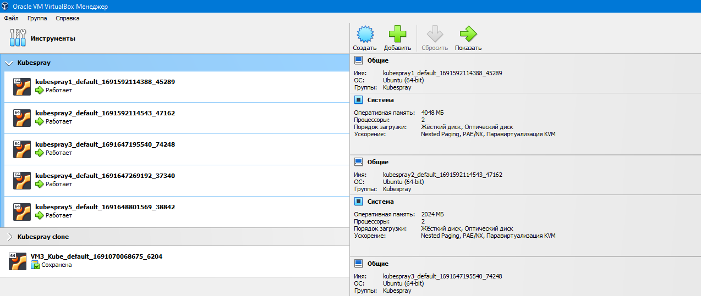
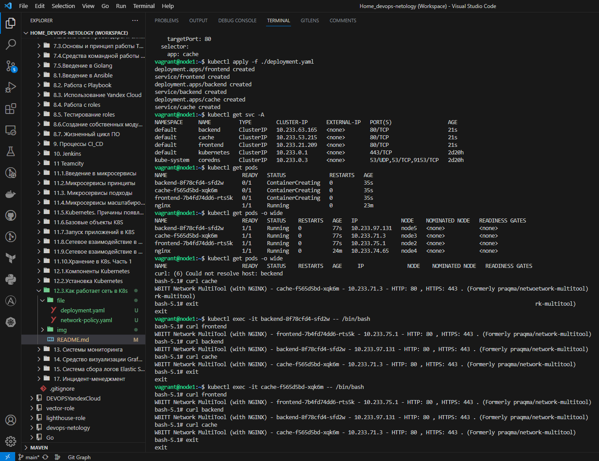

# Домашнее задание к занятию «Как работает сеть в K8s»

### Цель задания

Настроить сетевую политику доступа к подам.

### Чеклист готовности к домашнему заданию

1. Кластер K8s с установленным сетевым плагином Calico.

### Инструменты и дополнительные материалы, которые пригодятся для выполнения задания

1. [Документация Calico](https://www.tigera.io/project-calico/).
2. [Network Policy](https://kubernetes.io/docs/concepts/services-networking/network-policies/).
3. [About Network Policy](https://docs.projectcalico.org/about/about-network-policy).

-----

### Задание 1. Создать сетевую политику или несколько политик для обеспечения доступа

1. Создать deployment'ы приложений frontend, backend и cache и соответсвующие сервисы.
2. В качестве образа использовать network-multitool.
3. Разместить поды в namespace App.
4. Создать политики, чтобы обеспечить доступ frontend -> backend -> cache. Другие виды подключений должны быть запрещены.
5. Продемонстрировать, что трафик разрешён и запрещён.

### Решение:


### Решение:

Поскольку период действия гранта в Yandex Cloud закончился,
развернул на Oracle VM VirtualBox 5 node с помощью kubespray, как в предидущем ДЗ.



```bash
vagrant@node1:~$ kubectl get nodes -A
NAME    STATUS   ROLES           AGE     VERSION
node1   Ready    control-plane   2d19h   v1.26.7
node2   Ready    <none>          2d19h   v1.26.7
node3   Ready    <none>          2d19h   v1.26.7
node4   Ready    <none>          2d19h   v1.26.7
node5   Ready    <none>          2d19h   v1.26.7
```

```bash
vagrant@node1:~$ kubectl get pods -A -o wide
NAMESPACE     NAME                                      READY   STATUS    RESTARTS       AGE     IP               NODE    NOMINATED NODE   READINESS GATES
kube-system   calico-kube-controllers-6dfcdfb99-cw2m7   1/1     Running   7 (17h ago)    2d19h   10.233.97.130    node5   <none>           <none>
kube-system   calico-node-4k4wq                         1/1     Running   3 (17h ago)    2d19h   192.168.1.10     node1   <none>           <none>
kube-system   calico-node-87gpl                         1/1     Running   1 (17h ago)    2d19h   192.168.1.40     node4   <none>           <none>
kube-system   calico-node-95fbg                         1/1     Running   1 (17h ago)    2d19h   192.168.1.20     node2   <none>           <none>
kube-system   calico-node-9knbm                         1/1     Running   1 (17h ago)    2d19h   192.168.1.30     node3   <none>           <none>
kube-system   calico-node-cxq69                         1/1     Running   1 (17h ago)    2d19h   192.168.1.50     node5   <none>           <none>
kube-system   coredns-645b46f4b6-gf2td                  1/1     Running   1 (17h ago)    2d19h   10.233.71.2      node3   <none>           <none>
kube-system   coredns-645b46f4b6-vnjx5                  1/1     Running   3 (17h ago)    2d19h   10.233.102.135   node1   <none>           <none>
kube-system   dns-autoscaler-659b8c48cb-ffv94           1/1     Running   3 (17h ago)    2d19h   10.233.102.136   node1   <none>           <none>
kube-system   kube-apiserver-node1                      1/1     Running   4 (17h ago)    2d19h   192.168.1.10     node1   <none>           <none>
kube-system   kube-controller-manager-node1             1/1     Running   11 (17h ago)   2d19h   192.168.1.10     node1   <none>           <none>
kube-system   kube-proxy-flnkm                          1/1     Running   1 (17h ago)    2d19h   192.168.1.40     node4   <none>           <none>
kube-system   kube-proxy-fxfgn                          1/1     Running   1 (17h ago)    2d19h   192.168.1.30     node3   <none>           <none>
kube-system   kube-proxy-kgxwd                          1/1     Running   1 (17h ago)    2d19h   192.168.1.50     node5   <none>           <none>
kube-system   kube-proxy-q8c97                          1/1     Running   1 (17h ago)    2d19h   192.168.1.20     node2   <none>           <none>
kube-system   kube-proxy-w79s7                          1/1     Running   3 (17h ago)    2d19h   192.168.1.10     node1   <none>           <none>
kube-system   kube-scheduler-node1                      1/1     Running   12 (17h ago)   2d19h   192.168.1.10     node1   <none>           <none>
kube-system   nginx-proxy-node2                         1/1     Running   1 (17h ago)    2d19h   192.168.1.20     node2   <none>           <none>
kube-system   nginx-proxy-node3                         1/1     Running   1 (17h ago)    2d19h   192.168.1.30     node3   <none>           <none>
kube-system   nginx-proxy-node4                         1/1     Running   1 (17h ago)    2d19h   192.168.1.40     node4   <none>           <none>
kube-system   nginx-proxy-node5                         1/1     Running   1 (17h ago)    2d19h   192.168.1.50     node5   <none>           <none>
kube-system   nodelocaldns-clclf                        1/1     Running   6 (17h ago)    2d19h   192.168.1.10     node1   <none>           <none>
kube-system   nodelocaldns-dmsrh                        1/1     Running   1 (17h ago)    2d19h   192.168.1.50     node5   <none>           <none>
kube-system   nodelocaldns-pw2pw                        1/1     Running   2 (17h ago)    2d19h   192.168.1.20     node2   <none>           <none>
kube-system   nodelocaldns-s77q9                        1/1     Running   1 (17h ago)    2d19h   192.168.1.30     node3   <none>           <none>
kube-system   nodelocaldns-wdtvz                        1/1     Running   2 (17h ago)    2d19h   192.168.1.40     node4   <none>           <none>
```

Запускаем создание ресурсов из манифест файла: [deployment](./file/network-policy.yaml)

```bash
vagrant@node1:~$ kubectl apply -f ./deployment.yaml                                                                                               
deployment.apps/frontend created
service/frontend created
deployment.apps/backend created
service/backend created
deployment.apps/cache created
service/cache created

vagrant@node1:~$ kubectl get svc -A
NAMESPACE     NAME         TYPE        CLUSTER-IP      EXTERNAL-IP   PORT(S)                  AGE
default       backend      ClusterIP   10.233.63.165   <none>        80/TCP                   21s
default       cache        ClusterIP   10.233.53.215   <none>        80/TCP                   21s
default       frontend     ClusterIP   10.233.21.209   <none>        80/TCP                   21s
default       kubernetes   ClusterIP   10.233.0.1      <none>        443/TCP                  2d20h
kube-system   coredns      ClusterIP   10.233.0.3      <none>        53/UDP,53/TCP,9153/TCP   2d20h

vagrant@node1:~$ kubectl get pods -o wide
NAME                        READY   STATUS    RESTARTS   AGE     IP              NODE    NOMINATED NODE   READINESS GATES
backend-8f78cfd4-sfd2w      1/1     Running   0          2m52s   10.233.97.131   node5   <none>           <none>
cache-f565d5bd-xqk6m        1/1     Running   0          2m52s   10.233.71.3     node3   <none>           <none>
frontend-7b4fd74dd6-rts5k   1/1     Running   0          2m52s   10.233.75.1     node2   <none>           <none>
nginx                       1/1     Running   0          25m     10.233.74.65    node4   <none>           <none>
```

До применения сетевых политик трафик не ограничен:

```bash
vagrant@node1:~$ kubectl exec -it frontend-7b4fd74dd6-rts5k -- /bin/bash
bash-5.1# curl frontend
WBITT Network MultiTool (with NGINX) - frontend-7b4fd74dd6-rts5k - 10.233.75.1 - HTTP: 80 , HTTPS: 443 . (Formerly praqma/network-multitool)
bash-5.1# curl backend
WBITT Network MultiTool (with NGINX) - backend-8f78cfd4-sfd2w - 10.233.97.131 - HTTP: 80 , HTTPS: 443 . (Formerly praqma/network-multitool)
bash-5.1# curl cache
WBITT Network MultiTool (with NGINX) - cache-f565d5bd-xqk6m - 10.233.71.3 - HTTP: 80 , HTTPS: 443 . (Formerly praqma/network-multitool)
bash-5.1# 
```
```bash
vagrant@node1:~$ kubectl exec -it backend-8f78cfd4-sfd2w -- /bin/bash
bash-5.1# curl frontend
WBITT Network MultiTool (with NGINX) - frontend-7b4fd74dd6-rts5k - 10.233.75.1 - HTTP: 80 , HTTPS: 443 . (Formerly praqma/network-multitool)
bash-5.1# curl backend
WBITT Network MultiTool (with NGINX) - backend-8f78cfd4-sfd2w - 10.233.97.131 - HTTP: 80 , HTTPS: 443 . (Formerly praqma/network-multitool)
bash-5.1# curl cache
WBITT Network MultiTool (with NGINX) - cache-f565d5bd-xqk6m - 10.233.71.3 - HTTP: 80 , HTTPS: 443 . (Formerly praqma/network-multitool)
bash-5.1# 
```
```bash
vagrant@node1:~$ kubectl exec -it cache-f565d5bd-xqk6m -- /bin/bash
bash-5.1# curl frontend
WBITT Network MultiTool (with NGINX) - frontend-7b4fd74dd6-rts5k - 10.233.75.1 - HTTP: 80 , HTTPS: 443 . (Formerly praqma/network-multitool)
bash-5.1# curl backend
WBITT Network MultiTool (with NGINX) - backend-8f78cfd4-sfd2w - 10.233.97.131 - HTTP: 80 , HTTPS: 443 . (Formerly praqma/network-multitool)
bash-5.1# curl cache
WBITT Network MultiTool (with NGINX) - cache-f565d5bd-xqk6m - 10.233.71.3 - HTTP: 80 , HTTPS: 443 . (Formerly praqma/network-multitool)
bash-5.1# exit
```

Применяем на default namespace манифест файл [network-policy](./file/network-policy.yaml) сетевых политик, запрещающий весь трафик кроме трафика от frontend к backend и от backend к cache:

```bash
vagrant@node1:~$ kubectl apply -f ./network-policy.yaml
networkpolicy.networking.k8s.io/ingress-deny-all created
networkpolicy.networking.k8s.io/allow-frontend-to-backend created
networkpolicy.networking.k8s.io/allow-backend-to-cache created
```

Проверяем прохождение трафика.

C fronend команда curl отрабатывает только до backend:

```bash
vagrant@node1:~$ kubectl exec -it frontend-7b4fd74dd6-rts5k -- /bin/bash
bash-5.1# curl frontend
^C
bash-5.1# curl backend
WBITT Network MultiTool (with NGINX) - backend-8f78cfd4-sfd2w - 10.233.97.131 - HTTP: 80 , HTTPS: 443 . (Formerly praqma/network-multitool)
bash-5.1# curl cache
^C
bash-5.1# exit
exit
```

С backend команда curl отрабатывает только до cache:

```bash
vagrant@node1:~$ kubectl exec -it backend-8f78cfd4-sfd2w -- /bin/bash
bash-5.1# curl frontend
^C
bash-5.1# curl backend
^C
bash-5.1# curl cache
WBITT Network MultiTool (with NGINX) - cache-f565d5bd-xqk6m - 10.233.71.3 - HTTP: 80 , HTTPS: 443 . (Formerly praqma/network-multitool)
bash-5.1# exit
exit
```

С cache весь трафик заблокирован:

```bash
vagrant@node1:~$ kubectl exec -it cache-f565d5bd-xqk6m -- /bin/bash
bash-5.1# curl frontend
^C
bash-5.1# curl backend
^C
bash-5.1# curl cache
^C
bash-5.1# exit
exit
```



### Правила приёма работы

1. Домашняя работа оформляется в своем Git-репозитории в файле README.md. Выполненное домашнее задание пришлите ссылкой на .md-файл в вашем репозитории.
2. Файл README.md должен содержать скриншоты вывода необходимых команд `kubectl get nodes`, а также скриншоты результатов.
3. Репозиторий должен содержать тексты манифестов или ссылки на них в файле README.md.