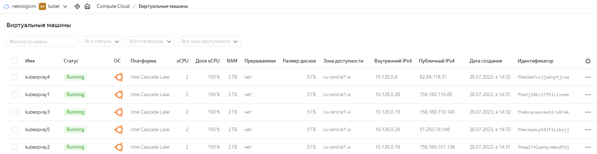

# Домашнее задание к занятию «Как работает сеть в K8s»

### Цель задания

Настроить сетевую политику доступа к подам.

### Чеклист готовности к домашнему заданию

1. Кластер K8s с установленным сетевым плагином Calico.

### Инструменты и дополнительные материалы, которые пригодятся для выполнения задания

1. [Документация Calico](https://www.tigera.io/project-calico/).
2. [Network Policy](https://kubernetes.io/docs/concepts/services-networking/network-policies/).
3. [About Network Policy](https://docs.projectcalico.org/about/about-network-policy).

-----

### Задание 1. Создать сетевую политику или несколько политик для обеспечения доступа

1. Создать deployment'ы приложений frontend, backend и cache и соответсвующие сервисы.
2. В качестве образа использовать network-multitool.
3. Разместить поды в namespace App.
4. Создать политики, чтобы обеспечить доступ frontend -> backend -> cache. Другие виды подключений должны быть запрещены.
5. Продемонстрировать, что трафик разрешён и запрещён.

### Решение:


# Домашнее задание к занятию «Установка Kubernetes»

### Цель задания

Установить кластер K8s.

### Чеклист готовности к домашнему заданию

1. Развёрнутые ВМ с ОС Ubuntu 20.04-lts.

### Решение:

Для развертывания ВМ с ОС Ubuntu 20.04-lts запускаем скрипт: 

<details><summary>bash createvmyc.sh</summary>

```bash
#!/bin/bash

set -e

yc compute instance create \
  --name kubespray1 \
  --hostname kubespray1 \
  --zone ru-central1-a \
  --network-interface subnet-name=default-ru-central1-a,nat-ip-version=ipv4 \
  --create-boot-disk image-folder-id=standard-images,image-family=ubuntu-2004-lts \
  --memory 2 \
  --cores 2 \
  --metadata serial-port-enable=1 \
  --ssh-key ~/.ssh/id_rsa.pub 

yc compute instance create \
  --name kubespray2 \
  --hostname kubespray2 \
  --zone ru-central1-a \
  --network-interface subnet-name=default-ru-central1-a,nat-ip-version=ipv4 \
  --create-boot-disk image-folder-id=standard-images,image-family=ubuntu-2004-lts \
  --memory 2 \
  --cores 2 \
  --metadata serial-port-enable=1 \
  --ssh-key ~/.ssh/id_rsa.pub 

yc compute instance create \
  --name kubespray3 \
  --hostname kubespray3 \
  --zone ru-central1-a \
  --network-interface subnet-name=default-ru-central1-a,nat-ip-version=ipv4 \
  --create-boot-disk image-folder-id=standard-images,image-family=ubuntu-2004-lts \
  --memory 2 \
  --cores 2 \
  --metadata serial-port-enable=1 \
  --ssh-key ~/.ssh/id_rsa.pub 

yc compute instance create \
  --name kubespray4 \
  --hostname kubespray4 \
  --zone ru-central1-a \
  --network-interface subnet-name=default-ru-central1-a,nat-ip-version=ipv4 \
  --create-boot-disk image-folder-id=standard-images,image-family=ubuntu-2004-lts \
  --memory 2 \
  --cores 2 \
  --metadata serial-port-enable=1 \
  --ssh-key ~/.ssh/id_rsa.pub 

yc compute instance create \
  --name kubespray5 \
  --hostname kubespray5 \
  --zone ru-central1-a \
  --network-interface subnet-name=default-ru-central1-a,nat-ip-version=ipv4 \
  --create-boot-disk image-folder-id=standard-images,image-family=ubuntu-2004-lts \
  --memory 2 \
  --cores 2 \
  --metadata serial-port-enable=1 \
  --ssh-key ~/.ssh/id_rsa.pub 
```
</details>

<details><summary>yc compute instance list</summary>

```bash

vagrant@vagrant:~$ yc compute instance list
+----------------------+------------+---------------+---------+-----------------+-------------+
|          ID          |    NAME    |    ZONE ID    | STATUS  |   EXTERNAL IP   | INTERNAL IP |
+----------------------+------------+---------------+---------+-----------------+-------------+
| fhm26m7nc3ja9nptjcoa | kubespray4 | ru-central1-a | RUNNING | 62.84.118.51    | 10.128.0.6  |
| fhm5j38bc27f5lc1veee | kubespray1 | ru-central1-a | RUNNING | 158.160.116.80  | 10.128.0.28 |
| fhmbcaneesee9lru6r4k | kubespray3 | ru-central1-a | RUNNING | 158.160.110.140 | 10.128.0.19 |
| fhmcmpmcp58lf1slbojj | kubespray5 | ru-central1-a | RUNNING | 51.250.78.148   | 10.128.0.24 |
| fhmq174laehpvm6udfdj | kubespray2 | ru-central1-a | RUNNING | 158.160.101.136 | 10.128.0.16 |
+----------------------+------------+---------------+---------+-----------------+-------------+

```

</details>

<details><summary>ssh yc-user@158.160.116.80</summary>

```bash
yc-user@kubespray1:~$ ssh yc-user@158.160.116.80
Welcome to Ubuntu 20.04.6 LTS (GNU/Linux 5.4.0-153-generic x86_64)

 * Documentation:  https://help.ubuntu.com
 * Management:     https://landscape.canonical.com
 * Support:        https://ubuntu.com/advantage
New release '22.04.2 LTS' available.
Run 'do-release-upgrade' to upgrade to it.

Last login: Fri Jul 28 11:39:01 2023 from 95.73.171.160
yc-user@kubespray1:~$ hostnamectl
   Static hostname: kubespray1
         Icon name: computer-vm
           Chassis: vm
        Machine ID: 23000007c6c598d0b608ef2d581fb9ce
           Boot ID: c443616940a7481fa0d5533ff1de100b
    Virtualization: kvm
  Operating System: Ubuntu 20.04.6 LTS
            Kernel: Linux 5.4.0-153-generic
      Architecture: x86-64
yc-user@kubespray1:~$
```

</details>





### Инструменты и дополнительные материалы, которые пригодятся для выполнения задания

1. [Инструкция по установке kubeadm](https://kubernetes.io/docs/setup/production-environment/tools/kubeadm/create-cluster-kubeadm/).
2. [Документация kubespray](https://kubespray.io/).

-----

### Задание 1. Установить кластер k8s с 1 master node

1. Подготовка работы кластера из 5 нод: 1 мастер и 4 рабочие ноды.
2. В качестве CRI — containerd.
3. Запуск etcd производить на мастере.
4. Способ установки выбрать самостоятельно.

### Решение:

Скачиваем kubespray из репозитория:

```bash
yc-user@kubespray1:~$ git clone https://github.com/kubernetes-sigs/kubespray
Cloning into 'kubespray'...
remote: Enumerating objects: 70127, done.
remote: Counting objects: 100% (771/771), done.
remote: Compressing objects: 100% (509/509), done.
remote: Total 70127 (delta 187), reused 648 (delta 182), pack-reused 69356
Receiving objects: 100% (70127/70127), 22.29 MiB | 1.23 MiB/s, done.
Resolving deltas: 100% (39235/39235), done.
```

```bash
yc-user@kubespray1:~/kubespray$ cat requirements.txt
ansible==7.6.0
ansible-core==2.14.6
cryptography==41.0.1
jinja2==3.1.2
jmespath==1.0.1
MarkupSafe==2.1.3
netaddr==0.8.0
pbr==5.11.1
ruamel.yaml==0.17.31
ruamel.yaml.clib==0.2.7

```
Устанавливаем зависимости:

<details><summary>pip3.9 install -r requirements.txt</summary>

```bash

yc-user@kubespray1:~/kubespray$ pip3.9 install -r requirements.txt
Defaulting to user installation because normal site-packages is not writeable
Collecting ansible==7.6.0 (from -r requirements.txt (line 1))
  Obtaining dependency information for ansible==7.6.0 from https://files.pythonhosted.org/packages/9a/54/ceba345e4f42ea9d4b8c6f24a51c5edd382ead93acd8f170ce5150e4885d/ansible-7.6.0-py3-none-any.whl.metadata
  Downloading ansible-7.6.0-py3-none-any.whl.metadata (7.9 kB)
Collecting ansible-core==2.14.6 (from -r requirements.txt (line 2))
  Obtaining dependency information for ansible-core==2.14.6 from https://files.pythonhosted.org/packages/88/ea/8a53180f8ca275543eab6a8f032bbe4e91f622c985cb9dd8a3ebb0c305ec/ansible_core-2.14.6-py3-none-any.whl.metadata
  Downloading ansible_core-2.14.6-py3-none-any.whl.metadata (7.4 kB)
Collecting cryptography==41.0.1 (from -r requirements.txt (line 3))
  Obtaining dependency information for cryptography==41.0.1 from https://files.pythonhosted.org/packages/49/35/80c346e1a9509210defa857a05e9b7931093719aab25665d4d54f9b3ba83/cryptography-41.0.1-cp37-abi3-manylinux_2_28_x86_64.whl.metadata
  Downloading cryptography-41.0.1-cp37-abi3-manylinux_2_28_x86_64.whl.metadata (5.2 kB)
Collecting jinja2==3.1.2 (from -r requirements.txt (line 4))
  Downloading Jinja2-3.1.2-py3-none-any.whl (133 kB)
     ━━━━━━━━━━━━━━━━━━━━━━━━━━━━━━━━━━━━━━━━ 133.1/133.1 kB 1.6 MB/s eta 0:00:00
Collecting jmespath==1.0.1 (from -r requirements.txt (line 5))
  Downloading jmespath-1.0.1-py3-none-any.whl (20 kB)
Collecting MarkupSafe==2.1.3 (from -r requirements.txt (line 6))
  Obtaining dependency information for MarkupSafe==2.1.3 from https://files.pythonhosted.org/packages/de/63/cb7e71984e9159ec5f45b5e81e896c8bdd0e45fe3fc6ce02ab497f0d790e/MarkupSafe-2.1.3-cp39-cp39-manylinux_2_17_x86_64.manylinux2014_x86_64.whl.metadata
  Downloading MarkupSafe-2.1.3-cp39-cp39-manylinux_2_17_x86_64.manylinux2014_x86_64.whl.metadata (3.0 kB)
Collecting netaddr==0.8.0 (from -r requirements.txt (line 7))
  Downloading netaddr-0.8.0-py2.py3-none-any.whl (1.9 MB)
     ━━━━━━━━━━━━━━━━━━━━━━━━━━━━━━━━━━━━━━━━ 1.9/1.9 MB 3.0 MB/s eta 0:00:00
Collecting pbr==5.11.1 (from -r requirements.txt (line 8))
  Downloading pbr-5.11.1-py2.py3-none-any.whl (112 kB)
     ━━━━━━━━━━━━━━━━━━━━━━━━━━━━━━━━━━━━━━━━ 112.7/112.7 kB 1.9 MB/s eta 0:00:00
Collecting ruamel.yaml==0.17.31 (from -r requirements.txt (line 9))
  Obtaining dependency information for ruamel.yaml==0.17.31 from https://files.pythonhosted.org/packages/9c/9c/e69fc06169ac6e757c66004885e0dfcc6c2b5c1a331a5dc70b890b6b4bf8/ruamel.yaml-0.17.31-py3-none-any.whl.metadata
  Downloading ruamel.yaml-0.17.31-py3-none-any.whl.metadata (17 kB)
Collecting ruamel.yaml.clib==0.2.7 (from -r requirements.txt (line 10))
  Downloading ruamel.yaml.clib-0.2.7-cp39-cp39-manylinux_2_17_x86_64.manylinux2014_x86_64.manylinux_2_24_x86_64.whl (519 kB)     ━━━━━━━━━━━━━━━━━━━━━━━━━━━━━━━━━━━━━━━━ 519.4/519.4 kB 1.4 MB/s eta 0:00:00
Requirement already satisfied: PyYAML>=5.1 in /usr/lib/python3/dist-packages (from ansible-core==2.14.6->-r requirements.txt (line 2)) (5.3.1)
Collecting packaging (from ansible-core==2.14.6->-r requirements.txt (line 2))
  Downloading packaging-23.1-py3-none-any.whl (48 kB)
     ━━━━━━━━━━━━━━━━━━━━━━━━━━━━━━━━━━━━━━━━ 48.9/48.9 kB 7.8 MB/s eta 0:00:00
Collecting resolvelib<0.9.0,>=0.5.3 (from ansible-core==2.14.6->-r requirements.txt (line 2))
  Downloading resolvelib-0.8.1-py2.py3-none-any.whl (16 kB)
Collecting cffi>=1.12 (from cryptography==41.0.1->-r requirements.txt (line 3))
  Downloading cffi-1.15.1-cp39-cp39-manylinux_2_17_x86_64.manylinux2014_x86_64.whl (441 kB)
     ━━━━━━━━━━━━━━━━━━━━━━━━━━━━━━━━━━━━━━━━ 441.2/441.2 kB 1.3 MB/s eta 0:00:00
Collecting pycparser (from cffi>=1.12->cryptography==41.0.1->-r requirements.txt (line 3))
  Downloading pycparser-2.21-py2.py3-none-any.whl (118 kB)
     ━━━━━━━━━━━━━━━━━━━━━━━━━━━━━━━━━━━━━━━━ 118.7/118.7 kB 1.2 MB/s eta 0:00:00
Downloading ansible-7.6.0-py3-none-any.whl (43.8 MB)
   ━━━━━━━━━━━━━━━━━━━━━━━━━━━━━━━━━━━━━━━━ 43.8/43.8 MB 1.1 MB/s eta 0:00:00
Downloading ansible_core-2.14.6-py3-none-any.whl (2.2 MB)
   ━━━━━━━━━━━━━━━━━━━━━━━━━━━━━━━━━━━━━━━━ 2.2/2.2 MB 1.3 MB/s eta 0:00:00
Downloading cryptography-41.0.1-cp37-abi3-manylinux_2_28_x86_64.whl (4.3 MB)
   ━━━━━━━━━━━━━━━━━━━━━━━━━━━━━━━━━━━━━━━━ 4.3/4.3 MB 1.3 MB/s eta 0:00:00
Downloading MarkupSafe-2.1.3-cp39-cp39-manylinux_2_17_x86_64.manylinux2014_x86_64.whl (25 kB)
Downloading ruamel.yaml-0.17.31-py3-none-any.whl (112 kB)
   ━━━━━━━━━━━━━━━━━━━━━━━━━━━━━━━━━━━━━━━━ 112.1/112.1 kB 1.2 MB/s eta 0:00:00
Installing collected packages: resolvelib, netaddr, ruamel.yaml.clib, pycparser, pbr, packaging, MarkupSafe, jmespath, ruamel.yaml, jinja2, cffi, cryptography, ansible-core, ansible
  WARNING: The script netaddr is installed in '/home/vagrant/.local/bin' which is not on PATH.
  Consider adding this directory to PATH or, if you prefer to suppress this warning, use --no-warn-script-location.
  WARNING: The script pbr is installed in '/home/vagrant/.local/bin' which is not on PATH.
  Consider adding this directory to PATH or, if you prefer to suppress this warning, use --no-warn-script-location.
  WARNING: The scripts ansible, ansible-config, ansible-connection, ansible-console, ansible-doc, ansible-galaxy, ansible-inventory, ansible-playbook, ansible-pull and ansible-vault are installed in '/home/vagrant/.local/bin' which is not on PATH.
  Consider adding this directory to PATH or, if you prefer to suppress this warning, use --no-warn-script-location.
  WARNING: The script ansible-community is installed in '/home/vagrant/.local/bin' which is not on PATH.
  Consider adding this directory to PATH or, if you prefer to suppress this warning, use --no-warn-script-location.
Successfully installed MarkupSafe-2.1.3 ansible-7.6.0 ansible-core-2.14.6 cffi-1.15.1 cryptography-41.0.1 jinja2-3.1.2 jmespath-1.0.1 netaddr-0.8.0 packaging-23.1 pbr-5.11.1 pycparser-2.21 resolvelib-0.8.1 ruamel.yaml-0.17.31 ruamel.yaml.clib-0.2.7

```
</details>

Подготавливаем файл hosts.yaml

```bash

yc-user@kubespray1:~/kubespray$ cp -rfp inventory/sample inventory/mycluster

yc-user@kubespray1:~/kubespray$ declare -a IPS=(10.128.0.28 10.128.0.16 10.128.0.19 10.128.0.6 10.128.0.24)

```

<details><summary>CONFIG_FILE=inventory/mycluster/hosts.yaml python3.9 contrib/inventory_builder/inventory.py ${IPS[@]} </summary>

```bash
yc-user@kubespray1:~/kubespray$ CONFIG_FILE=inventory/mycluster/hosts.yaml python3.9 contrib/inventory_builder/inventory.py ${IPS[@]}
DEBUG: Adding group all
DEBUG: Adding group kube_control_plane
DEBUG: Adding group kube_node
DEBUG: Adding group etcd
DEBUG: Adding group k8s_cluster
DEBUG: Adding group calico_rr
DEBUG: adding host node1 to group all
DEBUG: adding host node2 to group all
DEBUG: adding host node3 to group all
DEBUG: adding host node4 to group all
DEBUG: adding host node5 to group all
DEBUG: adding host node1 to group etcd
DEBUG: adding host node2 to group etcd
DEBUG: adding host node3 to group etcd
DEBUG: adding host node1 to group kube_control_plane
DEBUG: adding host node2 to group kube_control_plane
DEBUG: adding host node1 to group kube_node
DEBUG: adding host node2 to group kube_node
DEBUG: adding host node3 to group kube_node
DEBUG: adding host node4 to group kube_node
DEBUG: adding host node5 to group kube_node
```
</details>

Редактируем файл hosts.yaml под требования задания:

```bash
yc-user@kubespray1:~$ cat  ~/kubespray/inventory/mycluster/hosts.yaml
all:
  hosts:
    node1:
      ansible_host: 10.128.0.28
      ip: 10.128.0.28
      access_ip: 10.128.0.28
    node2:
      ansible_host: 10.128.0.16
      ip: 10.128.0.16
      access_ip: 10.128.0.16
    node3:
      ansible_host: 10.128.0.19
      ip: 10.128.0.19
      access_ip: 10.128.0.19
    node4:
      ansible_host: 10.128.0.6
      ip: 10.128.0.6
      access_ip: 10.128.0.6
    node5:
      ansible_host: 10.128.0.24
      ip: 10.128.0.24
      access_ip: 10.128.0.24
  children:
    kube_control_plane:
      hosts:
        node1:
    kube_node:
      hosts:
        node2:
        node3:
        node4:
        node5:
    etcd:
      hosts:
        node1:
    k8s_cluster:
      children:
        kube_control_plane:
        kube_node:
    calico_rr:
      hosts: {}

```

Запускаем playbook:

<details><summary>ansible-playbook -i inventory/mycluster/hosts.yaml cluster.yml -b </summary>

```bash
TASK [download : Prep_download | Set a few facts] ************************************************************************ok: [node1]
Friday 04 August 2023  11:42:47 +0000 (0:00:00.085)       0:06:56.610 *********

TASK [download : Download_file | Starting download of file] **************************************************************ok: [node1] => {
    "msg": "https://github.com/etcd-io/etcd/releases/download/v3.5.6/etcd-v3.5.6-linux-amd64.tar.gz"
}
Friday 04 August 2023  11:42:47 +0000 (0:00:00.093)       0:06:56.704 ********* 

TASK [download : Download_file | Set pathname of cached file] ************************************************************ok: [node1]
Friday 04 August 2023  11:42:47 +0000 (0:00:00.087)       0:06:56.791 *********

TASK [download : Download_file | Create dest directory on node] **********************************************************ok: [node1]
Friday 04 August 2023  11:42:47 +0000 (0:00:00.280)       0:06:57.072 ********* 
Friday 04 August 2023  11:42:48 +0000 (0:00:00.041)       0:06:57.114 ********* 
Friday 04 August 2023  11:42:48 +0000 (0:00:00.051)       0:06:57.166 ********* 

TASK [download : Download_file | Validate mirrors] ***********************************************************************ok: [node1] => (item=None)
ok: [node1 -> {{ download_delegate if download_force_cache else inventory_hostname }}]
Friday 04 August 2023  11:42:49 +0000 (0:00:00.940)       0:06:58.106 *********

TASK [download : Download_file | Get the list of working mirrors] ********************************************************ok: [node1]
Friday 04 August 2023  11:42:49 +0000 (0:00:00.126)       0:06:58.233 *********

TASK [download : Download_file | Download item] **************************************************************************changed: [node1]
Friday 04 August 2023  11:42:50 +0000 (0:00:01.174)       0:06:59.407 *********
Friday 04 August 2023  11:42:50 +0000 (0:00:00.061)       0:06:59.469 ********* 
Friday 04 August 2023  11:42:50 +0000 (0:00:00.060)       0:06:59.530 ********* 
Friday 04 August 2023  11:42:50 +0000 (0:00:00.065)       0:06:59.596 ********* 

TASK [download : Download_file | Extract file archives] ******************************************************************included: /home/yc-user/kubespray/roles/download/tasks/extract_file.yml for node1
Friday 04 August 2023  11:42:50 +0000 (0:00:00.081)       0:06:59.677 ********* 

TASK [download : Extract_file | Unpacking archive] ***********************************************************************changed: [node1]
Friday 04 August 2023  11:42:52 +0000 (0:00:02.270)       0:07:01.947 *********

TASK [download : Prep_download | Set a few facts] ************************************************************************ok: [node1]
ok: [node2]
ok: [node3]
ok: [node4]
ok: [node5]
Friday 04 August 2023  11:42:53 +0000 (0:00:00.297)       0:07:02.245 ********* 

TASK [download : Download_file | Starting download of file] **************************************************************ok: [node1] => {
    "msg": "https://github.com/containernetworking/plugins/releases/download/v1.3.0/cni-plugins-linux-amd64-v1.3.0.tgz"   
}
ok: [node2] => {
    "msg": "https://github.com/containernetworking/plugins/releases/download/v1.3.0/cni-plugins-linux-amd64-v1.3.0.tgz"   
}
ok: [node3] => {
    "msg": "https://github.com/containernetworking/plugins/releases/download/v1.3.0/cni-plugins-linux-amd64-v1.3.0.tgz"   
}
ok: [node4] => {
    "msg": "https://github.com/containernetworking/plugins/releases/download/v1.3.0/cni-plugins-linux-amd64-v1.3.0.tgz"
}
ok: [node5] => {
    "msg": "https://github.com/containernetworking/plugins/releases/download/v1.3.0/cni-plugins-linux-amd64-v1.3.0.tgz"   
}
Friday 04 August 2023  11:42:53 +0000 (0:00:00.303)       0:07:02.548 *********

TASK [download : Download_file | Set pathname of cached file] ************************************************************ok: [node1]
ok: [node2]
ok: [node3]
ok: [node4]
ok: [node5]
Friday 04 August 2023  11:42:53 +0000 (0:00:00.292)       0:07:02.841 *********

TASK [download : Download_file | Create dest directory on node] **********************************************************ok: [node1]
ok: [node3]
ok: [node2]
ok: [node4]
ok: [node5]
Friday 04 August 2023  11:42:54 +0000 (0:00:00.906)       0:07:03.747 ********* 
Friday 04 August 2023  11:42:54 +0000 (0:00:00.043)       0:07:03.791 ********* 
Friday 04 August 2023  11:42:54 +0000 (0:00:00.052)       0:07:03.843 ********* 

TASK [download : Download_file | Validate mirrors] ***********************************************************************ok: [node2] => (item=None)
ok: [node2 -> {{ download_delegate if download_force_cache else inventory_hostname }}]
ok: [node1] => (item=None)
ok: [node1 -> {{ download_delegate if download_force_cache else inventory_hostname }}]
ok: [node4] => (item=None)
ok: [node4 -> {{ download_delegate if download_force_cache else inventory_hostname }}]
ok: [node5] => (item=None)
ok: [node5 -> {{ download_delegate if download_force_cache else inventory_hostname }}]
ok: [node3] => (item=None)
ok: [node3 -> {{ download_delegate if download_force_cache else inventory_hostname }}]
Friday 04 August 2023  11:42:56 +0000 (0:00:01.938)       0:07:05.782 *********

TASK [download : Download_file | Get the list of working mirrors] ********************************************************ok: [node1]
ok: [node2]
ok: [node3]
ok: [node4]
ok: [node5]
Friday 04 August 2023  11:42:57 +0000 (0:00:00.444)       0:07:06.226 *********

TASK [download : Download_file | Download item] **************************************************************************ok: [node2]
ok: [node3]
ok: [node4]
ok: [node5]
changed: [node1]
Friday 04 August 2023  11:43:00 +0000 (0:00:03.124)       0:07:09.351 ********* 
Friday 04 August 2023  11:43:00 +0000 (0:00:00.158)       0:07:09.509 ********* 
Friday 04 August 2023  11:43:00 +0000 (0:00:00.162)       0:07:09.672 ********* 
Friday 04 August 2023  11:43:00 +0000 (0:00:00.155)       0:07:09.827 ********* 

TASK [download : Download_file | Extract file archives] ******************************************************************included: /home/yc-user/kubespray/roles/download/tasks/extract_file.yml for node1, node2, node3, node4, node5
Friday 04 August 2023  11:43:00 +0000 (0:00:00.235)       0:07:10.063 ********* 
Friday 04 August 2023  11:43:01 +0000 (0:00:00.205)       0:07:10.268 ********* 

TASK [download : Prep_download | Set a few facts] ************************************************************************ok: [node1]
ok: [node2]
ok: [node3]
ok: [node4]
ok: [node5]
Friday 04 August 2023  11:43:01 +0000 (0:00:00.294)       0:07:10.563 *********

TASK [download : Download_file | Starting download of file] **************************************************************ok: [node1] => {
    "msg": "https://dl.k8s.io/release/v1.26.7/bin/linux/amd64/kubeadm"
}
ok: [node2] => {
    "msg": "https://dl.k8s.io/release/v1.26.7/bin/linux/amd64/kubeadm"
}
ok: [node3] => {
    "msg": "https://dl.k8s.io/release/v1.26.7/bin/linux/amd64/kubeadm"
}
ok: [node4] => {
    "msg": "https://dl.k8s.io/release/v1.26.7/bin/linux/amd64/kubeadm"
}
ok: [node5] => {
    "msg": "https://dl.k8s.io/release/v1.26.7/bin/linux/amd64/kubeadm"
}
Friday 04 August 2023  11:43:01 +0000 (0:00:00.301)       0:07:10.864 *********

TASK [download : Download_file | Set pathname of cached file] ************************************************************ok: [node1]
ok: [node2]
ok: [node3]
ok: [node4]
ok: [node5]
Friday 04 August 2023  11:43:02 +0000 (0:00:00.296)       0:07:11.161 *********

TASK [download : Download_file | Create dest directory on node] **********************************************************ok: [node1]
ok: [node2]
ok: [node3]
ok: [node4]
ok: [node5]
Friday 04 August 2023  11:43:02 +0000 (0:00:00.707)       0:07:11.868 *********
Friday 04 August 2023  11:43:02 +0000 (0:00:00.042)       0:07:11.911 ********* 
Friday 04 August 2023  11:43:02 +0000 (0:00:00.051)       0:07:11.963 ********* 

TASK [download : Download_file | Validate mirrors] ***********************************************************************ok: [node1] => (item=None)
ok: [node1 -> {{ download_delegate if download_force_cache else inventory_hostname }}]
ok: [node2] => (item=None)
ok: [node2 -> {{ download_delegate if download_force_cache else inventory_hostname }}]
ok: [node4] => (item=None)
ok: [node4 -> {{ download_delegate if download_force_cache else inventory_hostname }}]
ok: [node5] => (item=None)
ok: [node5 -> {{ download_delegate if download_force_cache else inventory_hostname }}]
ok: [node3] => (item=None)
ok: [node3 -> {{ download_delegate if download_force_cache else inventory_hostname }}]
Friday 04 August 2023  11:43:04 +0000 (0:00:01.664)       0:07:13.627 *********

TASK [download : Download_file | Get the list of working mirrors] ********************************************************ok: [node1]
ok: [node2]
ok: [node3]
ok: [node4]
ok: [node5]
Friday 04 August 2023  11:43:04 +0000 (0:00:00.453)       0:07:14.081 ********* 

TASK [download : Download_file | Download item] **************************************************************************ok: [node1]
ok: [node2]
ok: [node3]
ok: [node4]
ok: [node5]
Friday 04 August 2023  11:43:06 +0000 (0:00:01.416)       0:07:15.497 *********
Friday 04 August 2023  11:43:06 +0000 (0:00:00.151)       0:07:15.649 ********* 
Friday 04 August 2023  11:43:06 +0000 (0:00:00.153)       0:07:15.803 ********* 
Friday 04 August 2023  11:43:06 +0000 (0:00:00.155)       0:07:15.958 ********* 

TASK [download : Download_file | Extract file archives] ******************************************************************included: /home/yc-user/kubespray/roles/download/tasks/extract_file.yml for node1, node2, node3, node4, node5
Friday 04 August 2023  11:43:07 +0000 (0:00:00.232)       0:07:16.190 ********* 
Friday 04 August 2023  11:43:07 +0000 (0:00:00.186)       0:07:16.376 ********* 

TASK [download : Prep_download | Set a few facts] ************************************************************************ok: [node1]
ok: [node2]
ok: [node3]
ok: [node4]
ok: [node5]
Friday 04 August 2023  11:43:07 +0000 (0:00:00.298)       0:07:16.675 *********

TASK [download : Download_file | Starting download of file] **************************************************************ok: [node1] => {
    "msg": "https://dl.k8s.io/release/v1.26.7/bin/linux/amd64/kubelet"
}
ok: [node2] => {
    "msg": "https://dl.k8s.io/release/v1.26.7/bin/linux/amd64/kubelet"
}
ok: [node3] => {
    "msg": "https://dl.k8s.io/release/v1.26.7/bin/linux/amd64/kubelet"
}
ok: [node4] => {
    "msg": "https://dl.k8s.io/release/v1.26.7/bin/linux/amd64/kubelet"
}
ok: [node5] => {
    "msg": "https://dl.k8s.io/release/v1.26.7/bin/linux/amd64/kubelet"
}
Friday 04 August 2023  11:43:07 +0000 (0:00:00.295)       0:07:16.971 *********

TASK [download : Download_file | Set pathname of cached file] ************************************************************ok: [node1]
ok: [node2]
ok: [node3]
ok: [node4]
ok: [node5]
Friday 04 August 2023  11:43:08 +0000 (0:00:00.293)       0:07:17.265 ********* 

TASK [download : Download_file | Create dest directory on node] **********************************************************ok: [node1]
ok: [node2]
ok: [node3]
ok: [node4]
ok: [node5]
Friday 04 August 2023  11:43:08 +0000 (0:00:00.682)       0:07:17.948 ********* 
Friday 04 August 2023  11:43:08 +0000 (0:00:00.043)       0:07:17.991 ********* 
Friday 04 August 2023  11:43:08 +0000 (0:00:00.050)       0:07:18.041 ********* 

TASK [download : Download_file | Validate mirrors] ***********************************************************************ok: [node1] => (item=None)
ok: [node1 -> {{ download_delegate if download_force_cache else inventory_hostname }}]
ok: [node3] => (item=None)
ok: [node3 -> {{ download_delegate if download_force_cache else inventory_hostname }}]
ok: [node4] => (item=None)
ok: [node4 -> {{ download_delegate if download_force_cache else inventory_hostname }}]
ok: [node5] => (item=None)
ok: [node5 -> {{ download_delegate if download_force_cache else inventory_hostname }}]
ok: [node2] => (item=None)
ok: [node2 -> {{ download_delegate if download_force_cache else inventory_hostname }}]
Friday 04 August 2023  11:43:11 +0000 (0:00:02.143)       0:07:20.185 ********* 

TASK [download : Download_file | Get the list of working mirrors] ********************************************************ok: [node1]
ok: [node3]
ok: [node2]
ok: [node4]
ok: [node5]
Friday 04 August 2023  11:43:11 +0000 (0:00:00.439)       0:07:20.624 ********* 

TASK [download : Download_file | Download item] **************************************************************************ok: [node4]
ok: [node3]
ok: [node2]
ok: [node5]
changed: [node1]
Friday 04 August 2023  11:43:17 +0000 (0:00:05.511)       0:07:26.135 ********* 
Friday 04 August 2023  11:43:17 +0000 (0:00:00.157)       0:07:26.292 ********* 
Friday 04 August 2023  11:43:17 +0000 (0:00:00.154)       0:07:26.447 ********* 
Friday 04 August 2023  11:43:17 +0000 (0:00:00.151)       0:07:26.599 ********* 

TASK [download : Download_file | Extract file archives] ******************************************************************included: /home/yc-user/kubespray/roles/download/tasks/extract_file.yml for node1, node2, node3, node4, node5
Friday 04 August 2023  11:43:17 +0000 (0:00:00.224)       0:07:26.823 ********* 
Friday 04 August 2023  11:43:17 +0000 (0:00:00.183)       0:07:27.007 ********* 

TASK [download : Prep_download | Set a few facts] ************************************************************************ok: [node1]
Friday 04 August 2023  11:43:17 +0000 (0:00:00.087)       0:07:27.094 *********

TASK [download : Download_file | Starting download of file] **************************************************************ok: [node1] => {
    "msg": "https://dl.k8s.io/release/v1.26.7/bin/linux/amd64/kubectl"
}
Friday 04 August 2023  11:43:18 +0000 (0:00:00.088)       0:07:27.183 *********

TASK [download : Download_file | Set pathname of cached file] ************************************************************ok: [node1]
Friday 04 August 2023  11:43:18 +0000 (0:00:00.089)       0:07:27.272 *********

TASK [download : Download_file | Create dest directory on node] **********************************************************ok: [node1]
Friday 04 August 2023  11:43:18 +0000 (0:00:00.280)       0:07:27.553 *********
Friday 04 August 2023  11:43:18 +0000 (0:00:00.048)       0:07:27.601 ********* 
Friday 04 August 2023  11:43:18 +0000 (0:00:00.219)       0:07:27.821 ********* 

TASK [download : Download_file | Validate mirrors] ***********************************************************************ok: [node1] => (item=None)
ok: [node1 -> {{ download_delegate if download_force_cache else inventory_hostname }}]
Friday 04 August 2023  11:43:19 +0000 (0:00:00.887)       0:07:28.708 ********* 

TASK [download : Download_file | Get the list of working mirrors] ********************************************************ok: [node1]
Friday 04 August 2023  11:43:19 +0000 (0:00:00.130)       0:07:28.838 *********

TASK [download : Download_file | Download item] **************************************************************************changed: [node1]
Friday 04 August 2023  11:43:21 +0000 (0:00:02.126)       0:07:30.965 ********* 
Friday 04 August 2023  11:43:21 +0000 (0:00:00.062)       0:07:31.028 ********* 
Friday 04 August 2023  11:43:21 +0000 (0:00:00.063)       0:07:31.092 ********* 
Friday 04 August 2023  11:43:22 +0000 (0:00:00.061)       0:07:31.153 ********* 

TASK [download : Download_file | Extract file archives] ******************************************************************included: /home/yc-user/kubespray/roles/download/tasks/extract_file.yml for node1
Friday 04 August 2023  11:43:22 +0000 (0:00:00.086)       0:07:31.240 ********* 
Friday 04 August 2023  11:43:22 +0000 (0:00:00.071)       0:07:31.312 ********* 

TASK [download : Prep_download | Set a few facts] ************************************************************************ok: [node1]
ok: [node2]
ok: [node3]
ok: [node4]
ok: [node5]
Friday 04 August 2023  11:43:22 +0000 (0:00:00.301)       0:07:31.613 ********* 

TASK [download : Download_file | Starting download of file] **************************************************************ok: [node1] => {
    "msg": "https://github.com/kubernetes-sigs/cri-tools/releases/download/v1.26.0/crictl-v1.26.0-linux-amd64.tar.gz"     
}
ok: [node2] => {
    "msg": "https://github.com/kubernetes-sigs/cri-tools/releases/download/v1.26.0/crictl-v1.26.0-linux-amd64.tar.gz"     
}
ok: [node3] => {
    "msg": "https://github.com/kubernetes-sigs/cri-tools/releases/download/v1.26.0/crictl-v1.26.0-linux-amd64.tar.gz"     
}
ok: [node4] => {
    "msg": "https://github.com/kubernetes-sigs/cri-tools/releases/download/v1.26.0/crictl-v1.26.0-linux-amd64.tar.gz"     
}
ok: [node5] => {
    "msg": "https://github.com/kubernetes-sigs/cri-tools/releases/download/v1.26.0/crictl-v1.26.0-linux-amd64.tar.gz"     
}
Friday 04 August 2023  11:43:22 +0000 (0:00:00.308)       0:07:31.921 *********

TASK [download : Download_file | Set pathname of cached file] ************************************************************ok: [node1]
ok: [node2]
ok: [node3]
ok: [node4]
ok: [node5]
Friday 04 August 2023  11:43:23 +0000 (0:00:00.307)       0:07:32.229 ********* 

TASK [download : Download_file | Create dest directory on node] **********************************************************ok: [node1]
ok: [node2]
ok: [node3]
ok: [node4]
ok: [node5]
Friday 04 August 2023  11:43:23 +0000 (0:00:00.685)       0:07:32.915 *********
Friday 04 August 2023  11:43:23 +0000 (0:00:00.045)       0:07:32.960 ********* 
Friday 04 August 2023  11:43:23 +0000 (0:00:00.051)       0:07:33.012 ********* 

TASK [download : Download_file | Validate mirrors] ***********************************************************************ok: [node1] => (item=None)
ok: [node1 -> {{ download_delegate if download_force_cache else inventory_hostname }}]
ok: [node4] => (item=None)
ok: [node4 -> {{ download_delegate if download_force_cache else inventory_hostname }}]
ok: [node3] => (item=None)
ok: [node3 -> {{ download_delegate if download_force_cache else inventory_hostname }}]
ok: [node5] => (item=None)
ok: [node5 -> {{ download_delegate if download_force_cache else inventory_hostname }}]
ok: [node2] => (item=None)
ok: [node2 -> {{ download_delegate if download_force_cache else inventory_hostname }}]
Friday 04 August 2023  11:43:25 +0000 (0:00:01.982)       0:07:34.995 *********

TASK [download : Download_file | Get the list of working mirrors] ********************************************************ok: [node1]
ok: [node3]
ok: [node2]
ok: [node4]
ok: [node5]
Friday 04 August 2023  11:43:26 +0000 (0:00:00.451)       0:07:35.447 *********

TASK [download : Download_file | Download item] **************************************************************************ok: [node4]
ok: [node2]
ok: [node3]
ok: [node5]
changed: [node1]
Friday 04 August 2023  11:43:28 +0000 (0:00:01.935)       0:07:37.382 ********* 
Friday 04 August 2023  11:43:28 +0000 (0:00:00.150)       0:07:37.532 ********* 
Friday 04 August 2023  11:43:28 +0000 (0:00:00.155)       0:07:37.688 ********* 
Friday 04 August 2023  11:43:28 +0000 (0:00:00.152)       0:07:37.840 ********* 

TASK [download : Download_file | Extract file archives] ******************************************************************included: /home/yc-user/kubespray/roles/download/tasks/extract_file.yml for node1, node2, node3, node4, node5
Friday 04 August 2023  11:43:28 +0000 (0:00:00.236)       0:07:38.077 ********* 

TASK [download : Extract_file | Unpacking archive] ***********************************************************************ok: [node2]
ok: [node3]
ok: [node4]
ok: [node5]
changed: [node1]
Friday 04 August 2023  11:43:31 +0000 (0:00:02.567)       0:07:40.644 *********

TASK [download : Prep_download | Set a few facts] ************************************************************************ok: [node1]
ok: [node2]
ok: [node3]
ok: [node4]
ok: [node5]
Friday 04 August 2023  11:43:31 +0000 (0:00:00.297)       0:07:40.942 *********

TASK [download : Download_file | Starting download of file] **************************************************************ok: [node1] => {
    "msg": "https://github.com/opencontainers/runc/releases/download/v1.1.7/runc.amd64"
}
ok: [node2] => {
    "msg": "https://github.com/opencontainers/runc/releases/download/v1.1.7/runc.amd64"
}
ok: [node3] => {
    "msg": "https://github.com/opencontainers/runc/releases/download/v1.1.7/runc.amd64"
}
ok: [node4] => {
    "msg": "https://github.com/opencontainers/runc/releases/download/v1.1.7/runc.amd64"
}
ok: [node5] => {
    "msg": "https://github.com/opencontainers/runc/releases/download/v1.1.7/runc.amd64"
}
Friday 04 August 2023  11:43:32 +0000 (0:00:00.298)       0:07:41.240 ********* 

TASK [download : Download_file | Set pathname of cached file] ************************************************************ok: [node1]
ok: [node2]
ok: [node3]
ok: [node4]
ok: [node5]
Friday 04 August 2023  11:43:32 +0000 (0:00:00.297)       0:07:41.538 ********* 

TASK [download : Download_file | Create dest directory on node] **********************************************************ok: [node1]
ok: [node2]
ok: [node3]
ok: [node4]
ok: [node5]
Friday 04 August 2023  11:43:33 +0000 (0:00:00.640)       0:07:42.178 ********* 
Friday 04 August 2023  11:43:33 +0000 (0:00:00.044)       0:07:42.223 ********* 
Friday 04 August 2023  11:43:33 +0000 (0:00:00.051)       0:07:42.274 ********* 

TASK [download : Download_file | Validate mirrors] ***********************************************************************ok: [node1] => (item=None)
ok: [node1 -> {{ download_delegate if download_force_cache else inventory_hostname }}]
ok: [node2] => (item=None)
ok: [node2 -> {{ download_delegate if download_force_cache else inventory_hostname }}]
ok: [node3] => (item=None)
ok: [node3 -> {{ download_delegate if download_force_cache else inventory_hostname }}]
ok: [node4] => (item=None)
ok: [node4 -> {{ download_delegate if download_force_cache else inventory_hostname }}]
ok: [node5] => (item=None)
ok: [node5 -> {{ download_delegate if download_force_cache else inventory_hostname }}]
Friday 04 August 2023  11:43:35 +0000 (0:00:01.863)       0:07:44.137 *********

TASK [download : Download_file | Get the list of working mirrors] ********************************************************ok: [node1]
ok: [node2]
ok: [node3]
ok: [node4]
ok: [node5]
Friday 04 August 2023  11:43:35 +0000 (0:00:00.558)       0:07:44.696 ********* 

TASK [download : Download_file | Download item] **************************************************************************ok: [node2]
ok: [node3]
ok: [node4]
ok: [node5]
changed: [node1]
Friday 04 August 2023  11:43:37 +0000 (0:00:01.744)       0:07:46.440 ********* 
Friday 04 August 2023  11:43:37 +0000 (0:00:00.153)       0:07:46.594 ********* 
Friday 04 August 2023  11:43:37 +0000 (0:00:00.153)       0:07:46.747 ********* 
Friday 04 August 2023  11:43:37 +0000 (0:00:00.155)       0:07:46.902 ********* 

TASK [download : Download_file | Extract file archives] ******************************************************************included: /home/yc-user/kubespray/roles/download/tasks/extract_file.yml for node1, node2, node3, node4, node5
Friday 04 August 2023  11:43:38 +0000 (0:00:00.244)       0:07:47.147 ********* 
Friday 04 August 2023  11:43:38 +0000 (0:00:00.193)       0:07:47.340 ********* 

TASK [download : Prep_download | Set a few facts] ************************************************************************ok: [node1]
ok: [node2]
ok: [node3]
ok: [node4]
ok: [node5]
Friday 04 August 2023  11:43:38 +0000 (0:00:00.285)       0:07:47.626 ********* 

TASK [download : Download_file | Starting download of file] **************************************************************ok: [node1] => {
    "msg": "https://github.com/containerd/containerd/releases/download/v1.7.2/containerd-1.7.2-linux-amd64.tar.gz"        
}
ok: [node2] => {
    "msg": "https://github.com/containerd/containerd/releases/download/v1.7.2/containerd-1.7.2-linux-amd64.tar.gz"        
}
ok: [node3] => {
    "msg": "https://github.com/containerd/containerd/releases/download/v1.7.2/containerd-1.7.2-linux-amd64.tar.gz"        
}
ok: [node4] => {
    "msg": "https://github.com/containerd/containerd/releases/download/v1.7.2/containerd-1.7.2-linux-amd64.tar.gz"        
}
ok: [node5] => {
    "msg": "https://github.com/containerd/containerd/releases/download/v1.7.2/containerd-1.7.2-linux-amd64.tar.gz"        
}
Friday 04 August 2023  11:43:38 +0000 (0:00:00.302)       0:07:47.929 *********

TASK [download : Download_file | Set pathname of cached file] ************************************************************ok: [node1]
ok: [node2]
ok: [node3]
ok: [node4]
ok: [node5]
Friday 04 August 2023  11:43:39 +0000 (0:00:00.301)       0:07:48.230 ********* 

TASK [download : Download_file | Create dest directory on node] **********************************************************ok: [node1]
ok: [node3]
ok: [node2]
ok: [node4]
ok: [node5]
Friday 04 August 2023  11:43:39 +0000 (0:00:00.649)       0:07:48.879 ********* 
Friday 04 August 2023  11:43:39 +0000 (0:00:00.043)       0:07:48.923 ********* 
Friday 04 August 2023  11:43:39 +0000 (0:00:00.052)       0:07:48.976 ********* 

TASK [download : Download_file | Validate mirrors] ***********************************************************************ok: [node3] => (item=None)
ok: [node3 -> {{ download_delegate if download_force_cache else inventory_hostname }}]
ok: [node1] => (item=None)
ok: [node1 -> {{ download_delegate if download_force_cache else inventory_hostname }}]
ok: [node2] => (item=None)
ok: [node4] => (item=None)
ok: [node4 -> {{ download_delegate if download_force_cache else inventory_hostname }}]
ok: [node2 -> {{ download_delegate if download_force_cache else inventory_hostname }}]
ok: [node5] => (item=None)
ok: [node5 -> {{ download_delegate if download_force_cache else inventory_hostname }}]
Friday 04 August 2023  11:43:41 +0000 (0:00:01.682)       0:07:50.659 *********

TASK [download : Download_file | Get the list of working mirrors] ********************************************************ok: [node1]
ok: [node2]
ok: [node3]
ok: [node4]
ok: [node5]
Friday 04 August 2023  11:43:42 +0000 (0:00:00.457)       0:07:51.117 *********

TASK [download : Download_file | Download item] **************************************************************************ok: [node1]
ok: [node2]
ok: [node3]
ok: [node4]
ok: [node5]
Friday 04 August 2023  11:43:43 +0000 (0:00:01.391)       0:07:52.508 ********* 
Friday 04 August 2023  11:43:43 +0000 (0:00:00.153)       0:07:52.662 *********
Friday 04 August 2023  11:43:43 +0000 (0:00:00.151)       0:07:52.813 *********
Friday 04 August 2023  11:43:43 +0000 (0:00:00.156)       0:07:52.969 ********* 

TASK [download : Download_file | Extract file archives] ******************************************************************included: /home/yc-user/kubespray/roles/download/tasks/extract_file.yml for node1, node2, node3, node4, node5
Friday 04 August 2023  11:43:44 +0000 (0:00:00.236)       0:07:53.206 ********* 
Friday 04 August 2023  11:43:44 +0000 (0:00:00.195)       0:07:53.401 ********* 

TASK [download : Prep_download | Set a few facts] ************************************************************************ok: [node1]
ok: [node2]
ok: [node4]
ok: [node3]
ok: [node5]
Friday 04 August 2023  11:43:44 +0000 (0:00:00.304)       0:07:53.706 *********

TASK [download : Download_file | Starting download of file] **************************************************************ok: [node1] => {
    "msg": "https://github.com/containerd/nerdctl/releases/download/v1.4.0/nerdctl-1.4.0-linux-amd64.tar.gz"
}
ok: [node2] => {
    "msg": "https://github.com/containerd/nerdctl/releases/download/v1.4.0/nerdctl-1.4.0-linux-amd64.tar.gz"
}
ok: [node3] => {
    "msg": "https://github.com/containerd/nerdctl/releases/download/v1.4.0/nerdctl-1.4.0-linux-amd64.tar.gz"
}
ok: [node4] => {
    "msg": "https://github.com/containerd/nerdctl/releases/download/v1.4.0/nerdctl-1.4.0-linux-amd64.tar.gz"
}
ok: [node5] => {
    "msg": "https://github.com/containerd/nerdctl/releases/download/v1.4.0/nerdctl-1.4.0-linux-amd64.tar.gz"
}
Friday 04 August 2023  11:43:44 +0000 (0:00:00.291)       0:07:53.997 *********

TASK [download : Download_file | Set pathname of cached file] ************************************************************ok: [node1]
ok: [node2]
ok: [node3]
ok: [node4]
ok: [node5]
Friday 04 August 2023  11:43:45 +0000 (0:00:00.307)       0:07:54.305 ********* 

TASK [download : Download_file | Create dest directory on node] **********************************************************ok: [node1]
ok: [node2]
ok: [node3]
ok: [node5]
ok: [node4]
Friday 04 August 2023  11:43:45 +0000 (0:00:00.656)       0:07:54.962 *********
Friday 04 August 2023  11:43:45 +0000 (0:00:00.044)       0:07:55.006 ********* 
Friday 04 August 2023  11:43:45 +0000 (0:00:00.051)       0:07:55.058 ********* 

TASK [download : Download_file | Validate mirrors] ***********************************************************************ok: [node1] => (item=None)
ok: [node1 -> {{ download_delegate if download_force_cache else inventory_hostname }}]
ok: [node3] => (item=None)
ok: [node3 -> {{ download_delegate if download_force_cache else inventory_hostname }}]
ok: [node2] => (item=None)
ok: [node2 -> {{ download_delegate if download_force_cache else inventory_hostname }}]
ok: [node5] => (item=None)
ok: [node5 -> {{ download_delegate if download_force_cache else inventory_hostname }}]
ok: [node4] => (item=None)
ok: [node4 -> {{ download_delegate if download_force_cache else inventory_hostname }}]
Friday 04 August 2023  11:43:47 +0000 (0:00:01.843)       0:07:56.902 *********

TASK [download : Download_file | Get the list of working mirrors] ********************************************************ok: [node1]
ok: [node2]
ok: [node3]
ok: [node4]
ok: [node5]
Friday 04 August 2023  11:43:48 +0000 (0:00:00.448)       0:07:57.351 ********* 

TASK [download : Download_file | Download item] **************************************************************************ok: [node2]
ok: [node3]
ok: [node4]
ok: [node5]
changed: [node1]
Friday 04 August 2023  11:43:49 +0000 (0:00:01.693)       0:07:59.045 ********* 
Friday 04 August 2023  11:43:50 +0000 (0:00:00.161)       0:07:59.206 ********* 
Friday 04 August 2023  11:43:50 +0000 (0:00:00.153)       0:07:59.360 ********* 
Friday 04 August 2023  11:43:50 +0000 (0:00:00.155)       0:07:59.516 ********* 

TASK [download : Download_file | Extract file archives] ******************************************************************included: /home/yc-user/kubespray/roles/download/tasks/extract_file.yml for node1, node2, node3, node4, node5
Friday 04 August 2023  11:43:50 +0000 (0:00:00.233)       0:07:59.749 ********* 

TASK [download : Extract_file | Unpacking archive] ***********************************************************************ok: [node2]
ok: [node4]
ok: [node3]
ok: [node5]
changed: [node1]
Friday 04 August 2023  11:43:52 +0000 (0:00:01.875)       0:08:01.624 *********

TASK [download : Prep_download | Set a few facts] ************************************************************************ok: [node1]
ok: [node2]
ok: [node4]
ok: [node3]
ok: [node5]
Friday 04 August 2023  11:43:52 +0000 (0:00:00.299)       0:08:01.924 ********* 

TASK [download : Download_file | Starting download of file] **************************************************************ok: [node1] => {
    "msg": "https://github.com/projectcalico/calico/releases/download/v3.25.1/calicoctl-linux-amd64"
}
ok: [node2] => {
    "msg": "https://github.com/projectcalico/calico/releases/download/v3.25.1/calicoctl-linux-amd64"
}
ok: [node3] => {
    "msg": "https://github.com/projectcalico/calico/releases/download/v3.25.1/calicoctl-linux-amd64"
}
ok: [node4] => {
    "msg": "https://github.com/projectcalico/calico/releases/download/v3.25.1/calicoctl-linux-amd64"
}
ok: [node5] => {
    "msg": "https://github.com/projectcalico/calico/releases/download/v3.25.1/calicoctl-linux-amd64"
}
Friday 04 August 2023  11:43:53 +0000 (0:00:00.306)       0:08:02.231 *********

TASK [download : Download_file | Set pathname of cached file] ************************************************************ok: [node1]
ok: [node2]
ok: [node3]
ok: [node4]
ok: [node5]
Friday 04 August 2023  11:43:53 +0000 (0:00:00.301)       0:08:02.532 *********

TASK [download : Download_file | Create dest directory on node] **********************************************************ok: [node1]
ok: [node3]
ok: [node2]
ok: [node4]
ok: [node5]
Friday 04 August 2023  11:43:54 +0000 (0:00:00.626)       0:08:03.159 ********* 
Friday 04 August 2023  11:43:54 +0000 (0:00:00.044)       0:08:03.203 ********* 
Friday 04 August 2023  11:43:54 +0000 (0:00:00.051)       0:08:03.255 ********* 

TASK [download : Download_file | Validate mirrors] ***********************************************************************ok: [node2] => (item=None)
ok: [node2 -> {{ download_delegate if download_force_cache else inventory_hostname }}]
ok: [node1] => (item=None)
ok: [node1 -> {{ download_delegate if download_force_cache else inventory_hostname }}]
ok: [node4] => (item=None)
ok: [node4 -> {{ download_delegate if download_force_cache else inventory_hostname }}]
ok: [node3] => (item=None)
ok: [node3 -> {{ download_delegate if download_force_cache else inventory_hostname }}]
ok: [node5] => (item=None)
ok: [node5 -> {{ download_delegate if download_force_cache else inventory_hostname }}]
Friday 04 August 2023  11:43:55 +0000 (0:00:01.788)       0:08:05.044 *********

TASK [download : Download_file | Get the list of working mirrors] ********************************************************ok: [node1]
ok: [node2]
ok: [node5]
ok: [node3]
ok: [node4]
Friday 04 August 2023  11:43:56 +0000 (0:00:00.449)       0:08:05.493 *********

TASK [download : Download_file | Download item] **************************************************************************ok: [node2]
ok: [node3]
ok: [node5]
ok: [node4]
changed: [node1]
Friday 04 August 2023  11:43:59 +0000 (0:00:02.612)       0:08:08.106 ********* 
Friday 04 August 2023  11:43:59 +0000 (0:00:00.155)       0:08:08.262 ********* 
Friday 04 August 2023  11:43:59 +0000 (0:00:00.152)       0:08:08.414 ********* 
Friday 04 August 2023  11:43:59 +0000 (0:00:00.149)       0:08:08.564 ********* 

TASK [download : Download_file | Extract file archives] ******************************************************************included: /home/yc-user/kubespray/roles/download/tasks/extract_file.yml for node1, node2, node3, node4, node5
Friday 04 August 2023  11:43:59 +0000 (0:00:00.229)       0:08:08.793 ********* 
Friday 04 August 2023  11:43:59 +0000 (0:00:00.190)       0:08:08.984 ********* 

TASK [download : Set default values for flag variables] ******************************************************************ok: [node1]
ok: [node2]
ok: [node4]
ok: [node3]
ok: [node5]
Friday 04 August 2023  11:44:00 +0000 (0:00:00.279)       0:08:09.264 ********* 

TASK [download : Set_container_facts | Display the name of the image being processed] ************************************ok: [node1] => {
    "msg": "quay.io/calico/node"
}
ok: [node2] => {
    "msg": "quay.io/calico/node"
}
ok: [node3] => {
    "msg": "quay.io/calico/node"
}
ok: [node4] => {
    "msg": "quay.io/calico/node"
}
ok: [node5] => {
    "msg": "quay.io/calico/node"
}
Friday 04 August 2023  11:44:00 +0000 (0:00:00.467)       0:08:09.731 *********

TASK [download : Set_container_facts | Set if containers should be pulled by digest] *************************************ok: [node1]
ok: [node2]
ok: [node3]
ok: [node4]
ok: [node5]
Friday 04 August 2023  11:44:00 +0000 (0:00:00.332)       0:08:10.063 *********

TASK [download : Set_container_facts | Define by what name to pull the image] ********************************************ok: [node1]
ok: [node2]
ok: [node3]
ok: [node4]
ok: [node5]
Friday 04 August 2023  11:44:01 +0000 (0:00:00.300)       0:08:10.364 ********* 

TASK [download : Set_container_facts | Define file name of image] ********************************************************ok: [node1]
ok: [node2]
ok: [node3]
ok: [node4]
ok: [node5]
Friday 04 August 2023  11:44:01 +0000 (0:00:00.298)       0:08:10.663 *********

TASK [download : Set_container_facts | Define path of image] *************************************************************ok: [node1]
ok: [node2]
ok: [node3]
ok: [node4]
ok: [node5]
Friday 04 August 2023  11:44:01 +0000 (0:00:00.282)       0:08:10.945 *********
Friday 04 August 2023  11:44:02 +0000 (0:00:00.162)       0:08:11.108 *********

TASK [download : Set image save/load command for containerd] *************************************************************ok: [node1]
ok: [node2]
ok: [node3]
ok: [node4]
ok: [node5]
Friday 04 August 2023  11:44:02 +0000 (0:00:00.288)       0:08:11.397 *********
Friday 04 August 2023  11:44:02 +0000 (0:00:00.160)       0:08:11.557 ********* 
Friday 04 August 2023  11:44:02 +0000 (0:00:00.159)       0:08:11.716 ********* 

TASK [download : Set image save/load command for containerd on localhost] ************************************************ok: [node1]
ok: [node3]
ok: [node2]
ok: [node4]
ok: [node5]
Friday 04 August 2023  11:44:02 +0000 (0:00:00.335)       0:08:12.051 ********* 
Friday 04 August 2023  11:44:03 +0000 (0:00:00.158)       0:08:12.210 *********

TASK [download : Download_container | Prepare container download] ********************************************************included: /home/yc-user/kubespray/roles/download/tasks/check_pull_required.yml for node1, node2, node3, node4, node5
Friday 04 August 2023  11:44:03 +0000 (0:00:00.287)       0:08:12.498 *********

TASK [download : Check_pull_required |  Generate a list of information about the images on a node] ***********************ok: [node2]
ok: [node1]
ok: [node3]
ok: [node4]
ok: [node5]
Friday 04 August 2023  11:44:04 +0000 (0:00:00.608)       0:08:13.107 ********* 

TASK [download : Check_pull_required | Set pull_required if the desired image is not yet loaded] *************************ok: [node1]
ok: [node2]
ok: [node3]
ok: [node4]
ok: [node5]
Friday 04 August 2023  11:44:04 +0000 (0:00:00.284)       0:08:13.391 *********
Friday 04 August 2023  11:44:04 +0000 (0:00:00.160)       0:08:13.552 ********* 

TASK [download : debug] **************************************************************************************************ok: [node1] => {
    "msg": "Pull quay.io/calico/node:v3.25.1 required is: True"
}
ok: [node2] => {
    "msg": "Pull quay.io/calico/node:v3.25.1 required is: True"
}
ok: [node3] => {
    "msg": "Pull quay.io/calico/node:v3.25.1 required is: True"
}
ok: [node4] => {
    "msg": "Pull quay.io/calico/node:v3.25.1 required is: True"
}
ok: [node5] => {
    "msg": "Pull quay.io/calico/node:v3.25.1 required is: True"
}
Friday 04 August 2023  11:44:04 +0000 (0:00:00.277)       0:08:13.830 ********* 
Friday 04 August 2023  11:44:04 +0000 (0:00:00.180)       0:08:14.010 ********* 
Friday 04 August 2023  11:44:05 +0000 (0:00:00.157)       0:08:14.167 ********* 
Friday 04 August 2023  11:44:05 +0000 (0:00:00.151)       0:08:14.319 ********* 
FAILED - RETRYING: [node1]: Download_container | Download image if required (4 retries left).
FAILED - RETRYING: [node2]: Download_container | Download image if required (4 retries left).
FAILED - RETRYING: [node3]: Download_container | Download image if required (4 retries left).
FAILED - RETRYING: [node4]: Download_container | Download image if required (4 retries left).
FAILED - RETRYING: [node5]: Download_container | Download image if required (4 retries left).
FAILED - RETRYING: [node2]: Download_container | Download image if required (3 retries left).
FAILED - RETRYING: [node4]: Download_container | Download image if required (3 retries left).
FAILED - RETRYING: [node5]: Download_container | Download image if required (3 retries left).
FAILED - RETRYING: [node3]: Download_container | Download image if required (3 retries left).
FAILED - RETRYING: [node2]: Download_container | Download image if required (2 retries left).
FAILED - RETRYING: [node4]: Download_container | Download image if required (2 retries left).
FAILED - RETRYING: [node1]: Download_container | Download image if required (3 retries left).
FAILED - RETRYING: [node5]: Download_container | Download image if required (2 retries left).
FAILED - RETRYING: [node2]: Download_container | Download image if required (1 retries left).
FAILED - RETRYING: [node4]: Download_container | Download image if required (1 retries left).
FAILED - RETRYING: [node3]: Download_container | Download image if required (2 retries left).
FAILED - RETRYING: [node5]: Download_container | Download image if required (1 retries left).

TASK [download : Download_container | Download image if required] ********************************************************fatal: [node4]: FAILED! => {"attempts": 4, "changed": false, "cmd": "/usr/local/bin/nerdctl -n k8s.io pull --quiet quay.io/calico/node:v3.25.1", "msg": "[Errno 2] No such file or directory: b'/usr/local/bin/nerdctl'", "rc": 2, "stderr": "", "stderr_lines": [], "stdout": "", "stdout_lines": []}
fatal: [node2]: FAILED! => {"attempts": 4, "changed": false, "cmd": "/usr/local/bin/nerdctl -n k8s.io pull --quiet quay.io/calico/node:v3.25.1", "msg": "[Errno 2] No such file or directory: b'/usr/local/bin/nerdctl'", "rc": 2, "stderr": "", "stderr_lines": [], "stdout": "", "stdout_lines": []}
FAILED - RETRYING: [node1]: Download_container | Download image if required (2 retries left).
fatal: [node5]: FAILED! => {"attempts": 4, "changed": false, "cmd": "/usr/local/bin/nerdctl -n k8s.io pull --quiet quay.io/calico/node:v3.25.1", "msg": "[Errno 2] No such file or directory: b'/usr/local/bin/nerdctl'", "rc": 2, "stderr": "", "stderr_lines": [], "stdout": "", "stdout_lines": []}
FAILED - RETRYING: [node3]: Download_container | Download image if required (1 retries left).
FAILED - RETRYING: [node1]: Download_container | Download image if required (1 retries left).
fatal: [node3]: FAILED! => {"attempts": 4, "changed": false, "cmd": "/usr/local/bin/nerdctl -n k8s.io pull --quiet quay.io/calico/node:v3.25.1", "msg": "[Errno 2] No such file or directory: b'/usr/local/bin/nerdctl'", "rc": 2, "stderr": "", "stderr_lines": [], "stdout": "", "stdout_lines": []}
fatal: [node1]: FAILED! => {"attempts": 4, "changed": false, "cmd": "/usr/local/bin/nerdctl -n k8s.io pull --quiet quay.io/calico/node:v3.25.1", "msg": "[Errno 2] No such file or directory: b'/usr/local/bin/nerdctl'", "rc": 2, "stderr": "", "stderr_lines": [], "stdout": "", "stdout_lines": []}

NO MORE HOSTS LEFT *******************************************************************************************************
PLAY RECAP ***************************************************************************************************************localhost                  : ok=3    changed=0    unreachable=0    failed=0    skipped=0    rescued=0    ignored=0        
node1                      : ok=276  changed=20   unreachable=0    failed=0    skipped=371  rescued=0    ignored=0        
node2                      : ok=213  changed=1    unreachable=0    failed=0    skipped=310  rescued=0    ignored=0   
node3                      : ok=213  changed=1    unreachable=0    failed=0    skipped=310  rescued=0    ignored=0        
node4                      : ok=213  changed=1    unreachable=0    failed=0    skipped=310  rescued=0    ignored=0        
node5                      : ok=213  changed=1    unreachable=0    failed=0    skipped=310  rescued=0    ignored=0   

Friday 04 August 2023  11:44:35 +0000 (0:00:29.848)       0:08:44.167 *********
===============================================================================
container-engine/containerd : Download_file | Download item ------------------------------------------------------ 49.06s 
download : Download_file | Download item ------------------------------------------------------------------------- 44.08s 
download : Download_container | Download image if required ------------------------------------------------------- 29.85s 
container-engine/containerd : Download_file | Validate mirrors --------------------------------------------------- 27.63s 
container-engine/containerd : Containerd | Unpack containerd archive --------------------------------------------- 16.85s 
container-engine/containerd : Download_file | Starting download of file ------------------------------------------ 10.44s 
container-engine/containerd : Download_file | Set pathname of cached file ---------------------------------------- 10.41s 
download : Download | Download files / images --------------------------------------------------------------------- 9.29s 
bootstrap-os : Install dbus for the hostname module --------------------------------------------------------------- 7.17s 
download : Download_file | Validate mirrors ----------------------------------------------------------------------- 6.88s 
container-engine/containerd : Download_file | Get the list of working mirrors ------------------------------------- 5.59s
download : Download_file | Download item -------------------------------------------------------------------------- 5.51s
container-engine/validate-container-engine : Populate service facts ----------------------------------------------- 5.46s
container-engine/containerd : Prep_download | Set a few facts ----------------------------------------------------- 5.46s
container-engine/containerd : Extract_file | Unpacking archive ---------------------------------------------------- 5.35s
download : Prep_kubeadm_images | Copy kubeadm binary from download dir to system path ----------------------------- 4.64s
```
</details>

Краткий вывод:

```bash
LAY RECAP ***************************************************************************************************************
localhost                  : ok=3    changed=0    unreachable=0    failed=0    skipped=0    rescued=0    ignored=0        
node1                      : ok=276  changed=20   unreachable=0    failed=0    skipped=371  rescued=0    ignored=0        
node2                      : ok=213  changed=1    unreachable=0    failed=0    skipped=310  rescued=0    ignored=0   
node3                      : ok=213  changed=1    unreachable=0    failed=0    skipped=310  rescued=0    ignored=0        
node4                      : ok=213  changed=1    unreachable=0    failed=0    skipped=310  rescued=0    ignored=0        
node5                      : ok=213  changed=1    unreachable=0    failed=0    skipped=310  rescued=0    ignored=0   

Friday 04 August 2023  11:44:35 +0000 (0:00:29.848)       0:08:44.167 *********
===============================================================================
container-engine/containerd : Download_file | Download item ------------------------------------------------------ 49.06s 
download : Download_file | Download item ------------------------------------------------------------------------- 44.08s 
download : Download_container | Download image if required ------------------------------------------------------- 29.85s 
container-engine/containerd : Download_file | Validate mirrors --------------------------------------------------- 27.63s 
container-engine/containerd : Containerd | Unpack containerd archive --------------------------------------------- 16.85s 
container-engine/containerd : Download_file | Starting download of file ------------------------------------------ 10.44s 
container-engine/containerd : Download_file | Set pathname of cached file ---------------------------------------- 10.41s 
download : Download | Download files / images --------------------------------------------------------------------- 9.29s 
bootstrap-os : Install dbus for the hostname module --------------------------------------------------------------- 7.17s 
download : Download_file | Validate mirrors ----------------------------------------------------------------------- 6.88s 
container-engine/containerd : Download_file | Get the list of working mirrors ------------------------------------- 5.59s
download : Download_file | Download item -------------------------------------------------------------------------- 5.51s
container-engine/validate-container-engine : Populate service facts ----------------------------------------------- 5.46s
container-engine/containerd : Prep_download | Set a few facts ----------------------------------------------------- 5.46s
container-engine/containerd : Extract_file | Unpacking archive ---------------------------------------------------- 5.35s
download : Prep_kubeadm_images | Copy kubeadm binary from download dir to system path ----------------------------- 4.64s
```

Проверяем:

```bash
yc-user@node1:~/.kube# kubectl get nodes
NAME        STATUS   ROLES           AGE   VERSION
node1     Ready    control-plane   16m   v1.26.3
node2     Ready    <none>          15m   v1.26.3
node3     Ready    <none>          15m   v1.26.3
node4     Ready    <none>          15m   v1.26.3
node5     Ready    <none>          15m   v1.26.3
```

Удаляем ВМ:

```bash
vagrant@vagrant:~$ yc compute instance delete fhm26m7nc3ja9nptjcoa fhm5j38bc27f5lc1veee fhmbcaneesee9lru6r4k fhmcmpmcp58lf1slbojj fhmq174laehpvm6udfdj
'fhm26m7nc3ja9nptjcoa' is deleting
done (31s)
'fhm5j38bc27f5lc1veee' is deleting
done (27s)
'fhmbcaneesee9lru6r4k' is deleting
done (23s)
'fhmcmpmcp58lf1slbojj' is deleting
done (27s)
'fhmq174laehpvm6udfdj' is deleting
done (25s)
```


### Правила приёма работы

1. Домашняя работа оформляется в своем Git-репозитории в файле README.md. Выполненное домашнее задание пришлите ссылкой на .md-файл в вашем репозитории.
2. Файл README.md должен содержать скриншоты вывода необходимых команд `kubectl get nodes`, а также скриншоты результатов.
3. Репозиторий должен содержать тексты манифестов или ссылки на них в файле README.md.