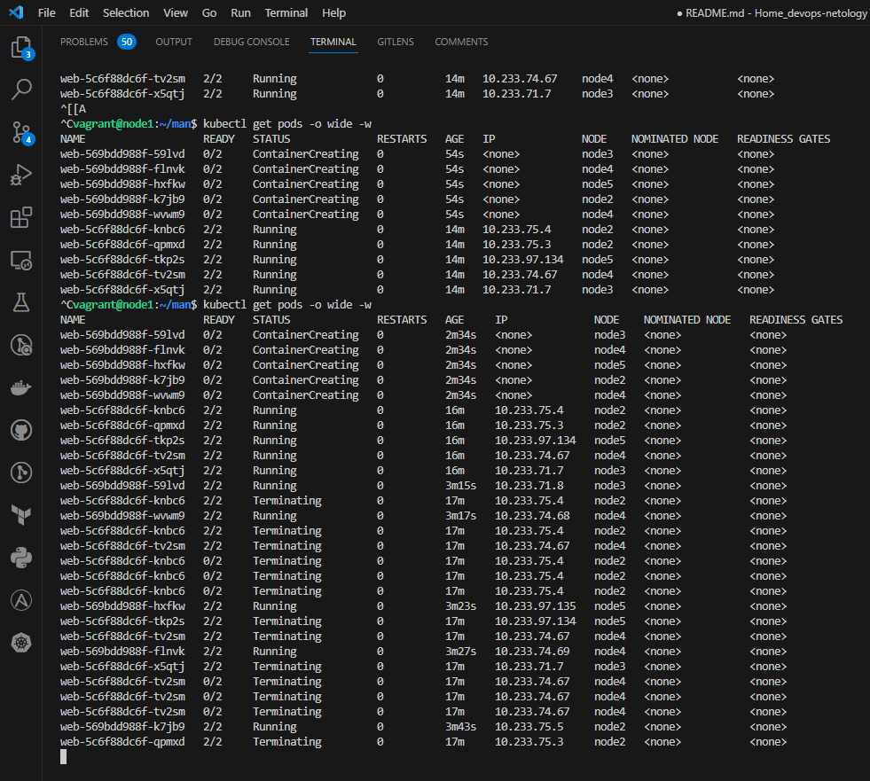
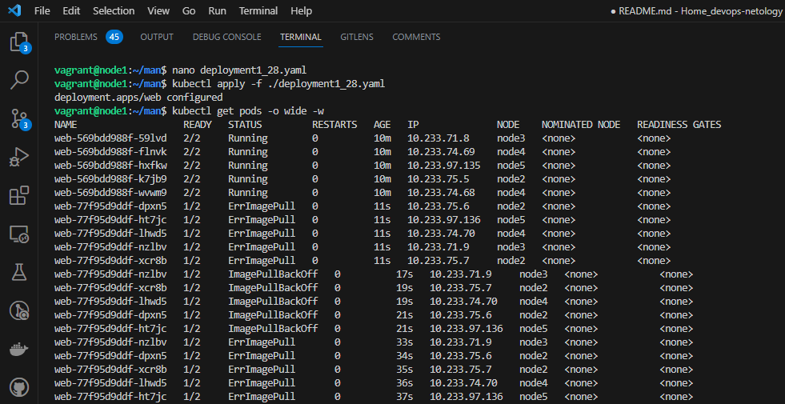
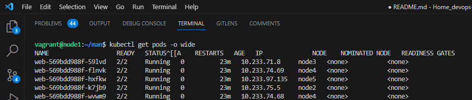

# Домашнее задание к занятию «Обновление приложений»

----

### Задание 1. Выбрать стратегию обновления приложения и описать ваш выбор

1. Имеется приложение, состоящее из нескольких реплик, которое требуется обновить.
2. Ресурсы, выделенные для приложения, ограничены, и нет возможности их увеличить.
3. Запас по ресурсам в менее загруженный момент времени составляет 20%.
4. Обновление мажорное, новые версии приложения не умеют работать со старыми.
5. Вам нужно объяснить свой выбор стратегии обновления приложения.

### Решение:

Предлагаю использовать стратегию обновления Rolling Update с указанием параметров maxSurge maxUnavailable для избежания ситуации с нехваткой ресурсов. Проводить обновление следует в менее загруженный момент времени сервиса. При данной стратегии(Rolling Update) k8s постепенно заменит все поды без ущерба производительности. И если что-то пойдет не так, можно будет быстро откатится к предыдущему состоянию.

### Задание 2. Обновить приложение

1. Создать deployment приложения с контейнерами nginx и multitool. Версию nginx взять 1.19. Количество реплик — 5.
2. Обновить версию nginx в приложении до версии 1.20, сократив время обновления до минимума. Приложение должно быть доступно.
3. Попытаться обновить nginx до версии 1.28, приложение должно оставаться доступным.
4. Откатиться после неудачного обновления.

### Решение:

Запускаем deployment с multitool и nginx из манифест файла: [deployment.yaml](./file/deployment.yaml)

```bash
vagrant@node1:~/man$ kubectl apply -f ./deployment.yaml
deployment.apps/web created

vagrant@node1:~/man$ kubectl get pods -o wide
NAME                   READY   STATUS    RESTARTS   AGE     IP              NODE    NOMINATED NODE   READINESS GATES
web-5c6f88dc6f-knbc6   2/2     Running   0          9m20s   10.233.75.4     node2   <none>           <none>
web-5c6f88dc6f-qpmxd   2/2     Running   0          9m20s   10.233.75.3     node2   <none>           <none>
web-5c6f88dc6f-tkp2s   2/2     Running   0          9m20s   10.233.97.134   node5   <none>           <none>
web-5c6f88dc6f-tv2sm   2/2     Running   0          9m20s   10.233.74.67    node4   <none>           <none>
web-5c6f88dc6f-x5qtj   2/2     Running   0          9m20s   10.233.71.7     node3   <none>           <none>
```
Обновляем до версии 1.20

```bash
vagrant@node1:~/man$ kubectl apply -f ./deployment1_20.yaml
deployment.apps/web configured
```

```bash
vagrant@node1:~/man$ kubectl get pods -o wide -w                                              
NAME                   READY   STATUS              RESTARTS   AGE   IP              NODE    NOMINATED NODE   READINESS GATES
web-569bdd988f-59lvd   0/2     ContainerCreating   0          54s   <none>          node3   <none>           <none>
web-569bdd988f-flnvk   0/2     ContainerCreating   0          54s   <none>          node4   <none>           <none>
web-569bdd988f-hxfkw   0/2     ContainerCreating   0          54s   <none>          node5   <none>           <none>
web-569bdd988f-k7jb9   0/2     ContainerCreating   0          54s   <none>          node2   <none>           <none>
web-569bdd988f-wvwm9   0/2     ContainerCreating   0          54s   <none>          node4   <none>           <none>
web-5c6f88dc6f-knbc6   2/2     Running             0          14m   10.233.75.4     node2   <none>           <none>
web-5c6f88dc6f-qpmxd   2/2     Running             0          14m   10.233.75.3     node2   <none>           <none>
web-5c6f88dc6f-tkp2s   2/2     Running             0          14m   10.233.97.134   node5   <none>           <none>
web-5c6f88dc6f-tv2sm   2/2     Running             0          14m   10.233.74.67    node4   <none>           <none>
web-5c6f88dc6f-x5qtj   2/2     Running             0          14m   10.233.71.7     node3   <none>           <none>

```
Cначала были созданы поды с новой версией приложений и только после запуска подов с новой версией начали удаляться поды со старой версией.



Обновляем до версии 1.28

```bash
vagrant@node1:~/man$ kubectl apply -f ./deployment1_28.yaml
deployment.apps/web configured
vagrant@node1:~/man$ kubectl get pods -o wide -w
NAME                   READY   STATUS         RESTARTS   AGE   IP              NODE    NOMINATED NODE   READINESS GATES
web-569bdd988f-59lvd   2/2     Running        0          10m   10.233.71.8     node3   <none>           <none>
web-569bdd988f-flnvk   2/2     Running        0          10m   10.233.74.69    node4   <none>           <none>
web-569bdd988f-hxfkw   2/2     Running        0          10m   10.233.97.135   node5   <none>           <none>
web-569bdd988f-k7jb9   2/2     Running        0          10m   10.233.75.5     node2   <none>           <none>
web-569bdd988f-wvwm9   2/2     Running        0          10m   10.233.74.68    node4   <none>           <none>
web-77f95d9ddf-dpxn5   1/2     ErrImagePull   0          11s   10.233.75.6     node2   <none>           <none>
web-77f95d9ddf-ht7jc   1/2     ErrImagePull   0          11s   10.233.97.136   node5   <none>           <none>
web-77f95d9ddf-lhwd5   1/2     ErrImagePull   0          11s   10.233.74.70    node4   <none>           <none>
web-77f95d9ddf-nzlbv   1/2     ErrImagePull   0          11s   10.233.71.9     node3   <none>           <none>
web-77f95d9ddf-xcr8b   1/2     ErrImagePull   0          11s   10.233.75.7     node2   <none>           <none>
web-77f95d9ddf-nzlbv   1/2     ImagePullBackOff   0          17s   10.233.71.9     node3   <none>           <none>
web-77f95d9ddf-xcr8b   1/2     ImagePullBackOff   0          19s   10.233.75.7     node2   <none>           <none>
web-77f95d9ddf-lhwd5   1/2     ImagePullBackOff   0          19s   10.233.74.70    node4   <none>           <none>
web-77f95d9ddf-dpxn5   1/2     ImagePullBackOff   0          21s   10.233.75.6     node2   <none>           <none>
web-77f95d9ddf-ht7jc   1/2     ImagePullBackOff   0          21s   10.233.97.136   node5   <none>           <none>
web-77f95d9ddf-nzlbv   1/2     ErrImagePull       0          33s   10.233.71.9     node3   <none>           <none>
web-77f95d9ddf-dpxn5   1/2     ErrImagePull       0          34s   10.233.75.6     node2   <none>           <none>
web-77f95d9ddf-xcr8b   1/2     ErrImagePull       0          35s   10.233.75.7     node2   <none>           <none>
web-77f95d9ddf-lhwd5   1/2     ErrImagePull       0          36s   10.233.74.70    node4   <none>           <none>
web-77f95d9ddf-ht7jc   1/2     ErrImagePull       0          37s   10.233.97.136   node5   <none>           <none>
```

Новые поды с новой версией 1.28 упали в ошибку при попытке запуска. При этом поды со старой версией по прежнему работают.



Выполняем откат на предыдущую версию:

```bash
vagrant@node1:~/man$ kubectl rollout undo deployment/web
deployment.apps/web rolled back
vagrant@node1:~/man$ kubectl get pods -o wide
NAME                   READY   STATUS    RESTARTS   AGE   IP              NODE    NOMINATED NODE   READINESS GATES
web-569bdd988f-59lvd   2/2     Running   0          20m   10.233.71.8     node3   <none>           <none>
web-569bdd988f-flnvk   2/2     Running   0          20m   10.233.74.69    node4   <none>           <none>
web-569bdd988f-hxfkw   2/2     Running   0          20m   10.233.97.135   node5   <none>           <none>
web-569bdd988f-k7jb9   2/2     Running   0          20m   10.233.75.5     node2   <none>           <none>
web-569bdd988f-wvwm9   2/2     Running   0          20m   10.233.74.68    node4   <none>           <none>
```
После выполнения команды ```kubectl rollout undo deployment/web``` поды с новой, несуществующей, версией nginx были удалены, а поды с предыдущей, рабочей в работе:



----