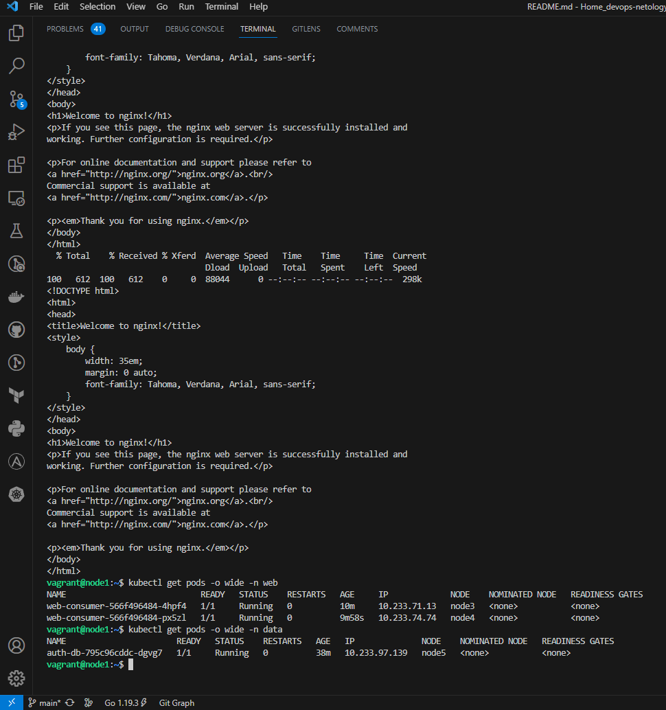

# Домашнее задание к занятию Troubleshooting

### Цель задания

Устранить неисправности при деплое приложения.

### Чеклист готовности к домашнему заданию

1. Кластер K8s.

### Задание. При деплое приложение web-consumer не может подключиться к auth-db. Необходимо это исправить

1. Установить приложение по команде:
```shell
kubectl apply -f https://raw.githubusercontent.com/netology-code/kuber-homeworks/main/3.5/files/task.yaml
```
2. Выявить проблему и описать.
3. Исправить проблему, описать, что сделано.
4. Продемонстрировать, что проблема решена.

### Решение:

Развернул кластер на Oracle VM VirtualBox 5 node с помощью kubespray:

```shell
vagrant@node1:~/man$ kubectl get nodes -A
NAME    STATUS   ROLES           AGE   VERSION
node1   Ready    control-plane   4d    v1.26.7
node2   Ready    <none>          4d    v1.26.7
node3   Ready    <none>          4d    v1.26.7
node4   Ready    <none>          4d    v1.26.7
node5   Ready    <none>          4d    v1.26.7
```

```bash
vagrant@node1:~/man$ kubectl get pods -o wide -n kube-system
NAME                                      READY   STATUS    RESTARTS       AGE   IP               NODE    NOMINATED NODE   READINESS GATES
calico-kube-controllers-6dfcdfb99-cw2m7   1/1     Running   10 (32m ago)   4d    10.233.97.137    node5   <none>           <none>
calico-node-4k4wq                         1/1     Running   6 (32m ago)    4d    192.168.1.10     node1   <none>           <none>
calico-node-87gpl                         1/1     Running   4 (32m ago)    4d    192.168.1.40     node4   <none>           <none>
calico-node-95fbg                         1/1     Running   3 (32m ago)    4d    192.168.1.20     node2   <none>           <none>
calico-node-9knbm                         1/1     Running   4 (32m ago)    4d    192.168.1.30     node3   <none>           <none>
calico-node-cxq69                         1/1     Running   3 (32m ago)    4d    192.168.1.50     node5   <none>           <none>
coredns-645b46f4b6-gf2td                  1/1     Running   3 (32m ago)    4d    10.233.71.10     node3   <none>           <none>
coredns-645b46f4b6-vnjx5                  1/1     Running   7 (32m ago)    4d    10.233.102.143   node1   <none>           <none>
dns-autoscaler-659b8c48cb-ffv94           1/1     Running   7 (32m ago)    4d    10.233.102.144   node1   <none>           <none>
kube-apiserver-node1                      1/1     Running   10 (32m ago)   4d    192.168.1.10     node1   <none>           <none>
kube-controller-manager-node1             1/1     Running   19 (32m ago)   4d    192.168.1.10     node1   <none>           <none>
kube-proxy-flnkm                          1/1     Running   4 (32m ago)    4d    192.168.1.40     node4   <none>           <none>
kube-proxy-fxfgn                          1/1     Running   4 (32m ago)    4d    192.168.1.30     node3   <none>           <none>
kube-proxy-kgxwd                          1/1     Running   4 (32m ago)    4d    192.168.1.50     node5   <none>           <none>
kube-proxy-q8c97                          1/1     Running   3 (32m ago)    4d    192.168.1.20     node2   <none>           <none>
kube-proxy-w79s7                          1/1     Running   8 (32m ago)    4d    192.168.1.10     node1   <none>           <none>
kube-scheduler-node1                      1/1     Running   20 (32m ago)   4d    192.168.1.10     node1   <none>           <none>
nginx-proxy-node2                         1/1     Running   3 (32m ago)    4d    192.168.1.20     node2   <none>           <none>
nginx-proxy-node3                         1/1     Running   4 (32m ago)    4d    192.168.1.30     node3   <none>           <none>
nginx-proxy-node4                         1/1     Running   4 (32m ago)    4d    192.168.1.40     node4   <none>           <none>
nginx-proxy-node5                         1/1     Running   4 (32m ago)    4d    192.168.1.50     node5   <none>           <none>
nodelocaldns-clclf                        1/1     Running   12 (31m ago)   4d    192.168.1.10     node1   <none>           <none>
nodelocaldns-dmsrh                        1/1     Running   4 (32m ago)    4d    192.168.1.50     node5   <none>           <none>
nodelocaldns-pw2pw                        1/1     Running   5 (32m ago)    4d    192.168.1.20     node2   <none>           <none>
nodelocaldns-s77q9                        1/1     Running   4 (32m ago)    4d    192.168.1.30     node3   <none>           <none>
nodelocaldns-wdtvz                        1/1     Running   6 (32m ago)    4d    192.168.1.40     node4   <none>           <none>
```

Установливаем приложение по команде:

```shell
kubectl apply -f https://raw.githubusercontent.com/netology-code/kuber-homeworks/main/3.5/files/task.yaml
```

```bash
vagrant@node1:~$ kubectl apply -f https://raw.githubusercontent.com/netology-code/kuber-homeworks/main/3.5/files/task.yaml
Error from server (NotFound): error when creating "https://raw.githubusercontent.com/netology-code/kuber-homeworks/main/3.5/files/task.yaml": namespaces "web" not found
Error from server (NotFound): error when creating "https://raw.githubusercontent.com/netology-code/kuber-homeworks/main/3.5/files/task.yaml": namespaces "data" not found
Error from server (NotFound): error when creating "https://raw.githubusercontent.com/netology-code/kuber-homeworks/main/3.5/files/task.yaml": namespaces "data" not found
vagrant@node1:~$ 
```
Судя по выводу не найдены:   ```namespaces "web" not found``` и ```namespaces "data" not found ```
Для решения проблемы создаём эти namespaces:

```bash
vagrant@node1:~$ kubectl create namespace web
namespace/web created

vagrant@node1:~$ kubectl create namespace data
namespace/data created

vagrant@node1:~$ kubectl get namespace
NAME              STATUS   AGE
data              Active   42s
default           Active   4d
kube-node-lease   Active   4d
kube-public       Active   4d
kube-system       Active   4d
web               Active   2m15s
```

Повторно применяем манифест файл для установки приложения:

```bash
vagrant@node1:~$ kubectl apply -f https://raw.githubusercontent.com/netology-code/kuber-homeworks/main/3.5/files/task.yaml
deployment.apps/web-consumer created
deployment.apps/auth-db created
service/auth-db created
```

Поды в неймспейсах wed и data успешно запущены:

```bash
vagrant@node1:~$ kubectl get pods -o wide -n web
NAME                            READY   STATUS    RESTARTS   AGE     IP             NODE    NOMINATED NODE   READINESS GATES
web-consumer-577d47b97d-6t852   1/1     Running   0          2m19s   10.233.74.73   node4   <none>           <none>
web-consumer-577d47b97d-w4cnh   1/1     Running   0          2m19s   10.233.75.10   node2   <none>           <none>

vagrant@node1:~$ kubectl get pods -o wide -n data
NAME                       READY   STATUS    RESTARTS   AGE     IP              NODE    NOMINATED NODE   READINESS GATES
auth-db-795c96cddc-dgvg7   1/1     Running   0          2m25s   10.233.97.139   node5   <none>           <none>
```

Смотрим логи, что бы убедиться, что проблем нет, однако проблемы есть.
В web-consumer найдена ошибка связанная с невозможностью определить ip адрес имени "auth-db":

```bash
vagrant@node1:~$ kubectl logs web-consumer-577d47b97d-6t852 -n web
curl: (6) Couldn't resolve host 'auth-db'
curl: (6) Couldn't resolve host 'auth-db'
curl: (6) Couldn't resolve host 'auth-db'
curl: (6) Couldn't resolve host 'auth-db'
curl: (6) Couldn't resolve host 'auth-db'
curl: (6) Couldn't resolve host 'auth-db'
curl: (6) Couldn't resolve host 'auth-db'
curl: (6) Couldn't resolve host 'auth-db'
curl: (6) Couldn't resolve host 'auth-db'
curl: (6) Couldn't resolve host 'auth-db'
curl: (6) Couldn't resolve host 'auth-db'
```

```bash
vagrant@node1:~$ kubectl logs web-consumer-577d47b97d-w4cnh -n web
curl: (6) Couldn't resolve host 'auth-db'
curl: (6) Couldn't resolve host 'auth-db'
curl: (6) Couldn't resolve host 'auth-db'
curl: (6) Couldn't resolve host 'auth-db'
curl: (6) Couldn't resolve host 'auth-db'
curl: (6) Couldn't resolve host 'auth-db'
curl: (6) Couldn't resolve host 'auth-db'
curl: (6) Couldn't resolve host 'auth-db'
curl: (6) Couldn't resolve host 'auth-db'
curl: (6) Couldn't resolve host 'auth-db'
curl: (6) Couldn't resolve host 'auth-db'
curl: (6) Couldn't resolve host 'auth-db'
```

Это связанно с тем что web-consumer создан в namespace web, а сервис с именем auth-db и поды к которым он предоставляет доступ находятся в namespace data.
То есть разная подсеть: web - 10.233.74.0 и data - 10.233.97.0

Для решения проблемы редактируем деплоймент web-consumer: ``` - while true; do curl auth-db.data; sleep 5; done ```
После применения пересоздаются поды:

```bash
vagrant@node1:~$ kubectl edit deployment web-consumer -n web
deployment.apps/web-consumer edited

vagrant@node1:~$ kubectl get pods -o wide -n web
NAME                            READY   STATUS        RESTARTS   AGE   IP             NODE    NOMINATED NODE   READINESS GATES
web-consumer-566f496484-4hpf4   1/1     Running       0          8s    10.233.71.13   node3   <none>           <none>
web-consumer-566f496484-px5zl   1/1     Running       0          2s    10.233.74.74   node4   <none>           <none>
web-consumer-577d47b97d-6t852   1/1     Terminating   0          27m   10.233.74.73   node4   <none>           <none>
web-consumer-577d47b97d-w4cnh   1/1     Terminating   0          27m   10.233.75.10   node2   <none>           <none>
```

В новых подах команда curl внутри web-consumer теперь успешно отрабатывает:

```bash
vagrant@node1:~$ kubectl logs web-consumer-566f496484-4hpf4 -n web
% Total    % Received % Xferd  Average Speed   Time    Time     Time  Current
                                 Dload  Upload   Total   Spent    Left  Speed
100   612  100   612    0     0  88044      0 --:--:-- --:--:-- --:--:--  298k
<!DOCTYPE html>
<html>
<head>
<title>Welcome to nginx!</title>
<style>
    body {
        width: 35em;
        margin: 0 auto;
        font-family: Tahoma, Verdana, Arial, sans-serif;
    }
</style>
</head>
<body>
<h1>Welcome to nginx!</h1>
<p>If you see this page, the nginx web server is successfully installed and
working. Further configuration is required.</p>

<p>For online documentation and support please refer to
<a href="http://nginx.org/">nginx.org</a>.<br/>
Commercial support is available at
<a href="http://nginx.com/">nginx.com</a>.</p>

<p><em>Thank you for using nginx.</em></p>
</body>
</html>
```



----