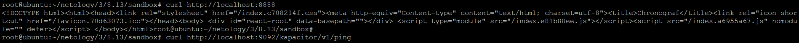
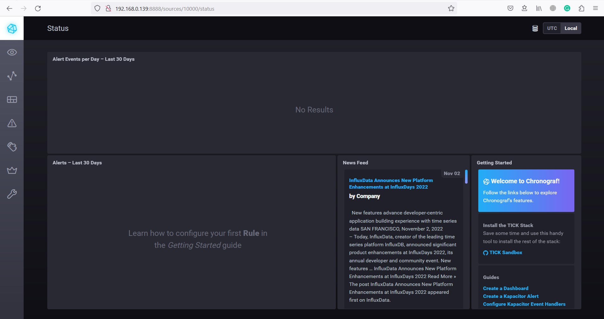
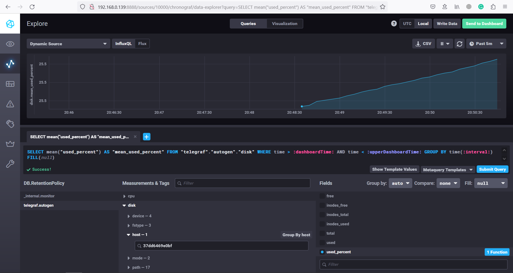
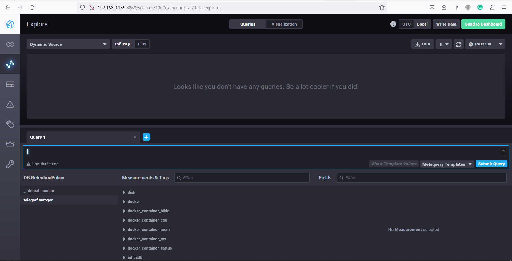

# Домашнее задание к занятию "13.Системы мониторинга"

## Обязательные задания

1. Вас пригласили настроить мониторинг на проект. На онбординге вам рассказали, что проект представляет из себя 
платформу для вычислений с выдачей текстовых отчетов, которые сохраняются на диск. Взаимодействие с платформой 
осуществляется по протоколу http. Также вам отметили, что вычисления загружают ЦПУ. Какой минимальный набор метрик вы
выведите в мониторинг и почему?

### Решение:

- Я бы предложил мониторить нагрузку на ЦП - текущая нагрузка и за сутки, поскольку сервер используется для вычислений. 
- Так же необходимо мониторить свободное место на дисках, скорость чтения/записи и IOWait к диску, поскольку сказано, что текстовые отчёты сохраняются на диск. 
- Кроме того необходимо мониторить сетевой трафик на текущий момент и статистику за последние сутки поскольку взаимодействие происходит оп сети.

#

2. Менеджер продукта посмотрев на ваши метрики сказал, что ему непонятно что такое RAM/inodes/CPUla. Также он сказал, что хочет понимать, насколько мы выполняем свои обязанности перед клиентами и какое качество обслуживания. Что вы можете ему предложить?

### Решение:

- Я бы предложил отдавать клиенту не более 5% 4xx и 5xx ответов, а также должны отвечать не дольше 3-х секунд. Для этого необходимо будет собирать с серверов такие метрики как коды ответов и скорость ответа, а потом исходя из статистики за определенный промежуток времени подсчитывать показатели. Например для кодов ответов: (Количество 4хх ответов + количество 5xx ответов) / (Общее кол-во ответов).

#

3. Вашей DevOps команде в этом году не выделили финансирование на построение системы сбора логов. Разработчики в свою очередь хотят видеть все ошибки, которые выдают их приложения. Какое решение вы можете предпринять в этой ситуации, чтобы разработчики получали ошибки приложения?

### Решение:

- Можно воспользоваться бесплатными облачными сервисами хранения метрик, например ElasticSearch.

#

4. Вы, как опытный SRE, сделали мониторинг, куда вывели отображения выполнения SLA=99% по http кодам ответов. Вычисляете этот параметр по следующей формуле: summ_2xx_requests/summ_all_requests. Данный параметр не поднимается выше 70%, но при этом в вашей системе нет кодов ответа 5xx и 4xx. Где у вас ошибка?

### Решение:

- Необходимо мониторить не 2хх коды, а наоборот коды ошибок 4хх и 5хх и сопоставлять их количество с общим числом ответов.

#

5. Опишите основные плюсы и минусы pull и push систем мониторинга.

### Решение:

Плюсы и минусы систем:
   Система | Плюсы | Минусы
   ------- | ----- | ------
   Push | Проще отправлять данные в различные системы мониторинга, за счёт этого можно организовать дублируемость данных без настройки репликации между серверами. Возможность более гибко настраивать собираемые метрики на каждом отдельном сервере. | Придётся устанавливать и настраивать каждый агент отдельно.
   Pull | Возможность централизованной настройки агентов, можно контроллировать от каких хостов получать данные, а от каких нет. | Более централизованный подход к управлению лишает гибкости в настройках каждого отдельного агента. Репликацию данных, в случае нескольких управляющих узлов необходимо обеспечивать на уровне самих узлов.

#

6. Какие из ниже перечисленных систем относятся к push модели, а какие к pull? А может есть гибридные?

    - Prometheus 
    - TICK
    - Zabbix
    - VictoriaMetrics
    - Nagios

    ### Решение:

    Система | Тип системы
   -- | -----------
   Prometheus | pull
   TICK | push
   Zabbix | pull/push
   VictoriaMetrics | push
   Nagios | pull

#

7. Склонируйте себе [репозиторий](https://github.com/influxdata/sandbox/tree/master) и запустите TICK-стэк, используя технологии docker и docker-compose.

В виде решения на это упражнение приведите скриншот веб-интерфейса ПО chronograf (`http://localhost:8888`). 

P.S.: если при запуске некоторые контейнеры будут падать с ошибкой - проставьте им режим `Z`, например
`./data:/var/lib:Z`

### Решение:





#

8. Перейдите в веб-интерфейс Chronograf (`http://localhost:8888`) и откройте вкладку `Data explorer`.

    - Нажмите на кнопку `Add a query`
    - Изучите вывод интерфейса и выберите БД `telegraf.autogen`
    - В `measurments` выберите mem->host->telegraf_container_id , а в `fields` выберите used_percent. 
    Внизу появится график утилизации оперативной памяти в контейнере telegraf.
    - Вверху вы можете увидеть запрос, аналогичный SQL-синтаксису. 
    Поэкспериментируйте с запросом, попробуйте изменить группировку и интервал наблюдений.

Для выполнения задания приведите скриншот с отображением метрик утилизации места на диске 
(disk->host->telegraf_container_id) из веб-интерфейса.

### Решение:



#

9. Изучите список [telegraf inputs](https://github.com/influxdata/telegraf/tree/master/plugins/inputs). 
Добавьте в конфигурацию telegraf следующий плагин - [docker](https://github.com/influxdata/telegraf/tree/master/plugins/inputs/docker):

```
[[inputs.docker]]
  endpoint = "unix:///var/run/docker.sock"
```

Дополнительно вам может потребоваться донастройка контейнера telegraf в `docker-compose.yml` дополнительного volume и режима privileged:

```
  telegraf:
    image: telegraf:1.4.0
    privileged: true
    volumes:
      - ./etc/telegraf.conf:/etc/telegraf/telegraf.conf:Z
      - /var/run/docker.sock:/var/run/docker.sock:Z
    links:
      - influxdb
    ports:
      - "8092:8092/udp"
      - "8094:8094"
      - "8125:8125/udp"
```

### Решение:



---
