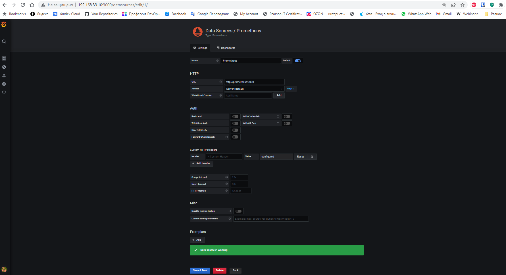
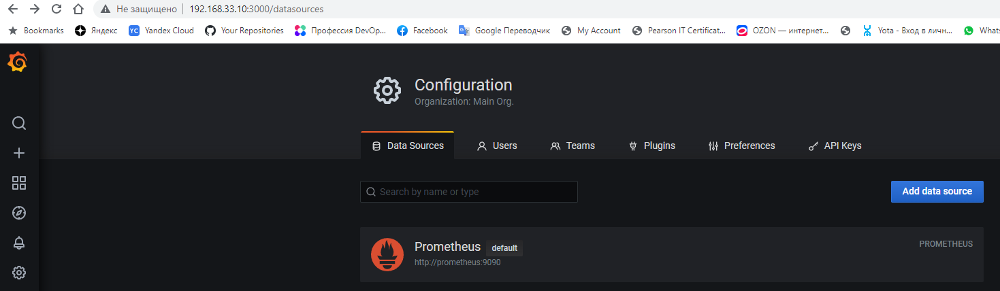

# Домашнее задание к занятию 14 «Средство визуализации Grafana»

## Обязательные задания

### Задание 1

1. Используя директорию [help](./help) внутри этого домашнего задания, запустите связку prometheus-grafana.
1. Зайдите в веб-интерфейс grafana, используя авторизационные данные, указанные в манифесте docker-compose.
1. Подключите поднятый вами prometheus, как источник данных.
1. Решение домашнего задания — скриншот веб-интерфейса grafana со списком подключенных Datasource.

### Решение:

<details><summary>vagrant@vagrant:~/help$ sudo docker-compose up -d</summary>

```bash
vagrant@vagrant:~/help$ sudo docker-compose up -d
[+] Running 26/14
 ✔ nodeexporter 3 layers [⣿⣿⣿]      0B/0B      Pulled                                                                 51.2s 
 ✔ prometheus 12 layers [⣿⣿⣿⣿⣿⣿⣿⣿⣿⣿⣿⣿]      0B/0B      Pulled                                                        132.1s 
 ✔ grafana 8 layers [⣿⣿⣿⣿⣿⣿⣿⣿]      0B/0B      Pulled                                                                119.1s 


[+] Building 0.0s (0/0)
[+] Running 5/5
 ✔ Network help_monitor-net    Created                                                                                 0.1s
 ✔ Volume "help_grafana_data"  Created                                                                                 0.0s
 ✔ Container nodeexporter      Started                                                                                17.8s
 ✔ Container prometheus        Started                                                                                 1.1s
 ✔ Container grafana           Started                                                                                 1.6s
```
</details>

<details><summary>vagrant@vagrant:~/help$ sudo docker ps -a</summary>

```bash
vagrant@vagrant:~/help$ sudo docker ps -a
CONTAINER ID   IMAGE                       COMMAND                  CREATED         STATUS              PORTS                                       NAMES
d3ac68c7bb29   grafana/grafana:7.4.0       "/run.sh"                2 minutes ago   Up About a minute   0.0.0.0:3000->3000/tcp, :::3000->3000/tcp   grafana
36773a05c391   prom/prometheus:v2.24.1     "/bin/prometheus --c…"   2 minutes ago   Up About a minute   9090/tcp                                    prometheus
546c676250fa   prom/node-exporter:v1.0.1   "/bin/node_exporter …"   2 minutes ago   Up About a minute   9100/tcp                                    nodeexporter
```
</details>

#



#



## Задание 2

Создайте Dashboard и в ней создайте Panels:

- утилизация CPU для nodeexporter (в процентах, 100-idle);
- CPULA 1/5/15;
- количество свободной оперативной памяти;
- количество места на файловой системе.

Для решения этого задания приведите promql-запросы для выдачи этих метрик, а также скриншот получившейся Dashboard.

### Решение:

Утилизация CPU: 
```100 - (avg by (instance) (irate(node_cpu_seconds_total{instance="node_exporter:9100",mode="idle"}[15s])) * 100)```  
   CPULA 1:
    ```node_load1{instance="node_exporter:9100"}```  
   CPULA 5:
    ```node_load5{instance="node_exporter:9100"}```  
   CPULA 15:
    ```node_load15{instance="node_exporter:9100"}```  
   Свободная ОЗУ:
    ```node_memory_MemFree_bytes{instance="node_exporter:9100", job="prometheus"}```  
   Свободное место на файловой системе:
    ```node_filesystem_avail_bytes{device="/dev/sda2", instance="node_exporter:9100"}```


## Задание 3

1. Создайте для каждой Dashboard подходящее правило alert — можно обратиться к первой лекции в блоке «Мониторинг».
1. В качестве решения задания приведите скриншот вашей итоговой Dashboard.

### Решение:


## Задание 4

1. Сохраните ваш Dashboard.Для этого перейдите в настройки Dashboard, выберите в боковом меню «JSON MODEL». Далее скопируйте отображаемое json-содержимое в отдельный файл и сохраните его.
1. В качестве решения задания приведите листинг этого файла.

### Решение:

 [Dashboard](./my_dashboard.json)

---