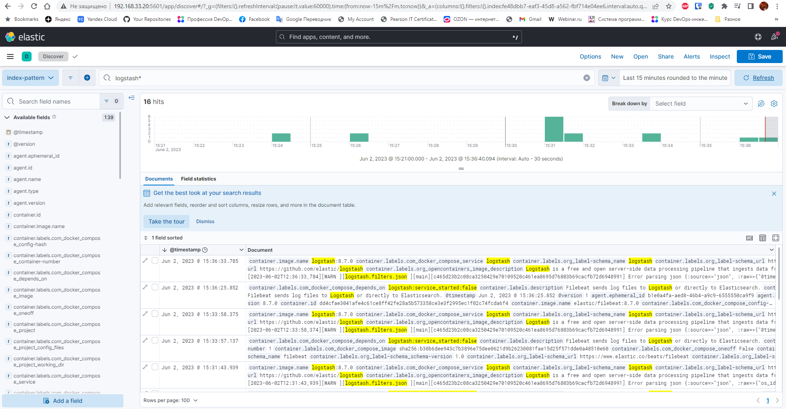

# Домашнее задание к занятию 15 «Система сбора логов Elastic Stack»

## Задание 1

Вам необходимо поднять в докере и связать между собой:

- elasticsearch (hot и warm ноды);
- logstash;
- kibana;
- filebeat.

Logstash следует сконфигурировать для приёма по tcp json-сообщений.

Filebeat следует сконфигурировать для отправки логов docker вашей системы в logstash.

В директории [help](./help) находится манифест docker-compose и конфигурации filebeat/logstash для быстрого 
выполнения этого задания.

Результатом выполнения задания должны быть:

- скриншот `docker ps` через 5 минут после старта всех контейнеров (их должно быть 5);
- скриншот интерфейса kibana;
- docker-compose манифест (если вы не использовали директорию help);
- ваши yml-конфигурации для стека (если вы не использовали директорию help).

### Решение:

<details><summary>vagrant@vagrant:~/help$ sudo docker-compose up -d</summary>

```bash
vagrant@vagrant:~/help$ sudo docker-compose up -d
[+] Running 56/6
✔ es-warm 10 layers [⣿⣿⣿⣿⣿⣿⣿⣿⣿⣿]      0B/0B      Pulled
✔ kibana 12 layers [⣿⣿⣿⣿⣿⣿⣿⣿⣿⣿⣿⣿]      0B/0B      Pulled
✔ logstash 11 layers [⣿⣿⣿⣿⣿⣿⣿⣿⣿⣿⣿]      0B/0B      Pulled
✔ filebeat 12 layers [⣿⣿⣿⣿⣿⣿⣿⣿⣿⣿⣿⣿]      0B/0B      Pulled
✔ Volume "help_data02"  Created
✔ Volume "help_data01"  Created
✔ Container es-warm     Started
✔ Container some_app    Started
✔ Container es-hot      Started
✔ Container logstash    Started
✔ Container kibana      Started
✔ Container filebeat    Started

```
</details>

<details><summary>vagrant@vagrant:~/help$ sudo docker ps -a</summary>

```bash
vagrant@vagrant:~/help$ sudo docker ps -a
CONTAINER ID   IMAGE                    COMMAND                  CREATED         STATUS         PORTS                                                                                            NAMES
dd4cfae3041a   elastic/filebeat:8.7.0   "/usr/bin/tini -- /u…"   9 minutes ago   Up 9 minutes                                                                                                    filebeat
22774143c749   kibana:8.7.0             "/bin/tini -- /usr/l…"   9 minutes ago   Up 9 minutes   0.0.0.0:5601->5601/tcp, :::5601->5601/tcp                                                        kibana
cc12280ac46d   logstash:8.7.0           "/usr/local/bin/dock…"   9 minutes ago   Up 9 minutes   0.0.0.0:5044->5044/tcp, :::5044->5044/tcp, 0.0.0.0:5046->5046/tcp, :::5046->5046/tcp, 9600/tcp   logstash
4ccae78d531b   elasticsearch:8.7.0      "/bin/tini -- /usr/l…"   9 minutes ago   Up 9 minutes   0.0.0.0:9200->9200/tcp, :::9200->9200/tcp, 9300/tcp                                              es-hot
3d4ea5f39df3   elasticsearch:8.7.0      "/bin/tini -- /usr/l…"   9 minutes ago   Up 9 minutes   9200/tcp, 9300/tcp                                                                               es-warm
40befe194af3   python:3.9-alpine        "python3 /opt/run.py"    9 minutes ago   Up 9 minutes                                                                                                    some_app

```
</details>

#


## Задание 2

Перейдите в меню [создания index-patterns  в kibana](http://localhost:5601/app/management/kibana/indexPatterns/create) и создайте несколько index-patterns из имеющихся.

Перейдите в меню просмотра логов в kibana (Discover) и самостоятельно изучите, как отображаются логи и как производить поиск по логам.

В манифесте директории help также приведенно dummy-приложение, которое генерирует рандомные события в stdout-контейнера.
Эти логи должны порождать индекс logstash-* в elasticsearch. Если этого индекса нет — воспользуйтесь советами и источниками из раздела «Дополнительные ссылки» этого задания.


### Решение:

Изучил как отображаются логи и как производить поиск по логам.



---