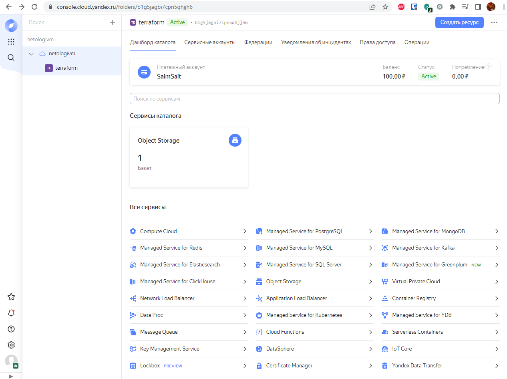
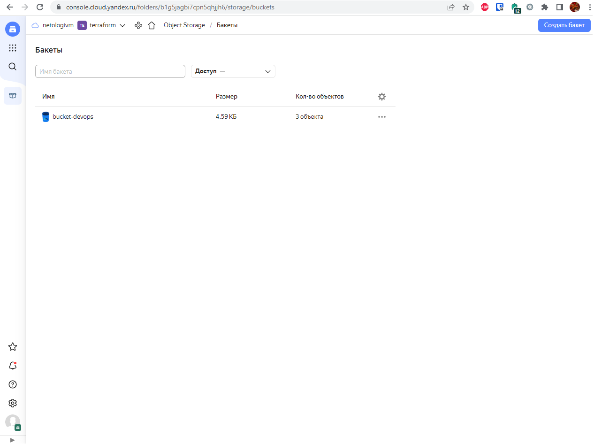
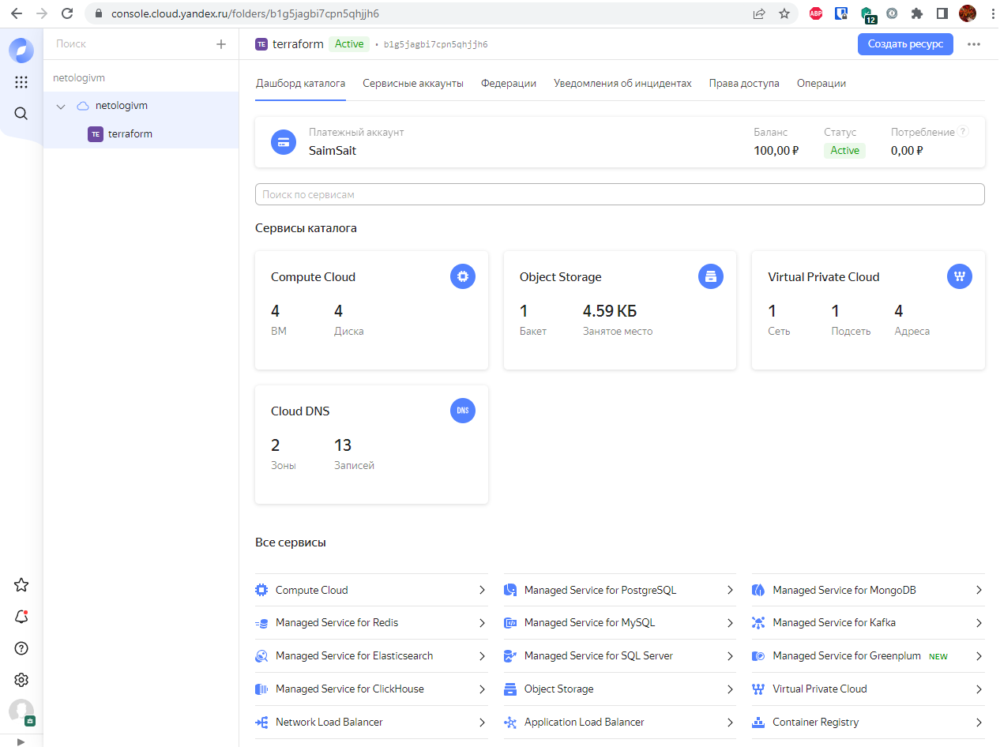
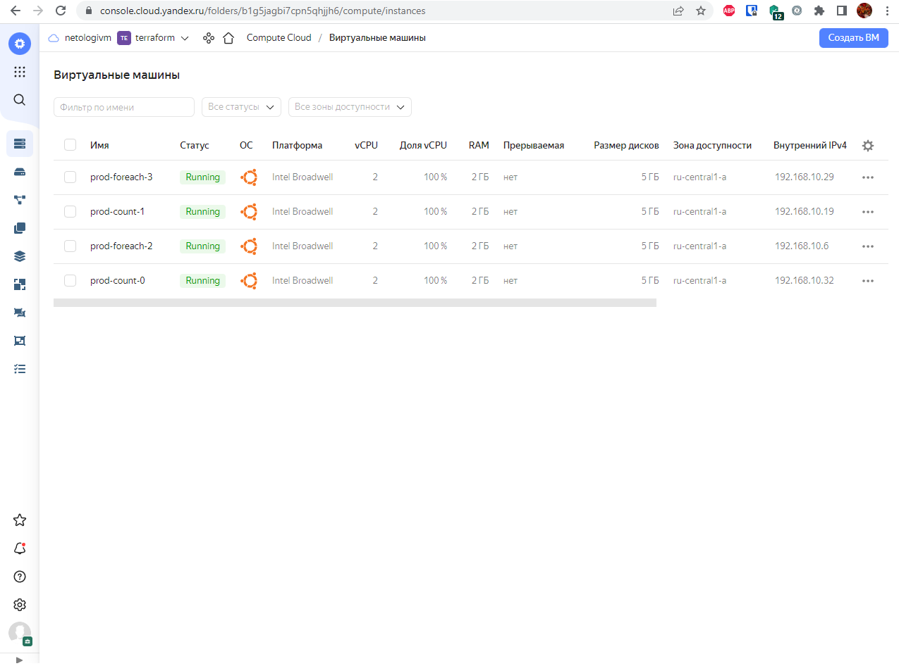

# Домашнее задание к занятию "7.3. Основы и принцип работы Терраформ"

## Задача 1. Создадим бэкэнд в S3 (необязательно, но крайне желательно).

Если в рамках предыдущего задания у вас уже есть аккаунт AWS, то давайте продолжим знакомство со взаимодействием
терраформа и aws. 

1. Создайте s3 бакет, iam роль и пользователя от которого будет работать терраформ. Можно создать отдельного пользователя,
а можно использовать созданного в рамках предыдущего задания, просто добавьте ему необходимы права, как описано 
[здесь](https://www.terraform.io/docs/backends/types/s3.html).
1. Зарегистрируйте бэкэнд в терраформ проекте как описано по ссылке выше. 

**Решение:**



## Задача 2. Инициализируем проект и создаем воркспейсы. 

1. Выполните `terraform init`:
    * если был создан бэкэнд в S3, то терраформ создат файл стейтов в S3 и запись в таблице 
dynamodb.
    * иначе будет создан локальный файл со стейтами.  
1. Создайте два воркспейса `stage` и `prod`.
1. В уже созданный `aws_instance` добавьте зависимость типа инстанса от вокспейса, что бы в разных ворскспейсах 
использовались разные `instance_type`.
1. Добавим `count`. Для `stage` должен создаться один экземпляр `ec2`, а для `prod` два. 
1. Создайте рядом еще один `aws_instance`, но теперь определите их количество при помощи `for_each`, а не `count`.
1. Что бы при изменении типа инстанса не возникло ситуации, когда не будет ни одного инстанса добавьте параметр
жизненного цикла `create_before_destroy = true` в один из рессурсов `aws_instance`.
1. При желании поэкспериментируйте с другими параметрами и рессурсами.

В виде результата работы пришлите:
* Вывод команды `terraform workspace list`.
* Вывод команды `terraform plan` для воркспейса `prod`.  

---

**Решение:**

* Вывод команды `terraform workspace list`:

```console
vagrant@vagrant:~/terraform$ terraform workspace list
  default
* prod
  stage
```
* Вывод команды `terraform plan` для воркспейса `prod` 
* (тут я позволил себе заменить `terraform plan` на `terraform apply -auto-approve`):

```console
vagrant@vagrant:~/terraform$ terraform apply -auto-approve

Terraform used the selected providers to generate the following execution plan. Resource actions are indicated with the following symbols:
  + create

Terraform will perform the following actions:

  # yandex_compute_instance.vm-1-count[0] will be created
  + resource "yandex_compute_instance" "vm-1-count" {
      + created_at                = (known after apply)
      + folder_id                 = (known after apply)
      + fqdn                      = (known after apply)
      + hostname                  = (known after apply)
      + id                        = (known after apply)
      + metadata                  = {
          + "ssh-keys" = <<-EOT
                ubuntu:ssh-rsa AAAAB3NzaC1yc2EAAAADAQABAAABgQDIodANd2ZHAOfwtnlNrIy6NrbdpUwFqYWRuAIE6+HNeUss6tpGwgYcVcj3+/6hOBjz40AhLrqRGBKXk7y2chQmMlrrtuV5fowjNQ/BQ3y4Ox2VDxVQJ/oIFLt2dhf4vQTyy+pYXZH0zTX5WHCf0sG0UXSmDziN0afN0IAG5US5UYV7NjitlLepw21oRL7fe4Qrvy8yFjWNxFXppwrft1oLqwlJLgO3agAk4+wXYRUM6uieFuEmQGNudWtBCXnNePhrAiZh0cI16yi2Niu2dE7EKHdSTg0AWxqpVa6B+oc85+ioBaIsLK2moC1jCPm8SbFjYeWS22LbnVA5/YVqpJ6kFWa5f8T1vZXTwKmFbZcLQCxSAWzd82QusYHgW+mlyFj4313Fh2ocK6EhOKKiM4HWGcES3UudAiCXGIcvRbGzRg1atV133TgQswPIVS/jQEPantgmHwzbgWdLGo6om1U41PuNuJaNerYp+kfzWLz1Fpkwb2S1ZMH4JliFGqsa7ds= vagrant@vagrant
            EOT
        }
      + name                      = "prod-count-0"
      + network_acceleration_type = "standard"
      + platform_id               = "standard-v1"
      + service_account_id        = (known after apply)
      + status                    = (known after apply)
      + zone                      = (known after apply)

      + boot_disk {
          + auto_delete = true
          + device_name = (known after apply)
          + disk_id     = (known after apply)
          + mode        = (known after apply)

          + initialize_params {
              + block_size  = (known after apply)
              + description = (known after apply)
              + image_id    = "fd89ovh4ticpo40dkbvd"
              + name        = (known after apply)
              + size        = (known after apply)
              + snapshot_id = (known after apply)
              + type        = "network-hdd"
            }
        }

      + network_interface {
          + index              = (known after apply)
          + ip_address         = (known after apply)
          + ipv4               = true
          + ipv6               = (known after apply)
          + ipv6_address       = (known after apply)
          + mac_address        = (known after apply)
          + nat                = true
          + nat_ip_address     = (known after apply)
          + nat_ip_version     = (known after apply)
          + security_group_ids = (known after apply)
          + subnet_id          = (known after apply)
        }

      + placement_policy {
          + host_affinity_rules = (known after apply)
          + placement_group_id  = (known after apply)
        }

      + resources {
          + core_fraction = 100
          + cores         = 2
          + memory        = 2
        }

      + scheduling_policy {
          + preemptible = (known after apply)
        }
    }

  # yandex_compute_instance.vm-1-count[1] will be created
  + resource "yandex_compute_instance" "vm-1-count" {
      + created_at                = (known after apply)
      + folder_id                 = (known after apply)
      + fqdn                      = (known after apply)
      + hostname                  = (known after apply)
      + id                        = (known after apply)
      + metadata                  = {
          + "ssh-keys" = <<-EOT
                ubuntu:ssh-rsa AAAAB3NzaC1yc2EAAAADAQABAAABgQDIodANd2ZHAOfwtnlNrIy6NrbdpUwFqYWRuAIE6+HNeUss6tpGwgYcVcj3+/6hOBjz40AhLrqRGBKXk7y2chQmMlrrtuV5fowjNQ/BQ3y4Ox2VDxVQJ/oIFLt2dhf4vQTyy+pYXZH0zTX5WHCf0sG0UXSmDziN0afN0IAG5US5UYV7NjitlLepw21oRL7fe4Qrvy8yFjWNxFXppwrft1oLqwlJLgO3agAk4+wXYRUM6uieFuEmQGNudWtBCXnNePhrAiZh0cI16yi2Niu2dE7EKHdSTg0AWxqpVa6B+oc85+ioBaIsLK2moC1jCPm8SbFjYeWS22LbnVA5/YVqpJ6kFWa5f8T1vZXTwKmFbZcLQCxSAWzd82QusYHgW+mlyFj4313Fh2ocK6EhOKKiM4HWGcES3UudAiCXGIcvRbGzRg1atV133TgQswPIVS/jQEPantgmHwzbgWdLGo6om1U41PuNuJaNerYp+kfzWLz1Fpkwb2S1ZMH4JliFGqsa7ds= vagrant@vagrant
            EOT
        }
      + name                      = "prod-count-1"
      + network_acceleration_type = "standard"
      + platform_id               = "standard-v1"
      + service_account_id        = (known after apply)
      + status                    = (known after apply)
      + zone                      = (known after apply)

      + boot_disk {
          + auto_delete = true
          + device_name = (known after apply)
          + disk_id     = (known after apply)
          + mode        = (known after apply)

          + initialize_params {
              + block_size  = (known after apply)
              + description = (known after apply)
              + image_id    = "fd89ovh4ticpo40dkbvd"
              + name        = (known after apply)
              + size        = (known after apply)
              + snapshot_id = (known after apply)
              + type        = "network-hdd"
            }
        }

      + network_interface {
          + index              = (known after apply)
          + ip_address         = (known after apply)
          + ipv4               = true
          + ipv6               = (known after apply)
          + ipv6_address       = (known after apply)
          + mac_address        = (known after apply)
          + nat                = true
          + nat_ip_address     = (known after apply)
          + nat_ip_version     = (known after apply)
          + security_group_ids = (known after apply)
          + subnet_id          = (known after apply)
        }

      + placement_policy {
          + host_affinity_rules = (known after apply)
          + placement_group_id  = (known after apply)
        }

      + resources {
          + core_fraction = 100
          + cores         = 2
          + memory        = 2
        }

      + scheduling_policy {
          + preemptible = (known after apply)
        }
    }

  # yandex_compute_instance.vm-1-fe["2"] will be created
  + resource "yandex_compute_instance" "vm-1-fe" {
      + created_at                = (known after apply)
      + folder_id                 = (known after apply)
      + fqdn                      = (known after apply)
      + hostname                  = (known after apply)
      + id                        = (known after apply)
      + metadata                  = {
          + "ssh-keys" = <<-EOT
                ubuntu:ssh-rsa AAAAB3NzaC1yc2EAAAADAQABAAABgQDIodANd2ZHAOfwtnlNrIy6NrbdpUwFqYWRuAIE6+HNeUss6tpGwgYcVcj3+/6hOBjz40AhLrqRGBKXk7y2chQmMlrrtuV5fowjNQ/BQ3y4Ox2VDxVQJ/oIFLt2dhf4vQTyy+pYXZH0zTX5WHCf0sG0UXSmDziN0afN0IAG5US5UYV7NjitlLepw21oRL7fe4Qrvy8yFjWNxFXppwrft1oLqwlJLgO3agAk4+wXYRUM6uieFuEmQGNudWtBCXnNePhrAiZh0cI16yi2Niu2dE7EKHdSTg0AWxqpVa6B+oc85+ioBaIsLK2moC1jCPm8SbFjYeWS22LbnVA5/YVqpJ6kFWa5f8T1vZXTwKmFbZcLQCxSAWzd82QusYHgW+mlyFj4313Fh2ocK6EhOKKiM4HWGcES3UudAiCXGIcvRbGzRg1atV133TgQswPIVS/jQEPantgmHwzbgWdLGo6om1U41PuNuJaNerYp+kfzWLz1Fpkwb2S1ZMH4JliFGqsa7ds= vagrant@vagrant
            EOT
        }
      + name                      = "prod-foreach-2"
      + network_acceleration_type = "standard"
      + platform_id               = "standard-v1"
      + service_account_id        = (known after apply)
      + status                    = (known after apply)
      + zone                      = (known after apply)

      + boot_disk {
          + auto_delete = true
          + device_name = (known after apply)
          + disk_id     = (known after apply)
          + mode        = (known after apply)

          + initialize_params {
              + block_size  = (known after apply)
              + description = (known after apply)
              + image_id    = "fd89ovh4ticpo40dkbvd"
              + name        = (known after apply)
              + size        = (known after apply)
              + snapshot_id = (known after apply)
              + type        = "network-hdd"
            }
        }

      + network_interface {
          + index              = (known after apply)
          + ip_address         = (known after apply)
          + ipv4               = true
          + ipv6               = (known after apply)
          + ipv6_address       = (known after apply)
          + mac_address        = (known after apply)
          + nat                = true
          + nat_ip_address     = (known after apply)
          + nat_ip_version     = (known after apply)
          + security_group_ids = (known after apply)
          + subnet_id          = (known after apply)
        }

      + placement_policy {
          + host_affinity_rules = (known after apply)
          + placement_group_id  = (known after apply)
        }

      + resources {
          + core_fraction = 100
          + cores         = 2
          + memory        = 2
        }

      + scheduling_policy {
          + preemptible = (known after apply)
        }
    }

  # yandex_compute_instance.vm-1-fe["3"] will be created
  + resource "yandex_compute_instance" "vm-1-fe" {
      + created_at                = (known after apply)
      + folder_id                 = (known after apply)
      + fqdn                      = (known after apply)
      + hostname                  = (known after apply)
      + id                        = (known after apply)
      + metadata                  = {
          + "ssh-keys" = <<-EOT
                ubuntu:ssh-rsa AAAAB3NzaC1yc2EAAAADAQABAAABgQDIodANd2ZHAOfwtnlNrIy6NrbdpUwFqYWRuAIE6+HNeUss6tpGwgYcVcj3+/6hOBjz40AhLrqRGBKXk7y2chQmMlrrtuV5fowjNQ/BQ3y4Ox2VDxVQJ/oIFLt2dhf4vQTyy+pYXZH0zTX5WHCf0sG0UXSmDziN0afN0IAG5US5UYV7NjitlLepw21oRL7fe4Qrvy8yFjWNxFXppwrft1oLqwlJLgO3agAk4+wXYRUM6uieFuEmQGNudWtBCXnNePhrAiZh0cI16yi2Niu2dE7EKHdSTg0AWxqpVa6B+oc85+ioBaIsLK2moC1jCPm8SbFjYeWS22LbnVA5/YVqpJ6kFWa5f8T1vZXTwKmFbZcLQCxSAWzd82QusYHgW+mlyFj4313Fh2ocK6EhOKKiM4HWGcES3UudAiCXGIcvRbGzRg1atV133TgQswPIVS/jQEPantgmHwzbgWdLGo6om1U41PuNuJaNerYp+kfzWLz1Fpkwb2S1ZMH4JliFGqsa7ds= vagrant@vagrant
            EOT
        }
      + name                      = "prod-foreach-3"
      + network_acceleration_type = "standard"
      + platform_id               = "standard-v1"
      + service_account_id        = (known after apply)
      + status                    = (known after apply)
      + zone                      = (known after apply)

      + boot_disk {
          + auto_delete = true
          + device_name = (known after apply)
          + disk_id     = (known after apply)
          + mode        = (known after apply)

          + initialize_params {
              + block_size  = (known after apply)
              + description = (known after apply)
              + image_id    = "fd89ovh4ticpo40dkbvd"
              + name        = (known after apply)
              + size        = (known after apply)
              + snapshot_id = (known after apply)
              + type        = "network-hdd"
            }
        }

      + network_interface {
          + index              = (known after apply)
          + ip_address         = (known after apply)
          + ipv4               = true
          + ipv6               = (known after apply)
          + ipv6_address       = (known after apply)
          + mac_address        = (known after apply)
          + nat                = true
          + nat_ip_address     = (known after apply)
          + nat_ip_version     = (known after apply)
          + security_group_ids = (known after apply)
          + subnet_id          = (known after apply)
        }

      + placement_policy {
          + host_affinity_rules = (known after apply)
          + placement_group_id  = (known after apply)
        }

      + resources {
          + core_fraction = 100
          + cores         = 2
          + memory        = 2
        }

      + scheduling_policy {
          + preemptible = (known after apply)
        }
    }

  # yandex_vpc_network.network-1 will be created
  + resource "yandex_vpc_network" "network-1" {
      + created_at                = (known after apply)
      + default_security_group_id = (known after apply)
      + folder_id                 = (known after apply)
      + id                        = (known after apply)
      + labels                    = (known after apply)
      + name                      = "network1"
      + subnet_ids                = (known after apply)
    }

  # yandex_vpc_subnet.subnet-1 will be created
  + resource "yandex_vpc_subnet" "subnet-1" {
      + created_at     = (known after apply)
      + folder_id      = (known after apply)
      + id             = (known after apply)
      + labels         = (known after apply)
      + name           = "subnet1"
      + network_id     = (known after apply)
      + v4_cidr_blocks = [
          + "192.168.10.0/24",
        ]
      + v6_cidr_blocks = (known after apply)
      + zone           = "ru-central1-a"
    }

Plan: 6 to add, 0 to change, 0 to destroy.

Changes to Outputs:
  + external_ip_address_vm_1 = [
      + (known after apply),
      + (known after apply),
    ]
  + internal_ip_address_vm_1 = [
      + (known after apply),
      + (known after apply),
    ]
yandex_vpc_network.network-1: Creating...
yandex_vpc_network.network-1: Creation complete after 1s [id=enp6pj1n2029e4f7cac9]
yandex_vpc_subnet.subnet-1: Creating...
yandex_vpc_subnet.subnet-1: Creation complete after 1s [id=e9b6rphr1okin0ckc65k]
yandex_compute_instance.vm-1-count[1]: Creating...
yandex_compute_instance.vm-1-fe["2"]: Creating...
yandex_compute_instance.vm-1-fe["3"]: Creating...
yandex_compute_instance.vm-1-count[0]: Creating...
yandex_compute_instance.vm-1-count[1]: Still creating... [10s elapsed]
yandex_compute_instance.vm-1-fe["2"]: Still creating... [10s elapsed]
yandex_compute_instance.vm-1-fe["3"]: Still creating... [10s elapsed]
yandex_compute_instance.vm-1-count[0]: Still creating... [10s elapsed]
yandex_compute_instance.vm-1-fe["2"]: Still creating... [20s elapsed]
yandex_compute_instance.vm-1-count[1]: Still creating... [20s elapsed]
yandex_compute_instance.vm-1-fe["3"]: Still creating... [20s elapsed]
yandex_compute_instance.vm-1-count[0]: Still creating... [20s elapsed]
yandex_compute_instance.vm-1-fe["3"]: Creation complete after 24s [id=fhm7ag5cqr92ou66pmfi]
yandex_compute_instance.vm-1-count[1]: Still creating... [30s elapsed]
yandex_compute_instance.vm-1-fe["2"]: Still creating... [30s elapsed]
yandex_compute_instance.vm-1-count[0]: Still creating... [30s elapsed]
yandex_compute_instance.vm-1-fe["2"]: Creation complete after 33s [id=fhms8idjor5c77iuve6n]
yandex_compute_instance.vm-1-count[1]: Still creating... [40s elapsed]
yandex_compute_instance.vm-1-count[0]: Still creating... [40s elapsed]
yandex_compute_instance.vm-1-count[1]: Still creating... [50s elapsed]
yandex_compute_instance.vm-1-count[0]: Still creating... [50s elapsed]
yandex_compute_instance.vm-1-count[0]: Creation complete after 54s [id=fhmsr61hu9nrauvqrpfa]
yandex_compute_instance.vm-1-count[1]: Creation complete after 1m0s [id=fhm8r1qr76oo09ir0906]

Apply complete! Resources: 6 added, 0 changed, 0 destroyed.

Outputs:

external_ip_address_vm_1 = [
  "178.154.241.1",
  "62.84.118.60",
]
internal_ip_address_vm_1 = [
  "192.168.10.32",
  "192.168.10.19",
]
```




* [main.tf](./src/main.tf)
* [s3.tf](./src/s3.tf)
* [versions.tf](./src/versions.tf)
---