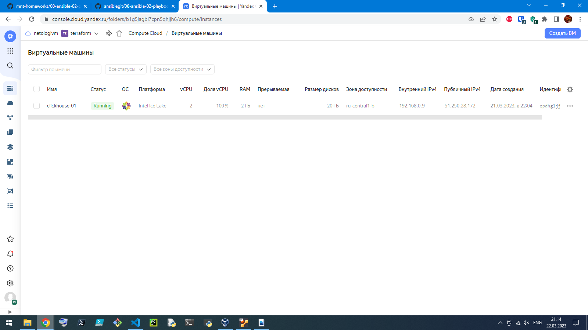

# Домашнее задание к занятию "8.2 Работа с Playbook"

## Подготовка к выполнению

1. (Необязательно) Изучите, что такое [clickhouse](https://www.youtube.com/watch?v=fjTNS2zkeBs) и [vector](https://www.youtube.com/watch?v=CgEhyffisLY)
2. Создайте свой собственный (или используйте старый) публичный репозиторий на github с произвольным именем.
3. Скачайте [playbook](./playbook/) из репозитория с домашним заданием и перенесите его в свой репозиторий.
4. Подготовьте хосты в соответствии с группами из предподготовленного playbook.

## Основная часть

1. Приготовьте свой собственный inventory файл `prod.yml`.
2. Допишите playbook: нужно сделать ещё один play, который устанавливает и настраивает [vector](https://vector.dev).
3. При создании tasks рекомендую использовать модули: `get_url`, `template`, `unarchive`, `file`.
4. Tasks должны: скачать нужной версии дистрибутив, выполнить распаковку в выбранную директорию, установить vector.
5. Запустите `ansible-lint site.yml` и исправьте ошибки, если они есть.
6. Попробуйте запустить playbook на этом окружении с флагом `--check`.
7. Запустите playbook на `prod.yml` окружении с флагом `--diff`. Убедитесь, что изменения на системе произведены.
8. Повторно запустите playbook с флагом `--diff` и убедитесь, что playbook идемпотентен.
9. Подготовьте README.md файл по своему playbook. В нём должно быть описано: что делает playbook, какие у него есть параметры и теги.
10. Готовый playbook выложите в свой репозиторий, поставьте тег `08-ansible-02-playbook` на фиксирующий коммит, в ответ предоставьте ссылку на него.

---

### Решение:
### Подготовка к выполнению


1. Что такое [clickhouse](https://www.youtube.com/watch?v=fjTNS2zkeBs) и [vector](https://www.youtube.com/watch?v=CgEhyffisLY) изучил, на канал подписался, палец вверх поставил, было интересно, спасибо за видео.
2. Сделано. [ansiblegit](https://github.com/Sergey-Klimov/ansiblegit/tree/main/)
3. Скачал из репозитория с домашним заданием и перенесите его в свой репозиторий: [8.2. Работа с Playbook](https://github.com/Sergey-Klimov/ansiblegit/tree/main/08-ansible-02-playbook)
4. Подготовил виртуальную машину с CentOS 7: 

## Основная часть

1. Приготовьте свой собственный inventory файл `prod.yml`.

### Решение:

```yml
---
clickhouse:
  hosts:
    clickhouse-01:
      ansible_host: 51.250.28.172
vector:
  hosts:
    vector-01:
      ansible_host: 51.250.28.172
```
2. Допишите playbook: нужно сделать ещё один play, который устанавливает и настраивает [vector](https://vector.dev).

### Решение:

```yml
---
- name: Install Clickhouse
  hosts: clickhouse
  handlers:
    - name: Start clickhouse service
      become: true
      ansible.builtin.service:
        name: clickhouse-server
        state: restarted


  tasks:
    - block:
        - name: Get clickhouse distrib
          ansible.builtin.get_url:
            url: "https://packages.clickhouse.com/rpm/stable/{{ item }}-{{ clickhouse_version }}.noarch.rpm"
            dest: "./{{ item }}-{{ clickhouse_version }}.rpm"
          with_items: "{{ clickhouse_packages }}"
          tags:
            - tag1
      rescue:
        - name: Get clickhouse distrib
          ansible.builtin.get_url:
            url: "https://packages.clickhouse.com/rpm/stable/clickhouse-common-static-{{ clickhouse_version }}.x86_64.rpm"
            dest: "./clickhouse-common-static-{{ clickhouse_version }}.rpm"
          tags:
            - tag1

    - name: Install clickhouse packages
      become: true
      ansible.builtin.yum:
        name:
          - clickhouse-common-static-{{ clickhouse_version }}.rpm
          - clickhouse-client-{{ clickhouse_version }}.rpm
          - clickhouse-server-{{ clickhouse_version }}.rpm
      notify: Start clickhouse service
      tags:
        - tag1

    - name: Flush handlers
      meta: flush_handlers

    - name: wait 10 sec
      ansible.builtin.pause:
        seconds: 10
      tags:
        - tag2

    - name: Create database
      ansible.builtin.command: "clickhouse-client -q 'create database logs;'"
      register: create_db
      failed_when: create_db.rc != 0 and create_db.rc !=82
      changed_when: create_db.rc == 0
      tags:
        - tag2

- name: Install Vector
  hosts: vector
  handlers:
    - name: restart vector service
      become: true
      ansible.builtin.systemd:
        name: vector
        state: restarted
        daemon_reload: true

  tasks:
    - name: Vector Install package
      become: true
      ansible.builtin.yum:
        name: https://packages.timber.io/vector/{{ vector_version }}/vector-{{ vector_version }}-1.{{ ansible_architecture }}.rpm
        state: present
      notify: restart vector service
      tags:
        - tag3

    - name: Configure Vector | ensure what directory exists
      file:
        path: "{{ vector_config_dir }}"
        state: directory
        mode: 0755
      tags:
        - tag3

    - name: Configure Vector | Template config
      ansible.builtin.template:
        src: /vagrant/share/cloud/playbook/templates/vector.yml.j2
        mode: 0755
        dest: "{{ vector_config_dir }}vector.yml"
      tags:
        - tag3

    - name: Configure Service | Template systemd unit
      become: true
      ansible.builtin.template:
        src: /vagrant/share/cloud/playbook/templates/vector.yml.j2
        dest: /etc/systemd/system/vector.service
        mode: 0644
      notify: restart vector service
      tags:
        - tag3

```

3. При создании tasks рекомендую использовать модули: `get_url`, `template`, `unarchive`, `file`.
4. Tasks должны: скачать нужной версии дистрибутив, выполнить распаковку в выбранную директорию, установить vector.
5. Запустите `ansible-lint site.yml` и исправьте ошибки, если они есть.

### Решение:

```consol
vagrant@vagrant:~/share/cloud/playbook$ ansible-lint site.yml
vagrant@vagrant:~/share/cloud/playbook$
```

6. Попробуйте запустить playbook на этом окружении с флагом `--check`.

```yaml
vagrant@vagrant:~/share/cloud/playbook$ ansible-playbook -i inventory/prod.yml site.yml --check

PLAY [Install Clickhouse] *************************************************************************************************************************************************************
TASK [Gathering Facts] ****************************************************************************************************************************************************************ok: [clickhouse-01]

TASK [Get clickhouse distrib] *********************************************************************************************************************************************************ok: [clickhouse-01] => (item=clickhouse-client)
ok: [clickhouse-01] => (item=clickhouse-server)
failed: [clickhouse-01] (item=clickhouse-common-static) => {"ansible_loop_var": "item", "changed": false, "dest": "./clickhouse-common-static-22.3.3.44.rpm", "elapsed": 0, "gid": 1000, "group": "vagrant", "item": "clickhouse-common-static", "mode": "0664", "msg": "Request failed", "owner": "vagrant", "response": "HTTP Error 404: Not Found", "secontext": "unconfined_u:object_r:user_home_t:s0", "size": 246310036, "state": "file", "status_code": 404, "uid": 1000, "url": "https://packages.clickhouse.com/rpm/stable/clickhouse-common-static-22.3.3.44.noarch.rpm"}

TASK [Get clickhouse distrib] *********************************************************************************************************************************************************ok: [clickhouse-01]

TASK [Install clickhouse packages] ****************************************************************************************************************************************************ok: [clickhouse-01]

TASK [Flush handlers] *****************************************************************************************************************************************************************
TASK [wait 10 sec] ********************************************************************************************************************************************************************Pausing for 10 seconds
(ctrl+C then 'C' = continue early, ctrl+C then 'A' = abort)
ok: [clickhouse-01]

TASK [Create database] ****************************************************************************************************************************************************************skipping: [clickhouse-01]

PLAY [Install Vector] *****************************************************************************************************************************************************************
TASK [Gathering Facts] ****************************************************************************************************************************************************************ok: [vector-01]

TASK [Vector Install package] *********************************************************************************************************************************************************ok: [vector-01]

TASK [Configure Vector | ensure what directory exists] ********************************************************************************************************************************changed: [vector-01]

TASK [Configure Vector | Template config] *********************************************************************************************************************************************changed: [vector-01]

TASK [Configure Service | Template systemd unit] **************************************************************************************************************************************ok: [vector-01]

PLAY RECAP ****************************************************************************************************************************************************************************clickhouse-01              : ok=4    changed=0    unreachable=0    failed=0    skipped=1    rescued=1    ignored=0
vector-01                  : ok=5    changed=2    unreachable=0    failed=0    skipped=0    rescued=0    ignored=0

vagrant@vagrant:~/share/cloud/playbook$ 

```
7. Запустите playbook на `prod.yml` окружении с флагом `--diff`. Убедитесь, что изменения на системе произведены.

### Рушение:

```yaml
vagrant@vagrant:~/share/cloud/playbook$ ansible-playbook -i inventory/prod.yml site.yml --diff

PLAY [Install Clickhouse] **********************************************************************************************************************************************************************************************
TASK [Gathering Facts] *************************************************************************************************************************************************************************************************ok: [clickhouse-01]

TASK [Get clickhouse distrib] ******************************************************************************************************************************************************************************************ok: [clickhouse-01] => (item=clickhouse-client)
ok: [clickhouse-01] => (item=clickhouse-server)
failed: [clickhouse-01] (item=clickhouse-common-static) => {"ansible_loop_var": "item", "changed": false, "dest": "./clickhouse-common-static-22.3.3.44.rpm", "elapsed": 0, "gid": 1000, "group": "vagrant", "item": "clickhouse-common-static", "mode": "0664", "msg": "Request failed", "owner": "vagrant", "response": "HTTP Error 404: Not Found", "secontext": "unconfined_u:object_r:user_home_t:s0", "size": 246310036, "state": "file", 
"status_code": 404, "uid": 1000, "url": "https://packages.clickhouse.com/rpm/stable/clickhouse-common-static-22.3.3.44.noarch.rpm"}

TASK [Get clickhouse distrib] ******************************************************************************************************************************************************************************************
ok: [clickhouse-01]

TASK [Install clickhouse packages] *************************************************************************************************************************************************************************************ok: [clickhouse-01]

TASK [Flush handlers] **************************************************************************************************************************************************************************************************
TASK [wait 10 sec] *****************************************************************************************************************************************************************************************************Pausing for 10 seconds
(ctrl+C then 'C' = continue early, ctrl+C then 'A' = abort)
ok: [clickhouse-01]

TASK [Create database] *************************************************************************************************************************************************************************************************ok: [clickhouse-01]

PLAY [Install Vector] **************************************************************************************************************************************************************************************************
TASK [Gathering Facts] *************************************************************************************************************************************************************************************************ok: [vector-01]

TASK [Vector Install package] ******************************************************************************************************************************************************************************************ok: [vector-01]

TASK [Configure Vector | ensure what directory exists] *****************************************************************************************************************************************************************--- before
+++ after
@@ -1,4 +1,4 @@
 {
-    "mode": "0777",
+    "mode": "0755",
     "path": "/home/vagrant/vector_config/"
 }

changed: [vector-01]

TASK [Configure Vector | Template config] ******************************************************************************************************************************************************************************--- before
+++ after
@@ -1,4 +1,4 @@
 {
-    "mode": "0777",
+    "mode": "0755",
     "path": "/home/vagrant/vector_config/vector.yml"
 }

changed: [vector-01]

TASK [Configure Service | Template systemd unit] ***********************************************************************************************************************************************************************ok: [vector-01]

PLAY RECAP *************************************************************************************************************************************************************************************************************clickhouse-01              : ok=5    changed=0    unreachable=0    failed=0    skipped=0    rescued=1    ignored=0
vector-01                  : ok=5    changed=2    unreachable=0    failed=0    skipped=0    rescued=0    ignored=0
```
8. Повторно запустите playbook с флагом `--diff` и убедитесь, что playbook идемпотентен.

### Решение:

```yaml
vagrant@vagrant:~/share/cloud/playbook$ ansible-playbook -i inventory/prod.yml site.yml --diff

PLAY [Install Clickhouse] **********************************************************************************************************************************************************************************************
TASK [Gathering Facts] *************************************************************************************************************************************************************************************************ok: [clickhouse-01]

TASK [Get clickhouse distrib] ******************************************************************************************************************************************************************************************ok: [clickhouse-01] => (item=clickhouse-client)
ok: [clickhouse-01] => (item=clickhouse-server)
failed: [clickhouse-01] (item=clickhouse-common-static) => {"ansible_loop_var": "item", "changed": false, "dest": "./clickhouse-common-static-22.3.3.44.rpm", "elapsed": 0, "gid": 1000, "group": "vagrant", "item": "clickhouse-common-static", "mode": "0664", "msg": "Request failed", "owner": "vagrant", "response": "HTTP Error 404: Not Found", "secontext": "unconfined_u:object_r:user_home_t:s0", "size": 246310036, "state": "file", 
"status_code": 404, "uid": 1000, "url": "https://packages.clickhouse.com/rpm/stable/clickhouse-common-static-22.3.3.44.noarch.rpm"}

TASK [Get clickhouse distrib] ******************************************************************************************************************************************************************************************ok: [clickhouse-01]

TASK [Install clickhouse packages] *************************************************************************************************************************************************************************************ok: [clickhouse-01]

TASK [Flush handlers] **************************************************************************************************************************************************************************************************
TASK [wait 10 sec] *****************************************************************************************************************************************************************************************************Pausing for 10 seconds
(ctrl+C then 'C' = continue early, ctrl+C then 'A' = abort)
ok: [clickhouse-01]

TASK [Create database] *************************************************************************************************************************************************************************************************ok: [clickhouse-01]

PLAY [Install Vector] **************************************************************************************************************************************************************************************************
TASK [Gathering Facts] *************************************************************************************************************************************************************************************************ok: [vector-01]

TASK [Vector Install package] ******************************************************************************************************************************************************************************************ok: [vector-01]

TASK [Configure Vector | ensure what directory exists] *****************************************************************************************************************************************************************ok: [vector-01]

TASK [Configure Vector | Template config] ******************************************************************************************************************************************************************************ok: [vector-01]

TASK [Configure Service | Template systemd unit] ***********************************************************************************************************************************************************************ok: [vector-01]

PLAY RECAP *************************************************************************************************************************************************************************************************************clickhouse-01              : ok=5    changed=0    unreachable=0    failed=0    skipped=0    rescued=1    ignored=0
vector-01                  : ok=5    changed=0    unreachable=0    failed=0    skipped=0    rescued=0    ignored=0

vagrant@vagrant:~/share/cloud/playbook$
```

9. Подготовьте README.md файл по своему playbook. В нём должно быть описано: что делает playbook, какие у него есть параметры и теги.

### Решение: 

Сделано. [README.md](https://github.com/Sergey-Klimov/devops-netology/tree/main/Tasks/8.2.%20%D0%A0%D0%B0%D0%B1%D0%BE%D1%82%D0%B0%20%D1%81%20Playbook/playbook/readme)

10. Готовый playbook выложите в свой репозиторий, поставьте тег `08-ansible-02-playbook` на фиксирующий коммит, в ответ предоставьте ссылку на него.

### Решение: 

Сделано. [README.md](https://github.com/Sergey-Klimov/devops-netology/tree/main/Tasks/8.2.%20%D0%A0%D0%B0%D0%B1%D0%BE%D1%82%D0%B0%20%D1%81%20Playbook#readme)
