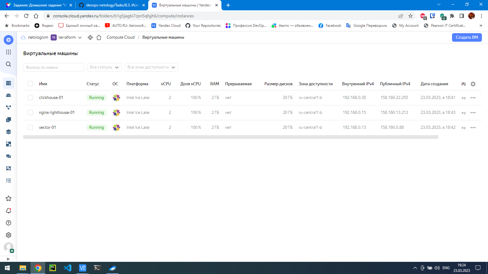
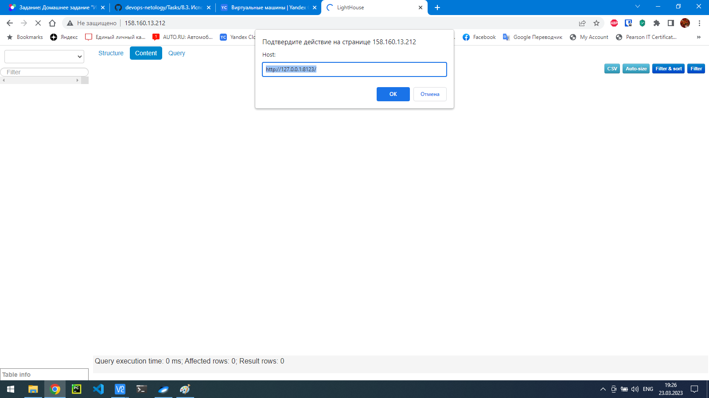

# Домашнее задание к занятию 3 «Использование Yandex Cloud»

## Подготовка к выполнению

1. Подготовьте в Yandex Cloud три хоста: для `clickhouse`, для `vector` и для `lighthouse`.



2. Репозиторий LightHouse находится [по ссылке](https://github.com/VKCOM/lighthouse).

## Основная часть

1. Допишите playbook: нужно сделать ещё один play, который устанавливает и настраивает LightHouse.

### Решение:

```yml
---
- name: Install Clickhouse
  hosts: clickhouse
  handlers:
    - name: Start clickhouse service
      become: true
      ansible.builtin.service:
        name: clickhouse-server
        state: restarted

  tasks:
    - block:
        - name: Get clickhouse distrib
          ansible.builtin.get_url:
            url: "https://packages.clickhouse.com/rpm/stable/{{ item }}-{{ clickhouse_version }}.noarch.rpm"
            dest: "./{{ item }}-{{ clickhouse_version }}.rpm"
          with_items: "{{ clickhouse_packages }}"
          tags:
            - clickhouse
      rescue:
        - name: Get clickhouse distrib
          ansible.builtin.get_url:
            url: "https://packages.clickhouse.com/rpm/stable/clickhouse-common-static-{{ clickhouse_version }}.x86_64.rpm"
            dest: "./clickhouse-common-static-{{ clickhouse_version }}.rpm"
          tags:
            - clickhouse

    - name: Install clickhouse packages
      become: true
      ansible.builtin.yum:
        name:
          - clickhouse-common-static-{{ clickhouse_version }}.rpm
          - clickhouse-client-{{ clickhouse_version }}.rpm
          - clickhouse-server-{{ clickhouse_version }}.rpm
      notify: Start clickhouse service
      tags:
        - clickhouse

    - name: Enable service clickhouse-server
      become: true
      ansible.builtin.service:
        name: clickhouse-server
        enabled: true
      tags:
        - clickhouse

    - name: Flush handlers
      meta: flush_handlers
      tags:
        - clickhouse

    - name: wait 10 sec
      ansible.builtin.pause:
        seconds: 10
      tags:
        - clickhouse

    - name: Create database
      ansible.builtin.command: "clickhouse-client -q 'create database logs;'"
      register: create_db
      failed_when: create_db.rc != 0 and create_db.rc !=82
      changed_when: create_db.rc == 0
      tags:
        - clickhouse

    - name: Create database2
      ansible.builtin.command: "clickhouse-client -q 'CREATE DATABASE nginxdb;'"
      register: create_db2
      failed_when: create_db2.rc != 0 and create_db.rc !=82
      changed_when: create_db2.rc == 0
      tags:
        - clickhouse

    - name: Create database3
      ansible.builtin.command: "clickhouse-client -q 'CREATE TABLE nginxdb.access_logs (message String) ENGINE = MergeTree() ORDER BY tuple();'"
      register: create_db3
      failed_when: create_db3.rc != 0 and create_db.rc !=82
      changed_when: create_db3.rc == 0
      tags:
        - clickhouse

- name: Install Vector
  hosts: vector
  handlers:
    - name: restart vector service
      become: true
      ansible.builtin.systemd:
        name: vector
        state: restarted
        daemon_reload: true

    - name: enable service Vector
      become: true
      ansible.builtin.service:
        name: vector
        enabled: true
      tags:
        - vector

  tasks:
    - name: Vector Install package
      become: true
      ansible.builtin.yum:
        name: https://packages.timber.io/vector/{{ vector_version }}/vector-{{ vector_version }}-1.{{ ansible_architecture }}.rpm
        state: present
      notify: enable service Vector
      tags:
        - vector

    - name: Configure Vector | Template config
      become: true
      ansible.builtin.template:
        src: /home/vagrant/share/playbook/templates/vector.toml.j2
        mode: 0644
        dest: "{{ vector_config_dir }}/vector.toml"
      notify: restart vector service
      tags:
        - vector

    - name: Flush handlers
      meta: flush_handlers
      tags:
        - vector


- name: Install nginx and lighthouse
  hosts: nginx-lighthouse-01
  handlers:
    - name: start nginx service
      become: true
      ansible.builtin.systemd:
        name: nginx
        enabled: true
        state: started
    - name: restart nginx service
      become: true
      ansible.builtin.systemd:
        name: nginx
        state: restarted
    - name: setenforce
      become: true
      command: setenforce 0

  tasks:
    - name: install epel-release
      become: true
      ansible.builtin.yum:
        name: epel-release
        state: present
      tags:
        - lighthouse

    - name: install nginx
      become: true
      ansible.builtin.yum:
        name: nginx
        state: present
      notify: start nginx service
      tags:
        - lighthouse

    - name: Disable SELinux
      become: true
      ansible.posix.selinux:
        state: disabled
      tags:
        - lighthouse
      notify: setenforce


    - name: Create a directory if it does not exist
      become: true
      ansible.builtin.file:
        path: "{{ lighthouse_location_dir }}"
        state: directory
        mode: '0755'
      tags:
        - lighthouse

    - name: install git
      become: true
      ansible.builtin.yum:
        name: git
        state: present
      tags:
        - lighthouse

    - name: copy lighthouse service from git
      become: true
      ansible.builtin.git:
        repo: "{{ lighthouse_repo }}"
        version: master
        dest: /tmp/lighthouse
      tags:
        - lighthouse

    - name: copy lighthouse files1 to nginx workdir
      become: true
      ansible.builtin.copy:
        src: "/tmp/lighthouse/{{ item }}"
        dest: "{{ lighthouse_location_dir }}"
        mode: '0644'
        remote_src: true
        follow: true
      loop:
        - js
        - app.js
        - index.html
        - jquery.js
      notify: restart nginx service
      tags:
        - lighthouse

    - name: copy lighthouse files2 to nginx workdir
      become: true
      ansible.builtin.copy:
        src: "/tmp/lighthouse/{{ item }}"
        dest: "{{ lighthouse_location_dir }}"
        mode: '0751'
        remote_src: true
        follow: true
      loop:
        - css
        - img
      notify: restart nginx service
      tags:
        - lighthouse

    - name: create lighthouse config
      become: true
      ansible.builtin.template:
        src: templates/lighthouse.conf.j2
        dest: /etc/nginx/conf.d/lighthouse.conf
        mode: '0644'
      notify: restart nginx service
      tags:
        - lighthouse
```
2. При создании tasks рекомендую использовать модули: `get_url`, `template`, `yum`, `apt`.
3. Tasks должны: скачать статику LightHouse, установить Nginx или любой другой веб-сервер, настроить его конфиг для открытия LightHouse, запустить веб-сервер.
4. Подготовьте свой inventory-файл `prod.yml`.

### Решение:

```yml
---
clickhouse:
  hosts:
    clickhouse-01:
      ansible_host: 158.160.22.255
vector:
  hosts:
    vector-01:
      ansible_host: 158.160.0.88
nginx-lighthouse:
  hosts:
    nginx-lighthouse-01:
      ansible_host: 158.160.13.212
```
5. Запустите `ansible-lint site.yml` и исправьте ошибки, если они есть.

### Решение:

```console
vagrant@vagrant:~/share/playbook$ ansible-lint site.yml
vagrant@vagrant:~/share/playbook$
```

6. Попробуйте запустить playbook на этом окружении с флагом `--check`.

### Решение:

```yml
vagrant@vagrant:~/share/playbook$ ansible-playbook -i inventory/prod.yml site.yml --check

[WARNING]: Invalid characters were found in group names but not replaced, use -vvvv to see details

PLAY [Install Clickhouse] ******************************************************************************************************************************************************************************************
TASK [Gathering Facts] ******************************************************************************************************************************************************************************************
ok: [clickhouse-01]

TASK [Get clickhouse distrib] ******************************************************************************************************************************************************************************************
ok: [clickhouse-01] => (item=clickhouse-client)
ok: [clickhouse-01] => (item=clickhouse-server)
failed: [clickhouse-01] (item=clickhouse-common-static) => {"ansible_loop_var": "item", "changed": false, "dest": "./clickhouse-common-static-22.3.3.44.rpm", "elapsed": 0, "gid": 1000, "group": "vagrant", "item": "clickhouse-common-static", "mode": "0664", "msg": "Request failed", "owner": "vagrant", "response": "HTTP Error 404: Not Found", "secontext": "unconfined_u:object_r:user_home_t:s0", "size": 246310036, "state": "file", 
"status_code": 404, "uid": 1000, "url": "https://packages.clickhouse.com/rpm/stable/clickhouse-common-static-22.3.3.44.noarch.rpm"}

TASK [Get clickhouse distrib] ******************************************************************************************************************************************************************************************
ok: [clickhouse-01]

TASK [Install clickhouse packages] *************************************************************************************************************************************************************************************
ok: [clickhouse-01]

TASK [Enable service clickhouse-server] ********************************************************************************************************************************************************************************
ok: [clickhouse-01]

TASK [Flush handlers] ******************************************************************************************************************************************************************************************
TASK [wait 10 sec] ******************************************************************************************************************************************************************************************
Pausing for 10 seconds
(ctrl+C then 'C' = continue early, ctrl+C then 'A' = abort)
ok: [clickhouse-01]

TASK [Create database] ******************************************************************************************************************************************************************************************
skipping: [clickhouse-01]

TASK [Create database2] *******************************************************************************************************************************************************************************************
skipping: [clickhouse-01]

TASK [Create database3] *******************************************************************************************************************************************************************************************
skipping: [clickhouse-01]

PLAY [Install Vector] *******************************************************************************************************************************************************************************************
TASK [Gathering Facts] *******************************************************************************************************************************************************************************************
ok: [vector-01]

TASK [Vector Install package] ******************************************************************************************************************************************************************************************
ok: [vector-01]

TASK [Configure Vector | Template config] ******************************************************************************************************************************************************************************************
ok: [vector-01]

TASK [Flush handlers] ******************************************************************************************************************************************************************************************
PLAY [Install nginx and lighthouse] ******************************************************************************************************************************************************************************************
TASK [Gathering Facts] ******************************************************************************************************************************************************************************************
ok: [nginx-lighthouse-01]

TASK [install epel-release] ******************************************************************************************************************************************************************************************
ok: [nginx-lighthouse-01]

TASK [install nginx] ******************************************************************************************************************************************************************************************
ok: [nginx-lighthouse-01]

TASK [Disable SELinux] ******************************************************************************************************************************************************************************************
[WARNING]: SELinux state change will take effect next reboot
ok: [nginx-lighthouse-01]

TASK [Create a directory if it does not exist] *****************************************************************************************************************************************************************************************
ok: [nginx-lighthouse-01]

TASK [install git] *****************************************************************************************************************************************************************************************
ok: [nginx-lighthouse-01]

TASK [copy lighthouse service from git] *****************************************************************************************************************************************************************************************
ok: [nginx-lighthouse-01]

TASK [copy lighthouse files1 to nginx workdir] *****************************************************************************************************************************************************************************************
ok: [nginx-lighthouse-01] => (item=js)
ok: [nginx-lighthouse-01] => (item=app.js)
ok: [nginx-lighthouse-01] => (item=index.html)
ok: [nginx-lighthouse-01] => (item=jquery.js)

TASK [copy lighthouse files2 to nginx workdir] ****************************************************************************************************************************************************************************************
ok: [nginx-lighthouse-01] => (item=css)
ok: [nginx-lighthouse-01] => (item=img)

TASK [create lighthouse config] ****************************************************************************************************************************************************************************************
ok: [nginx-lighthouse-01]

PLAY RECAP ****************************************************************************************************************************************************************************************
clickhouse-01              : ok=5    changed=0    unreachable=0    failed=0    skipped=3    rescued=1    ignored=0
nginx-lighthouse-01        : ok=10   changed=0    unreachable=0    failed=0    skipped=0    rescued=0    ignored=0
vector-01                  : ok=3    changed=0    unreachable=0    failed=0    skipped=0    rescued=0    ignored=0

vagrant@vagrant:~/share/playbook$ 
```
7. Запустите playbook на `prod.yml` окружении с флагом `--diff`. Убедитесь, что изменения на системе произведены.

### Решение:

```yml
vagrant@vagrant:~/share/playbook$ ansible-playbook -i inventory/prod.yml site.yml --diff
[WARNING]: Invalid characters were found in group names but not replaced, use -vvvv to see details

PLAY [Install Clickhouse] ******************************************************************************************************************************************************************************************
TASK [Gathering Facts] ******************************************************************************************************************************************************************************************
ok: [clickhouse-01]

TASK [Get clickhouse distrib] ******************************************************************************************************************************************************************************************
ok: [clickhouse-01] => (item=clickhouse-client)
ok: [clickhouse-01] => (item=clickhouse-server)
failed: [clickhouse-01] (item=clickhouse-common-static) => {"ansible_loop_var": "item", "changed": false, "dest": "./clickhouse-common-static-22.3.3.44.rpm", "elapsed": 0, "gid": 1000, "group": "vagrant", "item": "clickhouse-common-static", "mode": "0664", "msg": "Request failed", "owner": "vagrant", "response": "HTTP Error 404: Not Found", "secontext": "unconfined_u:object_r:user_home_t:s0", "size": 246310036, "state": "file", 
"status_code": 404, "uid": 1000, "url": "https://packages.clickhouse.com/rpm/stable/clickhouse-common-static-22.3.3.44.noarch.rpm"}

TASK [Get clickhouse distrib] ******************************************************************************************************************************************************************************************
ok: [clickhouse-01]

TASK [Install clickhouse packages] ******************************************************************************************************************************************************************************************
ok: [clickhouse-01]

TASK [Enable service clickhouse-server] ******************************************************************************************************************************************************************************************
ok: [clickhouse-01]

TASK [Flush handlers] ******************************************************************************************************************************************************************************************
TASK [wait 10 sec] ******************************************************************************************************************************************************************************************
Pausing for 10 seconds
(ctrl+C then 'C' = continue early, ctrl+C then 'A' = abort)
ok: [clickhouse-01]

TASK [Create database] *****************************************************************************************************************************************************************************************
ok: [clickhouse-01]

TASK [Create database2] *****************************************************************************************************************************************************************************************
ok: [clickhouse-01]

TASK [Create database3] *****************************************************************************************************************************************************************************************
ok: [clickhouse-01]

PLAY [Install Vector] *****************************************************************************************************************************************************************************************
TASK [Gathering Facts] *****************************************************************************************************************************************************************************************
ok: [vector-01]

TASK [Vector Install package] ****************************************************************************************************************************************************************************************
ok: [vector-01]

TASK [Configure Vector | Template config] ****************************************************************************************************************************************************************************************
ok: [vector-01]

TASK [Flush handlers] ****************************************************************************************************************************************************************************************
PLAY [Install nginx and lighthouse] ****************************************************************************************************************************************************************************************
TASK [Gathering Facts] ****************************************************************************************************************************************************************************************
ok: [nginx-lighthouse-01]

TASK [install epel-release] ****************************************************************************************************************************************************************************************
ok: [nginx-lighthouse-01]

TASK [install nginx] ****************************************************************************************************************************************************************************************
ok: [nginx-lighthouse-01]

TASK [Disable SELinux] ****************************************************************************************************************************************************************************************[WARNING]: SELinux state change will take effect next reboot
ok: [nginx-lighthouse-01]

TASK [Create a directory if it does not exist]    &****************************************************************************************************************************************************************************************
ok: [nginx-lighthouse-01]

TASK [install git] ****************************************************************************************************************************************************************************************
ok: [nginx-lighthouse-01]

TASK [copy lighthouse service from git] ****************************************************************************************************************************************************************************************
ok: [nginx-lighthouse-01]

TASK [copy lighthouse files1 to nginx workdir] ****************************************************************************************************************************************************************************************
ok: [nginx-lighthouse-01] => (item=js)
ok: [nginx-lighthouse-01] => (item=app.js)
ok: [nginx-lighthouse-01] => (item=index.html)
ok: [nginx-lighthouse-01] => (item=jquery.js)

TASK [copy lighthouse files2 to nginx workdir] ***************************************************************************************************************************************************************************************
ok: [nginx-lighthouse-01] => (item=css)
ok: [nginx-lighthouse-01] => (item=img)

TASK [create lighthouse config] ***************************************************************************************************************************************************************************************
ok: [nginx-lighthouse-01]

PLAY RECAP ***************************************************************************************************************************************************************************************
clickhouse-01              : ok=8    changed=0    unreachable=0    failed=0    skipped=0    rescued=1    ignored=0
nginx-lighthouse-01        : ok=10   changed=0    unreachable=0    failed=0    skipped=0    rescued=0    ignored=0
vector-01                  : ok=3    changed=0    unreachable=0    failed=0    skipped=0    rescued=0    ignored=0

vagrant@vagrant:~/share/playbook$ 
```
8. Повторно запустите playbook с флагом `--diff` и убедитесь, что playbook идемпотентен.

### Решение:

Повторил, убедился.

9. Подготовьте README.md-файл по своему playbook. В нём должно быть описано: что делает playbook, какие у него есть параметры и теги.

### Решение: 

Сделано. [README.md](https://github.com/Sergey-Klimov/devops-netology/blob/main/Tasks/8.3.%20%D0%98%D1%81%D0%BF%D0%BE%D0%BB%D1%8C%D0%B7%D0%BE%D0%B2%D0%B0%D0%BD%D0%B8%D0%B5%20Yandex%20Cloud/playbook/README.md)

10. Готовый playbook выложите в свой репозиторий, поставьте тег `08-ansible-03-yandex` на фиксирующий коммит, в ответ предоставьте ссылку на него.

### Решение: 

Сделано. [README.md](https://github.com/Sergey-Klimov/devops-netology/blob/main/Tasks/8.3.%20%D0%98%D1%81%D0%BF%D0%BE%D0%BB%D1%8C%D0%B7%D0%BE%D0%B2%D0%B0%D0%BD%D0%B8%D0%B5%20Yandex%20Cloud/README.md)

### Дополнительная информация:

```console
vagrant@vagrant:~/share/playbook$ ssh 158.160.22.255
[vagrant@clickhouse-01 ~]$ clickhouse-client
ClickHouse client version 22.3.3.44 (official build).
Connecting to localhost:9000 as user default.
Connected to ClickHouse server version 22.3.3 revision 54455.

clickhouse-01.ru-central1.internal :) SHOW DATABASES

SHOW DATABASES

Query id: b843ede5-e0cd-409f-85c1-048082192848

┌─name───────────────┐
│ INFORMATION_SCHEMA │
│ default            │
│ information_schema │
│ logs               │
│ nginxdb            │
│ system             │
└────────────────────┘

6 rows in set. Elapsed: 0.001 sec.
```



---