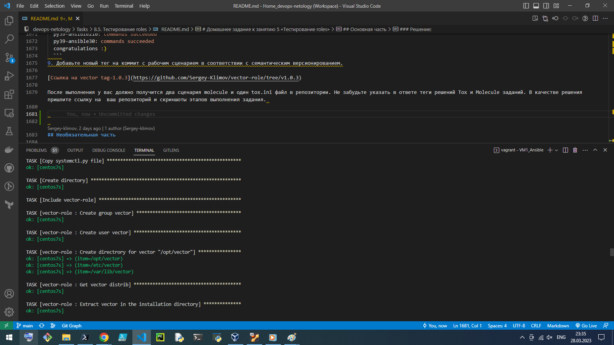
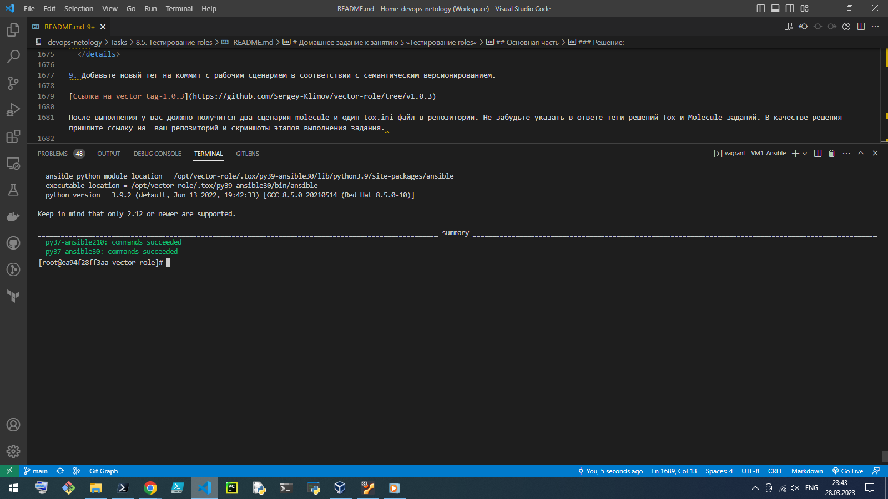

# Домашнее задание к занятию 5 «Тестирование roles»

## Подготовка к выполнению

1. Установите molecule: `pip3 install "molecule==3.5.2"`.

### Решение:

``` bash
vagrant@vagrant:~$ pip3 install "molecule==3.5.2"
Collecting molecule==3.5.2
  Downloading molecule-3.5.2-py3-none-any.whl (240 kB)
     |████████████████████████████████| 240 kB 1.4 MB/s
.
.
.
Installing collected packages: binaryornot, python-dateutil, arrow, jinja2-time, text-unidecode, python-slugify, charset-normalizer, requests, click, cookiecutter, click-help-colors, typing-extensions, mdurl, markdown-it-py, pygments, rich, enrich, zipp, importlib-resources, pkgutil-resolve-name, jsonschema, subprocess-tee, ansible-compat, pluggy, cerberus, bcrypt, paramiko, molecule
Successfully installed ansible-compat-3.0.1 arrow-1.2.3 bcrypt-4.0.1 binaryornot-0.4.4 cerberus-1.3.2 charset-normalizer-3.1.0 click-8.1.3 click-help-colors-0.9.1 cookiecutter-2.1.1 enrich-1.2.7 importlib-resources-5.12.0 jinja2-time-0.2.0 jsonschema-4.17.3 markdown-it-py-2.2.0 mdurl-0.1.2 molecule-3.5.2 paramiko-2.12.0 pkgutil-resolve-name-1.3.10 pluggy-1.0.0 pygments-2.14.0 python-dateutil-2.8.2 python-slugify-8.0.1 requests-2.28.2 rich-13.3.2 subprocess-tee-0.4.1 text-unidecode-1.3 typing-extensions-4.5.0 zipp-3.15.0

vagrant@vagrant:~$ molecule --version
molecule 3.5.2 using python 3.8 
    ansible:2.13.7
    delegated:3.5.2 from molecule
```

2. Выполните `docker pull aragast/netology:latest` —  это образ с podman, tox и несколькими пайтонами (3.7 и 3.9) внутри.

### Решение:

``` bash
vagrant@vagrant:~$ docker pull aragast/netology:latest
latest: Pulling from aragast/netology
Digest: sha256:e44f93d3d9880123ac8170d01bd38ea1cd6c5174832b1782ce8f97f13e695ad5
Status: Image is up to date for aragast/netology:latest
docker.io/aragast/netology:latest

vagrant@vagrant:~$ docker image ls
REPOSITORY          TAG       IMAGE ID       CREATED         SIZE
ubuntu              latest    6b7dfa7e8fdb   3 months ago    77.8MB
aragast/netology    latest    b453a84e3f7a   5 months ago    2.46GB
hello-world         latest    feb5d9fea6a5   18 months ago   13.3kB
pycontribs/centos   7         bafa54e44377   23 months ago   488MB
pycontribs/ubuntu   latest    42a4e3b21923   3 years ago     664MB
```

## Основная часть

Ваша цель — настроить тестирование ваших ролей. 

Задача — сделать сценарии тестирования для vector. 

Ожидаемый результат — все сценарии успешно проходят тестирование ролей.

### Molecule

1. Запустите  `molecule test -s centos_7` внутри корневой директории clickhouse-role, посмотрите на вывод команды. Данная команда может отработать с ошибками, это нормально. Наша цель - посмотреть как другие в реальном мире используют молекулу.

### Решение:

```bash
vagrant@vagrant:~/.ansible/roles/clickhouse$ molecule test -s centos_7
INFO     centos_7 scenario test matrix: dependency, lint, cleanup, destroy, syntax, create, prepare, converge, idempotence, side_effect, verify, cleanup, destroy
INFO     Performing prerun...
INFO     Set ANSIBLE_LIBRARY=/home/vagrant/.cache/ansible-compat/7e099f/modules:/home/vagrant/.ansible/plugins/modules:/usr/share/ansible/plugins/modules
INFO     Set ANSIBLE_COLLECTIONS_PATH=/home/vagrant/.cache/ansible-compat/7e099f/collections:/home/vagrant/.ansible/collections:/usr/share/ansible/collections
INFO     Set ANSIBLE_ROLES_PATH=/home/vagrant/.cache/ansible-compat/7e099f/roles:/home/vagrant/.ansible/roles:/usr/share/ansible/roles:/etc/ansible/roles
INFO     Inventory /home/vagrant/.ansible/roles/clickhouse/molecule/centos_7/../resources/inventory/hosts.yml linked to /home/vagrant/.cache/molecule/clickhouse/centos_7/inventory/hosts
INFO     Inventory /home/vagrant/.ansible/roles/clickhouse/molecule/centos_7/../resources/inventory/group_vars/ linked to /home/vagrant/.cache/molecule/clickhouse/centos_7/inventory/group_vars
INFO     Inventory /home/vagrant/.ansible/roles/clickhouse/molecule/centos_7/../resources/inventory/host_vars/ linked to /home/vagrant/.cache/molecule/clickhouse/centos_7/inventory/host_vars
INFO     Running centos_7 > dependency
WARNING  Skipping, missing the requirements file.
WARNING  Skipping, missing the requirements file.
INFO     Inventory /home/vagrant/.ansible/roles/clickhouse/molecule/centos_7/../resources/inventory/hosts.yml linked to /home/vagrant/.cache/molecule/clickhouse/centos_7/inventory/hosts
INFO     Inventory /home/vagrant/.ansible/roles/clickhouse/molecule/centos_7/../resources/inventory/group_vars/ linked to /home/vagrant/.cache/molecule/clickhouse/centos_7/inventory/group_vars
INFO     Inventory /home/vagrant/.ansible/roles/clickhouse/molecule/centos_7/../resources/inventory/host_vars/ linked to /home/vagrant/.cache/molecule/clickhouse/centos_7/inventory/host_vars
INFO     Running centos_7 > lint
COMMAND: yamllint .
ansible-lint
flake8

fatal: not a git repository (or any of the parent directories): .git
Traceback (most recent call last):
  File "/usr/bin/ansible-lint", line 11, in <module>
    load_entry_point('ansible-lint==4.2.0', 'console_scripts', 'ansible-lint')()
  File "/usr/lib/python3/dist-packages/ansiblelint/__main__.py", line 153, in main
    args = get_playbooks_and_roles(options=options)
  File "/usr/lib/python3/dist-packages/ansiblelint/utils.py", line 772, in get_playbooks_and_roles
    files = OrderedDict.fromkeys(sorted(subprocess.check_output(
  File "/usr/lib/python3.8/subprocess.py", line 415, in check_output
    return run(*popenargs, stdout=PIPE, timeout=timeout, check=True,
  File "/usr/lib/python3.8/subprocess.py", line 516, in run
    raise CalledProcessError(retcode, process.args,
subprocess.CalledProcessError: Command '['git', 'ls-files', '*.yaml', '*.yml']' returned non-zero exit status 128.
/bin/bash: line 2: flake8: command not found
CRITICAL Lint failed with error code 127
WARNING  An error occurred during the test sequence action: 'lint'. Cleaning up.
INFO     Inventory /home/vagrant/.ansible/roles/clickhouse/molecule/centos_7/../resources/inventory/hosts.yml linked to /home/vagrant/.cache/molecule/clickhouse/centos_7/inventory/hosts
INFO     Inventory /home/vagrant/.ansible/roles/clickhouse/molecule/centos_7/../resources/inventory/group_vars/ linked to /home/vagrant/.cache/molecule/clickhouse/centos_7/inventory/group_vars
INFO     Inventory /home/vagrant/.ansible/roles/clickhouse/molecule/centos_7/../resources/inventory/host_vars/ linked to /home/vagrant/.cache/molecule/clickhouse/centos_7/inventory/host_vars
INFO     Running centos_7 > cleanup
WARNING  Skipping, cleanup playbook not configured.
INFO     Inventory /home/vagrant/.ansible/roles/clickhouse/molecule/centos_7/../resources/inventory/hosts.yml linked to /home/vagrant/.cache/molecule/clickhouse/centos_7/inventory/hosts
INFO     Inventory /home/vagrant/.ansible/roles/clickhouse/molecule/centos_7/../resources/inventory/group_vars/ linked to /home/vagrant/.cache/molecule/clickhouse/centos_7/inventory/group_vars
INFO     Inventory /home/vagrant/.ansible/roles/clickhouse/molecule/centos_7/../resources/inventory/host_vars/ linked to /home/vagrant/.cache/molecule/clickhouse/centos_7/inventory/host_vars
INFO     Running centos_7 > destroy
INFO     Sanity checks: 'docker'

PLAY [Destroy] *****************************************************************

TASK [Set async_dir for HOME env] **********************************************
ok: [localhost]

TASK [Destroy molecule instance(s)] ********************************************
changed: [localhost] => (item=centos_7)

TASK [Wait for instance(s) deletion to complete] *******************************
FAILED - RETRYING: [localhost]: Wait for instance(s) deletion to complete (300 retries left).
ok: [localhost] => (item=centos_7)

TASK [Delete docker networks(s)] ***********************************************

PLAY RECAP *********************************************************************
localhost                  : ok=3    changed=1    unreachable=0    failed=0    skipped=1    rescued=0    ignored=0

INFO     Pruning extra files from scenario ephemeral directory
```

2. Перейдите в каталог с ролью vector-role и создайте сценарий тестирования по умолчанию при помощи `molecule init scenario --driver-name docker`.

### Решение:

```bash
vagrant@vagrant:~/.ansible/roles/vector-role$ molecule init scenario --driver-name docker
INFO     Initializing new scenario default...
INFO     Initialized scenario in /home/vagrant/.ansible/roles/vector-role/molecule/default successfully.
```

3. Добавьте несколько разных дистрибутивов (centos:8, ubuntu:latest) для инстансов и протестируйте роль, исправьте найденные ошибки, если они есть.

### Решение:

```bash
vagrant@vagrant:~/.ansible/roles/vector-role$ molecule init scenario centos8 --driver-name docker
INFO     Initializing new scenario centos8...
INFO     Initialized scenario in /home/vagrant/.ansible/roles/vector-role/molecule/centos8 successfully.
```

```bash
vagrant@vagrant:~/.ansible/roles/vector-role$ molecule init scenario ubuntu_latest --driver-name docker
INFO     Initializing new scenario ubuntu_latest...
INFO     Initialized scenario in /home/vagrant/.ansible/roles/vector-role/molecule/ubuntu_latest successfully.
```

4. Добавьте несколько assert в verify.yml-файл для  проверки работоспособности vector-role (проверка, что конфиг валидный, проверка успешности запуска и др.).

### Решение:

```yml
# This is an example playbook to execute Ansible tests.

- name: Verify
  hosts: all
  gather_facts: false
  vars:
    vector_config_path: /etc/vector/vector.yaml
  tasks:

  - name: Get Vector version
    ansible.builtin.command: "vector --version"
    changed_when: false
    register: vector_version
  - name: Assert Vector instalation
    assert:
      that: "'{{ vector_version.rc }}' == '0'"

  - name: Validation Vector configuration
    ansible.builtin.command: "vector validate --no-environment --config-yaml {{ vector_config_path }}"
    changed_when: false
    register: vector_validate
  - name: Assert Vector validate config
    assert:
      that: "'{{ vector_validate.rc }}' == '0'"
```

5. Запустите тестирование роли повторно и проверьте, что оно прошло успешно.

### Решение:

<details><summary></summary>

```bash
PLAY [Verify] ******************************************************************

TASK [Get Vector version] ******************************************************
ok: [instance]

TASK [Assert Vector instalation] ***********************************************
ok: [instance] => {
    "changed": false,
    "msg": "All assertions passed"
}

TASK [Validation Vector configuration] *****************************************
ok: [instance]

TASK [Assert Vector validate config] *******************************************
ok: [instance] => {
    "changed": false,
    "msg": "All assertions passed"
}

PLAY RECAP *********************************************************************
instance                   : ok=4    changed=0    unreachable=0    failed=0    skipped=0    rescued=0    ignored=0

INFO     Verifier completed successfully.
INFO     Running ubuntu_latest > cleanup
WARNING  Skipping, cleanup playbook not configured.
INFO     Running ubuntu_latest > destroy

PLAY [Destroy] *****************************************************************

TASK [Set async_dir for HOME env] **********************************************
ok: [localhost]

TASK [Destroy molecule instance(s)] ********************************************
changed: [localhost] => (item=instance)

TASK [Wait for instance(s) deletion to complete] *******************************
FAILED - RETRYING: [localhost]: Wait for instance(s) deletion to complete (300 retries left).
changed: [localhost] => (item=instance)

TASK [Delete docker networks(s)] ***********************************************

PLAY RECAP *********************************************************************
localhost                  : ok=3    changed=2    unreachable=0    failed=0    skipped=1    rescued=0    ignored=0

INFO     Pruning extra files from scenario ephemeral directory
```
</details>

6. Добавьте новый тег на коммит с рабочим сценарием в соответствии с семантическим версионированием.

### Решение:

[Ссылка на vector tag-1.0.2](https://github.com/Sergey-Klimov/vector-role/tree/v1.0.2)

### Tox

1. Добавьте в директорию с vector-role файлы из [директории](./example).

### Решение:

```console
vagrant@vagrant:~/.ansible/roles/vector-role$ ls -la
total 80
drwxrwxr-x 12 vagrant vagrant 4096 Mar 28 14:02  .
drwxrwxr-x  8 vagrant vagrant 4096 Mar 28 13:55  ..
-rw-rw-r--  1 vagrant vagrant    0 Mar 28 14:02 '{'
drwxrwxr-x  2 vagrant vagrant 4096 Mar 28 13:55  defaults
-rw-rw-r--  1 vagrant vagrant    0 Mar 28 14:03  destroy
-rw-rw-r--  1 vagrant vagrant  962 Mar 28 13:55  Dockerfile
drwxrwxr-x  8 vagrant vagrant 4096 Mar 28 13:55  .git
drwxrwxr-x  2 vagrant vagrant 4096 Mar 28 13:55  handlers
drwxrwxr-x  3 vagrant vagrant 4096 Mar 28 13:55  .idea
-rw-rw-r--  1 vagrant vagrant  651 Mar 28 13:55  Jenkinsfile
drwxrwxr-x  2 vagrant vagrant 4096 Mar 28 13:55  meta
drwxrwxr-x  5 vagrant vagrant 4096 Mar 28 13:55  molecule
-rw-rw-r--  1 vagrant vagrant 1555 Mar 28 13:55  README.md
-rw-rw-r--  1 vagrant vagrant  585 Mar 28 13:55  ScriptedJenkinsfile
drwxrwxr-x  2 vagrant vagrant 4096 Mar 28 13:55  tasks
drwxrwxr-x  2 vagrant vagrant 4096 Mar 28 13:55  templates
drwxrwxr-x  2 vagrant vagrant 4096 Mar 28 13:55  tests
-rw-rw-r--  1 vagrant vagrant  280 Mar 28 13:55  tox.ini
-rw-rw-r--  1 vagrant vagrant   90 Mar 28 13:55  tox-requirements.txt
-rw-rw-r--  1 vagrant vagrant  539 Mar 28 13:55  .travis.yml
drwxrwxr-x  2 vagrant vagrant 4096 Mar 28 13:55  vars
-rw-rw-r--  1 vagrant vagrant  598 Mar 28 13:55  .yamllint
```

2. Запустите `docker run --privileged=True -v <path_to_repo>:/opt/vector-role -w /opt/vector-role -it aragast/netology:latest /bin/bash`, где path_to_repo — путь до корня репозитория с vector-role на вашей файловой системе.

### Решение:

```bash
vagrant@vagrant:~/.ansible/roles$ docker run --privileged=True -v ~/.ansible/roles/vector-role:/opt/vector-role -w /opt/vector-role -it aragast/netology:latest /bin/bash
[root@155ba8278671 vector-role]# 
```

3. Внутри контейнера выполните команду `tox`, посмотрите на вывод.

### Решение:

```bash
[root@155ba8278671 vector-role]# tox -r
```

<details><summary></summary>

```bash
py37-ansible210 recreate: /opt/vector-role/.tox/py37-ansible210
py37-ansible210 installdeps: -rtox-requirements.txt, ansible<3.0
py37-ansible210 installed: ansible==2.10.7,ansible-base==2.10.17,ansible-compat==1.0.0,ansible-lint==5.1.3,arrow==1.2.3,bcrypt==4.0.1,binaryornot==0.4.4,bracex==2.3.post1,cached-property==1.5.2,Cerberus==1.3.2,certifi==2022.9.24,cffi==1.15.1,chardet==5.0.0,charset-normalizer==2.1.1,click==8.1.3,click-help-colors==0.9.1,commonmark==0.9.1,cookiecutter==2.1.1,cryptography==38.0.3,distro==1.8.0,docker==6.0.1,enrich==1.2.7,idna==3.4,importlib-metadata==5.0.0,Jinja2==3.1.2,jinja2-time==0.2.0,jmespath==1.0.1,lxml==4.9.1,MarkupSafe==2.1.1,molecule==3.4.0,molecule-docker==1.1.0,packaging==21.3,paramiko==2.12.0,pathspec==0.10.2,pluggy==0.13.1,pycparser==2.21,Pygments==2.13.0,PyNaCl==1.5.0,pyparsing==3.0.9,python-dateutil==2.8.2,python-slugify==6.1.2,PyYAML==5.4.1,requests==2.28.1,rich==12.6.0,ruamel.yaml==0.17.21,ruamel.yaml.clib==0.2.7,selinux==0.2.1,six==1.16.0,subprocess-tee==0.3.5,tenacity==8.1.0,text-unidecode==1.3,typing_extensions==4.4.0,urllib3==1.26.12,wcmatch==8.4.1,websocket-client==1.4.2,yamllint==1.26.3,zipp==3.10.0
py37-ansible210 run-test-pre: PYTHONHASHSEED='2046100410'
py37-ansible210 run-test: commands[0] | molecule test -s ubuntu_latest --destroy always
INFO     ubuntu_latest scenario test matrix: dependency, lint, cleanup, destroy, syntax, create, prepare, converge, idempotence, side_effect, verify, cleanup, destroy
INFO     Performing prerun...
WARNING  Failed to guess project directory using git:
INFO     Guessed /opt/vector-role as project root directory
INFO     Using /root/.cache/ansible-lint/b984a4/roles/alexeysetevoi.vector symlink to current repository in order to enable Ansible to find the role using its expected full name.
INFO     Added ANSIBLE_ROLES_PATH=~/.ansible/roles:/usr/share/ansible/roles:/etc/ansible/roles:/root/.cache/ansible-lint/b984a4/roles
INFO     Running ubuntu_latest > dependency
INFO     Running ansible-galaxy collection install --force -v community.docker:>=1.9.1
WARNING  Skipping, missing the requirements file.
WARNING  Skipping, missing the requirements file.
INFO     Running ubuntu_latest > lint
INFO     Lint is disabled.
INFO     Running ubuntu_latest > cleanup
WARNING  Skipping, cleanup playbook not configured.
INFO     Running ubuntu_latest > destroy
INFO     Sanity checks: 'docker'
[WARNING]: Collection community.docker does not support Ansible version 2.10.17

PLAY [Destroy] *****************************************************************

TASK [Destroy molecule instance(s)] ********************************************
changed: [localhost] => (item=instance)

TASK [Wait for instance(s) deletion to complete] *******************************
FAILED - RETRYING: Wait for instance(s) deletion to complete (300 retries left).
ok: [localhost] => (item=instance)

TASK [Delete docker networks(s)] ***********************************************

PLAY RECAP *********************************************************************
localhost                  : ok=2    changed=1    unreachable=0    failed=0    skipped=1    rescued=0    ignored=0

INFO     Running ubuntu_latest > syntax

playbook: /opt/vector-role/molecule/ubuntu_latest/converge.yml
INFO     Running ubuntu_latest > create
[WARNING]: Collection community.docker does not support Ansible version 2.10.17

PLAY [Create] ******************************************************************

TASK [Log into a Docker registry] **********************************************
skipping: [localhost] => (item=None)
skipping: [localhost]

TASK [Check presence of custom Dockerfiles] ************************************
ok: [localhost] => (item={'image': 'docker.io/pycontribs/ubuntu:latest', 'name': 'instance', 'pre_build_image': True})

TASK [Create Dockerfiles from image names] *************************************
skipping: [localhost] => (item={'image': 'docker.io/pycontribs/ubuntu:latest', 'name': 'instance', 'pre_build_image': True})

TASK [Discover local Docker images] ********************************************
ok: [localhost] => (item={'changed': False, 'skipped': True, 'skip_reason': 'Conditional result was False', 'item': {'image': 'docker.io/pycontribs/ubuntu:latest', 'name': 'instance', 'pre_build_image': True}, 'ansible_loop_var': 'item', 'i': 0, 'ansible_index_var': 'i'})

TASK [Build an Ansible compatible image (new)] *********************************
skipping: [localhost] => (item=molecule_local/docker.io/pycontribs/ubuntu:latest)

TASK [Create docker network(s)] ************************************************

TASK [Determine the CMD directives] ********************************************
ok: [localhost] => (item={'image': 'docker.io/pycontribs/ubuntu:latest', 'name': 'instance', 'pre_build_image': True})

TASK [Create molecule instance(s)] *********************************************
changed: [localhost] => (item=instance)

TASK [Wait for instance(s) creation to complete] *******************************
FAILED - RETRYING: Wait for instance(s) creation to complete (300 retries left).
FAILED - RETRYING: Wait for instance(s) creation to complete (299 retries left).
FAILED - RETRYING: Wait for instance(s) creation to complete (298 retries left).
FAILED - RETRYING: Wait for instance(s) creation to complete (297 retries left).
FAILED - RETRYING: Wait for instance(s) creation to complete (296 retries left).
FAILED - RETRYING: Wait for instance(s) creation to complete (295 retries left).
FAILED - RETRYING: Wait for instance(s) creation to complete (294 retries left).
FAILED - RETRYING: Wait for instance(s) creation to complete (293 retries left).
FAILED - RETRYING: Wait for instance(s) creation to complete (292 retries left).
FAILED - RETRYING: Wait for instance(s) creation to complete (291 retries left).
changed: [localhost] => (item={'started': 1, 'finished': 0, 'ansible_job_id': '955795517050.3145', 'results_file': '/root/.ansible_async/955795517050.3145', 'changed': True, 'failed': False, 'item': {'image': 'docker.io/pycontribs/ubuntu:latest', 'name': 'instance', 'pre_build_image': True}, 'ansible_loop_var': 'item'})

PLAY RECAP *********************************************************************
localhost                  : ok=5    changed=2    unreachable=0    failed=0    skipped=4    rescued=0    ignored=0

INFO     Running ubuntu_latest > prepare
WARNING  Skipping, prepare playbook not configured.
INFO     Running ubuntu_latest > converge

PLAY [Converge] ****************************************************************

TASK [Gathering Facts] *********************************************************
[WARNING]: Collection community.docker does not support Ansible version 2.10.17
ok: [instance]

TASK [Include vector-role] *****************************************************

TASK [vector-role : Get Vector distrib | CentOS] *******************************
skipping: [instance]

TASK [vector-role : Get Vector distrib | Ubuntu] *******************************
[WARNING]: Collection community.docker does not support Ansible version 2.10.17
changed: [instance]

TASK [vector-role : Install Vector packages | CentOS] **************************
skipping: [instance]

TASK [vector-role : Install Vector packages | Ubuntu] **************************
[WARNING]: Collection community.docker does not support Ansible version 2.10.17
changed: [instance]

TASK [vector-role : Deploy config Vector] **************************************
[WARNING]: Collection community.docker does not support Ansible version 2.10.17
[WARNING]: The value "0" (type int) was converted to "'0'" (type string). If
this does not look like what you expect, quote the entire value to ensure it
does not change.
changed: [instance]

TASK [vector-role : Creates directory] *****************************************
[WARNING]: Collection community.docker does not support Ansible version 2.10.17
changed: [instance]

TASK [vector-role : Create systemd unit Vector] ********************************
[WARNING]: Collection community.docker does not support Ansible version 2.10.17
changed: [instance]

TASK [vector-role : Start Vector service] **************************************
skipping: [instance]

RUNNING HANDLER [vector-role : Start Vector service] ***************************
skipping: [instance]

PLAY RECAP *********************************************************************
instance                   : ok=6    changed=5    unreachable=0    failed=0    skipped=4    rescued=0    ignored=0

INFO     Running ubuntu_latest > idempotence

PLAY [Converge] ****************************************************************

TASK [Gathering Facts] *********************************************************
[WARNING]: Collection community.docker does not support Ansible version 2.10.17
ok: [instance]

TASK [Include vector-role] *****************************************************

TASK [vector-role : Get Vector distrib | CentOS] *******************************
skipping: [instance]

TASK [vector-role : Get Vector distrib | Ubuntu] *******************************
[WARNING]: Collection community.docker does not support Ansible version 2.10.17
ok: [instance]

TASK [vector-role : Install Vector packages | CentOS] **************************
skipping: [instance]

TASK [vector-role : Install Vector packages | Ubuntu] **************************
[WARNING]: Collection community.docker does not support Ansible version 2.10.17
ok: [instance]

TASK [vector-role : Deploy config Vector] **************************************
[WARNING]: Collection community.docker does not support Ansible version 2.10.17
[WARNING]: The value "0" (type int) was converted to "'0'" (type string). If
this does not look like what you expect, quote the entire value to ensure it
does not change.
ok: [instance]

TASK [vector-role : Creates directory] *****************************************
[WARNING]: Collection community.docker does not support Ansible version 2.10.17
ok: [instance]

TASK [vector-role : Create systemd unit Vector] ********************************
[WARNING]: Collection community.docker does not support Ansible version 2.10.17
ok: [instance]

TASK [vector-role : Start Vector service] **************************************
skipping: [instance]

PLAY RECAP *********************************************************************
instance                   : ok=6    changed=0    unreachable=0    failed=0    skipped=3    rescued=0    ignored=0

INFO     Idempotence completed successfully.
INFO     Running ubuntu_latest > side_effect
WARNING  Skipping, side effect playbook not configured.
INFO     Running ubuntu_latest > verify
INFO     Running Ansible Verifier

PLAY [Verify] ******************************************************************

TASK [Get Vector version] ******************************************************
[WARNING]: Collection community.docker does not support Ansible version 2.10.17
ok: [instance]

TASK [Assert Vector instalation] ***********************************************
[WARNING]: Collection community.docker does not support Ansible version 2.10.17
ok: [instance] => {
    "changed": false,
    "msg": "All assertions passed"
}

TASK [Validation Vector configuration] *****************************************
[WARNING]: Collection community.docker does not support Ansible version 2.10.17
ok: [instance]

TASK [Assert Vector validate config] *******************************************
[WARNING]: Collection community.docker does not support Ansible version 2.10.17
ok: [instance] => {
    "changed": false,
    "msg": "All assertions passed"
}

PLAY RECAP *********************************************************************
instance                   : ok=4    changed=0    unreachable=0    failed=0    skipped=0    rescued=0    ignored=0

INFO     Verifier completed successfully.
INFO     Running ubuntu_latest > cleanup
WARNING  Skipping, cleanup playbook not configured.
INFO     Running ubuntu_latest > destroy
[WARNING]: Collection community.docker does not support Ansible version 2.10.17

PLAY [Destroy] *****************************************************************

TASK [Destroy molecule instance(s)] ********************************************
changed: [localhost] => (item=instance)

TASK [Wait for instance(s) deletion to complete] *******************************
FAILED - RETRYING: Wait for instance(s) deletion to complete (300 retries left).
changed: [localhost] => (item=instance)

TASK [Delete docker networks(s)] ***********************************************

PLAY RECAP *********************************************************************
localhost                  : ok=2    changed=2    unreachable=0    failed=0    skipped=1    rescued=0    ignored=0

INFO     Pruning extra files from scenario ephemeral directory
py37-ansible30 recreate: /opt/vector-role/.tox/py37-ansible30
py37-ansible30 installdeps: -rtox-requirements.txt, ansible<3.1
py37-ansible30 installed: ansible==3.0.0,ansible-base==2.10.17,ansible-compat==1.0.0,ansible-lint==5.1.3,arrow==1.2.3,bcrypt==4.0.1,binaryornot==0.4.4,bracex==2.3.post1,cached-property==1.5.2,Cerberus==1.3.2,certifi==2022.9.24,cffi==1.15.1,chardet==5.0.0,charset-normalizer==2.1.1,click==8.1.3,click-help-colors==0.9.1,commonmark==0.9.1,cookiecutter==2.1.1,cryptography==38.0.3,distro==1.8.0,docker==6.0.1,enrich==1.2.7,idna==3.4,importlib-metadata==5.0.0,Jinja2==3.1.2,jinja2-time==0.2.0,jmespath==1.0.1,lxml==4.9.1,MarkupSafe==2.1.1,molecule==3.4.0,molecule-docker==1.1.0,packaging==21.3,paramiko==2.12.0,pathspec==0.10.2,pluggy==0.13.1,pycparser==2.21,Pygments==2.13.0,PyNaCl==1.5.0,pyparsing==3.0.9,python-dateutil==2.8.2,python-slugify==6.1.2,PyYAML==5.4.1,requests==2.28.1,rich==12.6.0,ruamel.yaml==0.17.21,ruamel.yaml.clib==0.2.7,selinux==0.2.1,six==1.16.0,subprocess-tee==0.3.5,tenacity==8.1.0,text-unidecode==1.3,typing_extensions==4.4.0,urllib3==1.26.12,wcmatch==8.4.1,websocket-client==1.4.2,yamllint==1.26.3,zipp==3.10.0
py37-ansible30 run-test-pre: PYTHONHASHSEED='2046100410'
py37-ansible30 run-test: commands[0] | molecule test -s ubuntu_latest --destroy always
INFO     ubuntu_latest scenario test matrix: dependency, lint, cleanup, destroy, syntax, create, prepare, converge, idempotence, side_effect, verify, cleanup, destroy
INFO     Performing prerun...
WARNING  Failed to guess project directory using git:
INFO     Guessed /opt/vector-role as project root directory
INFO     Using /root/.cache/ansible-lint/b984a4/roles/alexeysetevoi.vector symlink to current repository in order to enable Ansible to find the role using its expected full name.
INFO     Added ANSIBLE_ROLES_PATH=~/.ansible/roles:/usr/share/ansible/roles:/etc/ansible/roles:/root/.cache/ansible-lint/b984a4/roles
INFO     Running ubuntu_latest > dependency
WARNING  Skipping, missing the requirements file.
WARNING  Skipping, missing the requirements file.
INFO     Running ubuntu_latest > lint
INFO     Lint is disabled.
INFO     Running ubuntu_latest > cleanup
WARNING  Skipping, cleanup playbook not configured.
INFO     Running ubuntu_latest > destroy
INFO     Sanity checks: 'docker'
[WARNING]: Collection community.docker does not support Ansible version 2.10.17

PLAY [Destroy] *****************************************************************

TASK [Destroy molecule instance(s)] ********************************************
changed: [localhost] => (item=instance)

TASK [Wait for instance(s) deletion to complete] *******************************
FAILED - RETRYING: Wait for instance(s) deletion to complete (300 retries left).
ok: [localhost] => (item=instance)

TASK [Delete docker networks(s)] ***********************************************

PLAY RECAP *********************************************************************
localhost                  : ok=2    changed=1    unreachable=0    failed=0    skipped=1    rescued=0    ignored=0

INFO     Running ubuntu_latest > syntax

playbook: /opt/vector-role/molecule/ubuntu_latest/converge.yml
INFO     Running ubuntu_latest > create
[WARNING]: Collection community.docker does not support Ansible version 2.10.17

PLAY [Create] ******************************************************************

TASK [Log into a Docker registry] **********************************************
skipping: [localhost] => (item=None)
skipping: [localhost]

TASK [Check presence of custom Dockerfiles] ************************************
ok: [localhost] => (item={'image': 'docker.io/pycontribs/ubuntu:latest', 'name': 'instance', 'pre_build_image': True})

TASK [Create Dockerfiles from image names] *************************************
skipping: [localhost] => (item={'image': 'docker.io/pycontribs/ubuntu:latest', 'name': 'instance', 'pre_build_image': True})

TASK [Discover local Docker images] ********************************************
ok: [localhost] => (item={'changed': False, 'skipped': True, 'skip_reason': 'Conditional result was False', 'item': {'image': 'docker.io/pycontribs/ubuntu:latest', 'name': 'instance', 'pre_build_image': True}, 'ansible_loop_var': 'item', 'i': 0, 'ansible_index_var': 'i'})

TASK [Build an Ansible compatible image (new)] *********************************
skipping: [localhost] => (item=molecule_local/docker.io/pycontribs/ubuntu:latest)

TASK [Create docker network(s)] ************************************************

TASK [Determine the CMD directives] ********************************************
ok: [localhost] => (item={'image': 'docker.io/pycontribs/ubuntu:latest', 'name': 'instance', 'pre_build_image': True})

TASK [Create molecule instance(s)] *********************************************
changed: [localhost] => (item=instance)

TASK [Wait for instance(s) creation to complete] *******************************
FAILED - RETRYING: Wait for instance(s) creation to complete (300 retries left).
changed: [localhost] => (item={'started': 1, 'finished': 0, 'ansible_job_id': '613077007645.6503', 'results_file': '/root/.ansible_async/613077007645.6503', 'changed': True, 'failed': False, 'item': {'image': 'docker.io/pycontribs/ubuntu:latest', 'name': 'instance', 'pre_build_image': True}, 'ansible_loop_var': 'item'})

PLAY RECAP *********************************************************************
localhost                  : ok=5    changed=2    unreachable=0    failed=0    skipped=4    rescued=0    ignored=0

INFO     Running ubuntu_latest > prepare
WARNING  Skipping, prepare playbook not configured.
INFO     Running ubuntu_latest > converge

PLAY [Converge] ****************************************************************

TASK [Gathering Facts] *********************************************************
[WARNING]: Collection community.docker does not support Ansible version 2.10.17
ok: [instance]

TASK [Include vector-role] *****************************************************

TASK [vector-role : Get Vector distrib | CentOS] *******************************
skipping: [instance]

TASK [vector-role : Get Vector distrib | Ubuntu] *******************************
[WARNING]: Collection community.docker does not support Ansible version 2.10.17
changed: [instance]

TASK [vector-role : Install Vector packages | CentOS] **************************
skipping: [instance]

TASK [vector-role : Install Vector packages | Ubuntu] **************************
[WARNING]: Collection community.docker does not support Ansible version 2.10.17
changed: [instance]

TASK [vector-role : Deploy config Vector] **************************************
[WARNING]: Collection community.docker does not support Ansible version 2.10.17
[WARNING]: The value "0" (type int) was converted to "'0'" (type string). If
this does not look like what you expect, quote the entire value to ensure it
does not change.
changed: [instance]

TASK [vector-role : Creates directory] *****************************************
[WARNING]: Collection community.docker does not support Ansible version 2.10.17
changed: [instance]

TASK [vector-role : Create systemd unit Vector] ********************************
[WARNING]: Collection community.docker does not support Ansible version 2.10.17
changed: [instance]

TASK [vector-role : Start Vector service] **************************************
skipping: [instance]

RUNNING HANDLER [vector-role : Start Vector service] ***************************
skipping: [instance]

PLAY RECAP *********************************************************************
instance                   : ok=6    changed=5    unreachable=0    failed=0    skipped=4    rescued=0    ignored=0

INFO     Running ubuntu_latest > idempotence

PLAY [Converge] ****************************************************************

TASK [Gathering Facts] *********************************************************
[WARNING]: Collection community.docker does not support Ansible version 2.10.17
ok: [instance]

TASK [Include vector-role] *****************************************************

TASK [vector-role : Get Vector distrib | CentOS] *******************************
skipping: [instance]

TASK [vector-role : Get Vector distrib | Ubuntu] *******************************
[WARNING]: Collection community.docker does not support Ansible version 2.10.17
ok: [instance]

TASK [vector-role : Install Vector packages | CentOS] **************************
skipping: [instance]

TASK [vector-role : Install Vector packages | Ubuntu] **************************
[WARNING]: Collection community.docker does not support Ansible version 2.10.17
ok: [instance]

TASK [vector-role : Deploy config Vector] **************************************
[WARNING]: Collection community.docker does not support Ansible version 2.10.17
[WARNING]: The value "0" (type int) was converted to "'0'" (type string). If
this does not look like what you expect, quote the entire value to ensure it
does not change.
ok: [instance]

TASK [vector-role : Creates directory] *****************************************
[WARNING]: Collection community.docker does not support Ansible version 2.10.17
ok: [instance]

TASK [vector-role : Create systemd unit Vector] ********************************
[WARNING]: Collection community.docker does not support Ansible version 2.10.17
ok: [instance]

TASK [vector-role : Start Vector service] **************************************
skipping: [instance]

PLAY RECAP *********************************************************************
instance                   : ok=6    changed=0    unreachable=0    failed=0    skipped=3    rescued=0    ignored=0

INFO     Idempotence completed successfully.
INFO     Running ubuntu_latest > side_effect
WARNING  Skipping, side effect playbook not configured.
INFO     Running ubuntu_latest > verify
INFO     Running Ansible Verifier

PLAY [Verify] ******************************************************************

TASK [Get Vector version] ******************************************************
[WARNING]: Collection community.docker does not support Ansible version 2.10.17
ok: [instance]

TASK [Assert Vector instalation] ***********************************************
[WARNING]: Collection community.docker does not support Ansible version 2.10.17
ok: [instance] => {
    "changed": false,
    "msg": "All assertions passed"
}

TASK [Validation Vector configuration] *****************************************
[WARNING]: Collection community.docker does not support Ansible version 2.10.17
ok: [instance]

TASK [Assert Vector validate config] *******************************************
[WARNING]: Collection community.docker does not support Ansible version 2.10.17
ok: [instance] => {
    "changed": false,
    "msg": "All assertions passed"
}

PLAY RECAP *********************************************************************
instance                   : ok=4    changed=0    unreachable=0    failed=0    skipped=0    rescued=0    ignored=0

INFO     Verifier completed successfully.
INFO     Running ubuntu_latest > cleanup
WARNING  Skipping, cleanup playbook not configured.
INFO     Running ubuntu_latest > destroy
[WARNING]: Collection community.docker does not support Ansible version 2.10.17

PLAY [Destroy] *****************************************************************

TASK [Destroy molecule instance(s)] ********************************************
changed: [localhost] => (item=instance)

TASK [Wait for instance(s) deletion to complete] *******************************
FAILED - RETRYING: Wait for instance(s) deletion to complete (300 retries left).
changed: [localhost] => (item=instance)

TASK [Delete docker networks(s)] ***********************************************

PLAY RECAP *********************************************************************
localhost                  : ok=2    changed=2    unreachable=0    failed=0    skipped=1    rescued=0    ignored=0

INFO     Pruning extra files from scenario ephemeral directory
py39-ansible210 create: /opt/vector-role/.tox/py39-ansible210
py39-ansible210 installdeps: -rtox-requirements.txt, ansible<3.0
py39-ansible210 installed: ansible==2.10.7,ansible-base==2.10.17,ansible-compat==2.2.4,ansible-lint==5.1.3,arrow==1.2.3,attrs==22.1.0,bcrypt==4.0.1,binaryornot==0.4.4,bracex==2.3.post1,Cerberus==1.3.2,certifi==2022.9.24,cffi==1.15.1,chardet==5.0.0,charset-normalizer==2.1.1,click==8.1.3,click-help-colors==0.9.1,commonmark==0.9.1,cookiecutter==2.1.1,cryptography==38.0.3,distro==1.8.0,docker==6.0.1,enrich==1.2.7,idna==3.4,Jinja2==3.1.2,jinja2-time==0.2.0,jmespath==1.0.1,jsonschema==4.17.0,lxml==4.9.1,MarkupSafe==2.1.1,molecule==3.4.0,molecule-docker==1.1.0,packaging==21.3,paramiko==2.12.0,pathspec==0.10.2,pluggy==0.13.1,pycparser==2.21,Pygments==2.13.0,PyNaCl==1.5.0,pyparsing==3.0.9,pyrsistent==0.19.2,python-dateutil==2.8.2,python-slugify==6.1.2,PyYAML==5.4.1,requests==2.28.1,rich==12.6.0,ruamel.yaml==0.17.21,ruamel.yaml.clib==0.2.7,selinux==0.2.1,six==1.16.0,subprocess-tee==0.3.5,tenacity==8.1.0,text-unidecode==1.3,urllib3==1.26.12,wcmatch==8.4.1,websocket-client==1.4.2,yamllint==1.26.3
py39-ansible210 run-test-pre: PYTHONHASHSEED='2046100410'
py39-ansible210 run-test: commands[0] | molecule test -s ubuntu_latest --destroy always
INFO     ubuntu_latest scenario test matrix: dependency, lint, cleanup, destroy, syntax, create, prepare, converge, idempotence, side_effect, verify, cleanup, destroy
INFO     Performing prerun...
WARNING  Failed to guess project directory using git:
INFO     Guessed /opt/vector-role as project root directory
INFO     Using /root/.cache/ansible-lint/b984a4/roles/alexeysetevoi.vector symlink to current repository in order to enable Ansible to find the role using its expected full name.
INFO     Added ANSIBLE_ROLES_PATH=~/.ansible/roles:/usr/share/ansible/roles:/etc/ansible/roles:/root/.cache/ansible-lint/b984a4/roles
INFO     Running ubuntu_latest > dependency
WARNING  Skipping, missing the requirements file.
WARNING  Skipping, missing the requirements file.
INFO     Running ubuntu_latest > lint
INFO     Lint is disabled.
INFO     Running ubuntu_latest > cleanup
WARNING  Skipping, cleanup playbook not configured.
INFO     Running ubuntu_latest > destroy
INFO     Sanity checks: 'docker'
[WARNING]: Collection community.docker does not support Ansible version 2.10.17

PLAY [Destroy] *****************************************************************

TASK [Destroy molecule instance(s)] ********************************************
changed: [localhost] => (item=instance)

TASK [Wait for instance(s) deletion to complete] *******************************
FAILED - RETRYING: Wait for instance(s) deletion to complete (300 retries left).
ok: [localhost] => (item=instance)

TASK [Delete docker networks(s)] ***********************************************

PLAY RECAP *********************************************************************
localhost                  : ok=2    changed=1    unreachable=0    failed=0    skipped=1    rescued=0    ignored=0

INFO     Running ubuntu_latest > syntax

playbook: /opt/vector-role/molecule/ubuntu_latest/converge.yml
INFO     Running ubuntu_latest > create
[WARNING]: Collection community.docker does not support Ansible version 2.10.17

PLAY [Create] ******************************************************************

TASK [Log into a Docker registry] **********************************************
skipping: [localhost] => (item=None)
skipping: [localhost]

TASK [Check presence of custom Dockerfiles] ************************************
ok: [localhost] => (item={'image': 'docker.io/pycontribs/ubuntu:latest', 'name': 'instance', 'pre_build_image': True})

TASK [Create Dockerfiles from image names] *************************************
skipping: [localhost] => (item={'image': 'docker.io/pycontribs/ubuntu:latest', 'name': 'instance', 'pre_build_image': True})

TASK [Discover local Docker images] ********************************************
ok: [localhost] => (item={'changed': False, 'skipped': True, 'skip_reason': 'Conditional result was False', 'item': {'image': 'docker.io/pycontribs/ubuntu:latest', 'name': 'instance', 'pre_build_image': True}, 'ansible_loop_var': 'item', 'i': 0, 'ansible_index_var': 'i'})

TASK [Build an Ansible compatible image (new)] *********************************
skipping: [localhost] => (item=molecule_local/docker.io/pycontribs/ubuntu:latest)

TASK [Create docker network(s)] ************************************************

TASK [Determine the CMD directives] ********************************************
ok: [localhost] => (item={'image': 'docker.io/pycontribs/ubuntu:latest', 'name': 'instance', 'pre_build_image': True})

TASK [Create molecule instance(s)] *********************************************
changed: [localhost] => (item=instance)

TASK [Wait for instance(s) creation to complete] *******************************
FAILED - RETRYING: Wait for instance(s) creation to complete (300 retries left).
changed: [localhost] => (item={'started': 1, 'finished': 0, 'ansible_job_id': '878542238009.9591', 'results_file': '/root/.ansible_async/878542238009.9591', 'changed': True, 'failed': False, 'item': {'image': 'docker.io/pycontribs/ubuntu:latest', 'name': 'instance', 'pre_build_image': True}, 'ansible_loop_var': 'item'})

PLAY RECAP *********************************************************************
localhost                  : ok=5    changed=2    unreachable=0    failed=0    skipped=4    rescued=0    ignored=0

INFO     Running ubuntu_latest > prepare
WARNING  Skipping, prepare playbook not configured.
INFO     Running ubuntu_latest > converge

PLAY [Converge] ****************************************************************

TASK [Gathering Facts] *********************************************************
[WARNING]: Collection community.docker does not support Ansible version 2.10.17
ok: [instance]

TASK [Include vector-role] *****************************************************

TASK [vector-role : Get Vector distrib | CentOS] *******************************
skipping: [instance]

TASK [vector-role : Get Vector distrib | Ubuntu] *******************************
[WARNING]: Collection community.docker does not support Ansible version 2.10.17
changed: [instance]

TASK [vector-role : Install Vector packages | CentOS] **************************
skipping: [instance]

TASK [vector-role : Install Vector packages | Ubuntu] **************************
[WARNING]: Collection community.docker does not support Ansible version 2.10.17
changed: [instance]

TASK [vector-role : Deploy config Vector] **************************************
[WARNING]: Collection community.docker does not support Ansible version 2.10.17
[WARNING]: The value "0" (type int) was converted to "'0'" (type string). If
this does not look like what you expect, quote the entire value to ensure it
does not change.
changed: [instance]

TASK [vector-role : Creates directory] *****************************************
[WARNING]: Collection community.docker does not support Ansible version 2.10.17
changed: [instance]

TASK [vector-role : Create systemd unit Vector] ********************************
[WARNING]: Collection community.docker does not support Ansible version 2.10.17
changed: [instance]

TASK [vector-role : Start Vector service] **************************************
skipping: [instance]

RUNNING HANDLER [vector-role : Start Vector service] ***************************
skipping: [instance]

PLAY RECAP *********************************************************************
instance                   : ok=6    changed=5    unreachable=0    failed=0    skipped=4    rescued=0    ignored=0

INFO     Running ubuntu_latest > idempotence

PLAY [Converge] ****************************************************************

TASK [Gathering Facts] *********************************************************
[WARNING]: Collection community.docker does not support Ansible version 2.10.17
ok: [instance]

TASK [Include vector-role] *****************************************************

TASK [vector-role : Get Vector distrib | CentOS] *******************************
skipping: [instance]

TASK [vector-role : Get Vector distrib | Ubuntu] *******************************
[WARNING]: Collection community.docker does not support Ansible version 2.10.17
ok: [instance]

TASK [vector-role : Install Vector packages | CentOS] **************************
skipping: [instance]

TASK [vector-role : Install Vector packages | Ubuntu] **************************
[WARNING]: Collection community.docker does not support Ansible version 2.10.17
ok: [instance]

TASK [vector-role : Deploy config Vector] **************************************
[WARNING]: Collection community.docker does not support Ansible version 2.10.17
[WARNING]: The value "0" (type int) was converted to "'0'" (type string). If
this does not look like what you expect, quote the entire value to ensure it
does not change.
ok: [instance]

TASK [vector-role : Creates directory] *****************************************
[WARNING]: Collection community.docker does not support Ansible version 2.10.17
ok: [instance]

TASK [vector-role : Create systemd unit Vector] ********************************
[WARNING]: Collection community.docker does not support Ansible version 2.10.17
ok: [instance]

TASK [vector-role : Start Vector service] **************************************
skipping: [instance]

PLAY RECAP *********************************************************************
instance                   : ok=6    changed=0    unreachable=0    failed=0    skipped=3    rescued=0    ignored=0

INFO     Idempotence completed successfully.
INFO     Running ubuntu_latest > side_effect
WARNING  Skipping, side effect playbook not configured.
INFO     Running ubuntu_latest > verify
INFO     Running Ansible Verifier

PLAY [Verify] ******************************************************************

TASK [Get Vector version] ******************************************************
[WARNING]: Collection community.docker does not support Ansible version 2.10.17
ok: [instance]

TASK [Assert Vector instalation] ***********************************************
[WARNING]: Collection community.docker does not support Ansible version 2.10.17
ok: [instance] => {
    "changed": false,
    "msg": "All assertions passed"
}

TASK [Validation Vector configuration] *****************************************
[WARNING]: Collection community.docker does not support Ansible version 2.10.17
ok: [instance]

TASK [Assert Vector validate config] *******************************************
[WARNING]: Collection community.docker does not support Ansible version 2.10.17
ok: [instance] => {
    "changed": false,
    "msg": "All assertions passed"
}

PLAY RECAP *********************************************************************
instance                   : ok=4    changed=0    unreachable=0    failed=0    skipped=0    rescued=0    ignored=0

INFO     Verifier completed successfully.
INFO     Running ubuntu_latest > cleanup
WARNING  Skipping, cleanup playbook not configured.
INFO     Running ubuntu_latest > destroy
[WARNING]: Collection community.docker does not support Ansible version 2.10.17

PLAY [Destroy] *****************************************************************

TASK [Destroy molecule instance(s)] ********************************************
changed: [localhost] => (item=instance)

TASK [Wait for instance(s) deletion to complete] *******************************
FAILED - RETRYING: Wait for instance(s) deletion to complete (300 retries left).
changed: [localhost] => (item=instance)

TASK [Delete docker networks(s)] ***********************************************

PLAY RECAP *********************************************************************
localhost                  : ok=2    changed=2    unreachable=0    failed=0    skipped=1    rescued=0    ignored=0

INFO     Pruning extra files from scenario ephemeral directory
py39-ansible30 recreate: /opt/vector-role/.tox/py39-ansible30
py39-ansible30 installdeps: -rtox-requirements.txt, ansible<3.1
py39-ansible30 installed: ansible==3.0.0,ansible-base==2.10.17,ansible-compat==2.2.4,ansible-lint==5.1.3,arrow==1.2.3,attrs==22.1.0,bcrypt==4.0.1,binaryornot==0.4.4,bracex==2.3.post1,Cerberus==1.3.2,certifi==2022.9.24,cffi==1.15.1,chardet==5.0.0,charset-normalizer==2.1.1,click==8.1.3,click-help-colors==0.9.1,commonmark==0.9.1,cookiecutter==2.1.1,cryptography==38.0.3,distro==1.8.0,docker==6.0.1,enrich==1.2.7,idna==3.4,Jinja2==3.1.2,jinja2-time==0.2.0,jmespath==1.0.1,jsonschema==4.17.0,lxml==4.9.1,MarkupSafe==2.1.1,molecule==3.4.0,molecule-docker==1.1.0,packaging==21.3,paramiko==2.12.0,pathspec==0.10.2,pluggy==0.13.1,pycparser==2.21,Pygments==2.13.0,PyNaCl==1.5.0,pyparsing==3.0.9,pyrsistent==0.19.2,python-dateutil==2.8.2,python-slugify==6.1.2,PyYAML==5.4.1,requests==2.28.1,rich==12.6.0,ruamel.yaml==0.17.21,ruamel.yaml.clib==0.2.7,selinux==0.2.1,six==1.16.0,subprocess-tee==0.3.5,tenacity==8.1.0,text-unidecode==1.3,urllib3==1.26.12,wcmatch==8.4.1,websocket-client==1.4.2,yamllint==1.26.3
py39-ansible30 run-test-pre: PYTHONHASHSEED='2046100410'
py39-ansible30 run-test: commands[0] | molecule test -s ubuntu_latest --destroy always
INFO     ubuntu_latest scenario test matrix: dependency, lint, cleanup, destroy, syntax, create, prepare, converge, idempotence, side_effect, verify, cleanup, destroy
INFO     Performing prerun...
WARNING  Failed to guess project directory using git:
INFO     Guessed /opt/vector-role as project root directory
INFO     Using /root/.cache/ansible-lint/b984a4/roles/alexeysetevoi.vector symlink to current repository in order to enable Ansible to find the role using its expected full name.
INFO     Added ANSIBLE_ROLES_PATH=~/.ansible/roles:/usr/share/ansible/roles:/etc/ansible/roles:/root/.cache/ansible-lint/b984a4/roles
INFO     Running ubuntu_latest > dependency
WARNING  Skipping, missing the requirements file.
WARNING  Skipping, missing the requirements file.
INFO     Running ubuntu_latest > lint
INFO     Lint is disabled.
INFO     Running ubuntu_latest > cleanup
WARNING  Skipping, cleanup playbook not configured.
INFO     Running ubuntu_latest > destroy
INFO     Sanity checks: 'docker'
[WARNING]: Collection community.docker does not support Ansible version 2.10.17

PLAY [Destroy] *****************************************************************

TASK [Destroy molecule instance(s)] ********************************************
changed: [localhost] => (item=instance)

TASK [Wait for instance(s) deletion to complete] *******************************
FAILED - RETRYING: Wait for instance(s) deletion to complete (300 retries left).
ok: [localhost] => (item=instance)

TASK [Delete docker networks(s)] ***********************************************

PLAY RECAP *********************************************************************
localhost                  : ok=2    changed=1    unreachable=0    failed=0    skipped=1    rescued=0    ignored=0

INFO     Running ubuntu_latest > syntax

playbook: /opt/vector-role/molecule/ubuntu_latest/converge.yml
INFO     Running ubuntu_latest > create
[WARNING]: Collection community.docker does not support Ansible version 2.10.17

PLAY [Create] ******************************************************************

TASK [Log into a Docker registry] **********************************************
skipping: [localhost] => (item=None)
skipping: [localhost]

TASK [Check presence of custom Dockerfiles] ************************************
ok: [localhost] => (item={'image': 'docker.io/pycontribs/ubuntu:latest', 'name': 'instance', 'pre_build_image': True})

TASK [Create Dockerfiles from image names] *************************************
skipping: [localhost] => (item={'image': 'docker.io/pycontribs/ubuntu:latest', 'name': 'instance', 'pre_build_image': True})

TASK [Discover local Docker images] ********************************************
ok: [localhost] => (item={'changed': False, 'skipped': True, 'skip_reason': 'Conditional result was False', 'item': {'image': 'docker.io/pycontribs/ubuntu:latest', 'name': 'instance', 'pre_build_image': True}, 'ansible_loop_var': 'item', 'i': 0, 'ansible_index_var': 'i'})

TASK [Build an Ansible compatible image (new)] *********************************
skipping: [localhost] => (item=molecule_local/docker.io/pycontribs/ubuntu:latest)

TASK [Create docker network(s)] ************************************************

TASK [Determine the CMD directives] ********************************************
ok: [localhost] => (item={'image': 'docker.io/pycontribs/ubuntu:latest', 'name': 'instance', 'pre_build_image': True})

TASK [Create molecule instance(s)] *********************************************
changed: [localhost] => (item=instance)

TASK [Wait for instance(s) creation to complete] *******************************
FAILED - RETRYING: Wait for instance(s) creation to complete (300 retries left).
changed: [localhost] => (item={'started': 1, 'finished': 0, 'ansible_job_id': '960198656203.12669', 'results_file': '/root/.ansible_async/960198656203.12669', 'changed': True, 'failed': False, 'item': {'image': 'docker.io/pycontribs/ubuntu:latest', 'name': 'instance', 'pre_build_image': True}, 'ansible_loop_var': 'item'})

PLAY RECAP *********************************************************************
localhost                  : ok=5    changed=2    unreachable=0    failed=0    skipped=4    rescued=0    ignored=0

INFO     Running ubuntu_latest > prepare
WARNING  Skipping, prepare playbook not configured.
INFO     Running ubuntu_latest > converge

PLAY [Converge] ****************************************************************

TASK [Gathering Facts] *********************************************************
[WARNING]: Collection community.docker does not support Ansible version 2.10.17
ok: [instance]

TASK [Include vector-role] *****************************************************

TASK [vector-role : Get Vector distrib | CentOS] *******************************
skipping: [instance]

TASK [vector-role : Get Vector distrib | Ubuntu] *******************************
[WARNING]: Collection community.docker does not support Ansible version 2.10.17
changed: [instance]

TASK [vector-role : Install Vector packages | CentOS] **************************
skipping: [instance]

TASK [vector-role : Install Vector packages | Ubuntu] **************************
[WARNING]: Collection community.docker does not support Ansible version 2.10.17
changed: [instance]

TASK [vector-role : Deploy config Vector] **************************************
[WARNING]: Collection community.docker does not support Ansible version 2.10.17
[WARNING]: The value "0" (type int) was converted to "'0'" (type string). If
this does not look like what you expect, quote the entire value to ensure it
does not change.
changed: [instance]

TASK [vector-role : Creates directory] *****************************************
[WARNING]: Collection community.docker does not support Ansible version 2.10.17
changed: [instance]

TASK [vector-role : Create systemd unit Vector] ********************************
[WARNING]: Collection community.docker does not support Ansible version 2.10.17
changed: [instance]

TASK [vector-role : Start Vector service] **************************************
skipping: [instance]

RUNNING HANDLER [vector-role : Start Vector service] ***************************
skipping: [instance]

PLAY RECAP *********************************************************************
instance                   : ok=6    changed=5    unreachable=0    failed=0    skipped=4    rescued=0    ignored=0

INFO     Running ubuntu_latest > idempotence

PLAY [Converge] ****************************************************************

TASK [Gathering Facts] *********************************************************
[WARNING]: Collection community.docker does not support Ansible version 2.10.17
ok: [instance]

TASK [Include vector-role] *****************************************************

TASK [vector-role : Get Vector distrib | CentOS] *******************************
skipping: [instance]

TASK [vector-role : Get Vector distrib | Ubuntu] *******************************
[WARNING]: Collection community.docker does not support Ansible version 2.10.17
ok: [instance]

TASK [vector-role : Install Vector packages | CentOS] **************************
skipping: [instance]

TASK [vector-role : Install Vector packages | Ubuntu] **************************
[WARNING]: Collection community.docker does not support Ansible version 2.10.17
ok: [instance]

TASK [vector-role : Deploy config Vector] **************************************
[WARNING]: Collection community.docker does not support Ansible version 2.10.17
[WARNING]: The value "0" (type int) was converted to "'0'" (type string). If
this does not look like what you expect, quote the entire value to ensure it
does not change.
ok: [instance]

TASK [vector-role : Creates directory] *****************************************
[WARNING]: Collection community.docker does not support Ansible version 2.10.17
ok: [instance]

TASK [vector-role : Create systemd unit Vector] ********************************
[WARNING]: Collection community.docker does not support Ansible version 2.10.17
ok: [instance]

TASK [vector-role : Start Vector service] **************************************
skipping: [instance]

PLAY RECAP *********************************************************************
instance                   : ok=6    changed=0    unreachable=0    failed=0    skipped=3    rescued=0    ignored=0

INFO     Idempotence completed successfully.
INFO     Running ubuntu_latest > side_effect
WARNING  Skipping, side effect playbook not configured.
INFO     Running ubuntu_latest > verify
INFO     Running Ansible Verifier

PLAY [Verify] ******************************************************************

TASK [Get Vector version] ******************************************************
[WARNING]: Collection community.docker does not support Ansible version 2.10.17
ok: [instance]

TASK [Assert Vector instalation] ***********************************************
[WARNING]: Collection community.docker does not support Ansible version 2.10.17
ok: [instance] => {
    "changed": false,
    "msg": "All assertions passed"
}

TASK [Validation Vector configuration] *****************************************
[WARNING]: Collection community.docker does not support Ansible version 2.10.17
ok: [instance]

TASK [Assert Vector validate config] *******************************************
[WARNING]: Collection community.docker does not support Ansible version 2.10.17
ok: [instance] => {
    "changed": false,
    "msg": "All assertions passed"
}

PLAY RECAP *********************************************************************
instance                   : ok=4    changed=0    unreachable=0    failed=0    skipped=0    rescued=0    ignored=0

INFO     Verifier completed successfully.
INFO     Running ubuntu_latest > cleanup
WARNING  Skipping, cleanup playbook not configured.
INFO     Running ubuntu_latest > destroy
[WARNING]: Collection community.docker does not support Ansible version 2.10.17

PLAY [Destroy] *****************************************************************

TASK [Destroy molecule instance(s)] ********************************************
changed: [localhost] => (item=instance)

TASK [Wait for instance(s) deletion to complete] *******************************
FAILED - RETRYING: Wait for instance(s) deletion to complete (300 retries left).
changed: [localhost] => (item=instance)

TASK [Delete docker networks(s)] ***********************************************

PLAY RECAP *********************************************************************
localhost                  : ok=2    changed=2    unreachable=0    failed=0    skipped=1    rescued=0    ignored=0

INFO     Pruning extra files from scenario ephemeral directory
______________________________________________________________________ summary ______________________________________________________________________
  py37-ansible210: commands succeeded
  py37-ansible30: commands succeeded
  py39-ansible210: commands succeeded
  py39-ansible30: commands succeeded
  congratulations :)
```
</details>

5. Создайте облегчённый сценарий для `molecule` с драйвером `molecule_podman`. Проверьте его на исполнимость.

### Решение:

Выполнено.

6. Пропишите правильную команду в `tox.ini`, чтобы запускался облегчённый сценарий.

### Решение:

```yml
[tox]
minversion = 1.8
basepython = python3.6
envlist = py{38}-ansible{210,30}
skipsdist = true

[testenv]
passenv = *
deps =
  -r tox-requirements.txt
  ansible210: ansible<2.12
  ansible30: ansible<3.1
commands =
  {posargs:molecule test -s centos7_lite --destroy always}
```

8. Запустите команду `tox`. Убедитесь, что всё отработало успешно.

### Решение:

<details><summary></summary>

```bash
[root@155ba8278671 vector-role]# tox -r
py39-ansible210 recreate: /opt/vector-role/.tox/py39-ansible210
py39-ansible210 installdeps: -rtox-requirements.txt, ansible<3.0
py39-ansible210 installed: ansible==2.10.7,ansible-base==2.10.17,ansible-compat==2.2.4,ansible-lint==5.1.3,arrow==1.2.3,attrs==22.1.0,bcrypt==4.0.1,binaryornot==0.4.4,bracex==2.3.post1,Cerberus==1.3.2,certifi==2022.9.24,cffi==1.15.1,chardet==5.0.0,charset-normalizer==2.1.1,click==8.1.3,click-help-colors==0.9.1,commonmark==0.9.1,cookiecutter==2.1.1,cryptography==38.0.3,distro==1.8.0,docker==6.0.1,enrich==1.2.7,idna==3.4,Jinja2==3.1.2,jinja2-time==0.2.0,jmespath==1.0.1,jsonschema==4.17.0,lxml==4.9.1,MarkupSafe==2.1.1,molecule==3.4.0,molecule-docker==1.1.0,packaging==21.3,paramiko==2.12.0,pathspec==0.10.2,pluggy==0.13.1,pycparser==2.21,Pygments==2.13.0,PyNaCl==1.5.0,pyparsing==3.0.9,pyrsistent==0.19.2,python-dateutil==2.8.2,python-slugify==6.1.2,PyYAML==5.4.1,requests==2.28.1,rich==12.6.0,ruamel.yaml==0.17.21,ruamel.yaml.clib==0.2.7,selinux==0.2.1,six==1.16.0,subprocess-tee==0.3.5,tenacity==8.1.0,text-unidecode==1.3,urllib3==1.26.12,wcmatch==8.4.1,websocket-client==1.4.2,yamllint==1.26.3
py39-ansible210 run-test-pre: PYTHONHASHSEED='3027040559'
py39-ansible210 run-test: commands[0] | molecule test -s centos7_lite --destroy always
INFO     centos7_lite scenario test matrix: destroy, create, converge, idempotence, verify, destroy
INFO     Performing prerun...
WARNING  Failed to guess project directory using git:
INFO     Guessed /opt/vector-role as project root directory
INFO     Using /root/.cache/ansible-lint/b984a4/roles/alexeysetevoi.vector symlink to current repository in order to enable Ansible to find the role using its expected full name.
INFO     Added ANSIBLE_ROLES_PATH=~/.ansible/roles:/usr/share/ansible/roles:/etc/ansible/roles:/root/.cache/ansible-lint/b984a4/roles
INFO     Running centos7_lite > destroy
INFO     Sanity checks: 'docker'
[WARNING]: Collection community.docker does not support Ansible version 2.10.17

PLAY [Destroy] *****************************************************************

TASK [Destroy molecule instance(s)] ********************************************
changed: [localhost] => (item=instance)

TASK [Wait for instance(s) deletion to complete] *******************************
FAILED - RETRYING: Wait for instance(s) deletion to complete (300 retries left).
ok: [localhost] => (item=instance)

TASK [Delete docker networks(s)] ***********************************************

PLAY RECAP *********************************************************************
localhost                  : ok=2    changed=1    unreachable=0    failed=0    skipped=1    rescued=0    ignored=0

INFO     Running centos7_lite > create
[WARNING]: Collection community.docker does not support Ansible version 2.10.17

PLAY [Create] ******************************************************************

TASK [Log into a Docker registry] **********************************************
skipping: [localhost] => (item=None)
skipping: [localhost]

TASK [Check presence of custom Dockerfiles] ************************************
ok: [localhost] => (item={'image': 'docker.io/pycontribs/centos:7', 'name': 'instance', 'pre_build_image': True})

TASK [Create Dockerfiles from image names] *************************************
skipping: [localhost] => (item={'image': 'docker.io/pycontribs/centos:7', 'name': 'instance', 'pre_build_image': True})

TASK [Discover local Docker images] ********************************************
ok: [localhost] => (item={'changed': False, 'skipped': True, 'skip_reason': 'Conditional result was False', 'item': {'image': 'docker.io/pycontribs/centos:7', 'name': 'instance', 'pre_build_image': True}, 'ansible_loop_var': 'item', 'i': 0, 'ansible_index_var': 'i'})

TASK [Build an Ansible compatible image (new)] *********************************
skipping: [localhost] => (item=molecule_local/docker.io/pycontribs/centos:7)

TASK [Create docker network(s)] ************************************************

TASK [Determine the CMD directives] ********************************************
ok: [localhost] => (item={'image': 'docker.io/pycontribs/centos:7', 'name': 'instance', 'pre_build_image': True})

TASK [Create molecule instance(s)] *********************************************
changed: [localhost] => (item=instance)

TASK [Wait for instance(s) creation to complete] *******************************
FAILED - RETRYING: Wait for instance(s) creation to complete (300 retries left).
FAILED - RETRYING: Wait for instance(s) creation to complete (299 retries left).
FAILED - RETRYING: Wait for instance(s) creation to complete (298 retries left).
FAILED - RETRYING: Wait for instance(s) creation to complete (297 retries left).
FAILED - RETRYING: Wait for instance(s) creation to complete (296 retries left).
FAILED - RETRYING: Wait for instance(s) creation to complete (295 retries left).
FAILED - RETRYING: Wait for instance(s) creation to complete (294 retries left).
FAILED - RETRYING: Wait for instance(s) creation to complete (293 retries left).
changed: [localhost] => (item={'started': 1, 'finished': 0, 'ansible_job_id': '598967948038.15788', 'results_file': '/root/.ansible_async/598967948038.15788', 'changed': True, 'failed': False, 'item': {'image': 'docker.io/pycontribs/centos:7', 'name': 'instance', 'pre_build_image': True}, 'ansible_loop_var': 'item'})

PLAY RECAP *********************************************************************
localhost                  : ok=5    changed=2    unreachable=0    failed=0    skipped=4    rescued=0    ignored=0

INFO     Running centos7_lite > converge

PLAY [Converge] ****************************************************************

TASK [Gathering Facts] *********************************************************
[WARNING]: Collection community.docker does not support Ansible version 2.10.17
ok: [instance]

TASK [Include vector-role] *****************************************************

TASK [vector-role : Get Vector distrib | CentOS] *******************************
[WARNING]: Collection community.docker does not support Ansible version 2.10.17
changed: [instance]

TASK [vector-role : Get Vector distrib | Ubuntu] *******************************
skipping: [instance]

TASK [vector-role : Install Vector packages | CentOS] **************************
[WARNING]: Collection community.docker does not support Ansible version 2.10.17
changed: [instance]

TASK [vector-role : Install Vector packages | Ubuntu] **************************
skipping: [instance]

TASK [vector-role : Deploy config Vector] **************************************
[WARNING]: Collection community.docker does not support Ansible version 2.10.17
[WARNING]: The value "0" (type int) was converted to "u'0'" (type string). If
this does not look like what you expect, quote the entire value to ensure it
does not change.
changed: [instance]

TASK [vector-role : Creates directory] *****************************************
[WARNING]: Collection community.docker does not support Ansible version 2.10.17
changed: [instance]

TASK [vector-role : Create systemd unit Vector] ********************************
[WARNING]: Collection community.docker does not support Ansible version 2.10.17
changed: [instance]

TASK [vector-role : Start Vector service] **************************************
skipping: [instance]

RUNNING HANDLER [vector-role : Start Vector service] ***************************
skipping: [instance]

PLAY RECAP *********************************************************************
instance                   : ok=6    changed=5    unreachable=0    failed=0    skipped=4    rescued=0    ignored=0

INFO     Running centos7_lite > idempotence

PLAY [Converge] ****************************************************************

TASK [Gathering Facts] *********************************************************
[WARNING]: Collection community.docker does not support Ansible version 2.10.17
ok: [instance]

TASK [Include vector-role] *****************************************************

TASK [vector-role : Get Vector distrib | CentOS] *******************************
[WARNING]: Collection community.docker does not support Ansible version 2.10.17
ok: [instance]

TASK [vector-role : Get Vector distrib | Ubuntu] *******************************
skipping: [instance]

TASK [vector-role : Install Vector packages | CentOS] **************************
[WARNING]: Collection community.docker does not support Ansible version 2.10.17
ok: [instance]

TASK [vector-role : Install Vector packages | Ubuntu] **************************
skipping: [instance]

TASK [vector-role : Deploy config Vector] **************************************
[WARNING]: Collection community.docker does not support Ansible version 2.10.17
[WARNING]: The value "0" (type int) was converted to "u'0'" (type string). If
this does not look like what you expect, quote the entire value to ensure it
does not change.
ok: [instance]

TASK [vector-role : Creates directory] *****************************************
[WARNING]: Collection community.docker does not support Ansible version 2.10.17
ok: [instance]

TASK [vector-role : Create systemd unit Vector] ********************************
[WARNING]: Collection community.docker does not support Ansible version 2.10.17
ok: [instance]

TASK [vector-role : Start Vector service] **************************************
skipping: [instance]

PLAY RECAP *********************************************************************
instance                   : ok=6    changed=0    unreachable=0    failed=0    skipped=3    rescued=0    ignored=0

INFO     Idempotence completed successfully.
INFO     Running centos7_lite > verify
INFO     Running Ansible Verifier

PLAY [Verify] ******************************************************************

TASK [Get Vector version] ******************************************************
[WARNING]: Collection community.docker does not support Ansible version 2.10.17
ok: [instance]

TASK [Assert Vector instalation] ***********************************************
[WARNING]: Collection community.docker does not support Ansible version 2.10.17
ok: [instance] => {
    "changed": false,
    "msg": "All assertions passed"
}

TASK [Validation Vector configuration] *****************************************
[WARNING]: Collection community.docker does not support Ansible version 2.10.17
ok: [instance]

TASK [Assert Vector validate config] *******************************************
[WARNING]: Collection community.docker does not support Ansible version 2.10.17
ok: [instance] => {
    "changed": false,
    "msg": "All assertions passed"
}

PLAY RECAP *********************************************************************
instance                   : ok=4    changed=0    unreachable=0    failed=0    skipped=0    rescued=0    ignored=0

INFO     Verifier completed successfully.
INFO     Running centos7_lite > destroy
[WARNING]: Collection community.docker does not support Ansible version 2.10.17

PLAY [Destroy] *****************************************************************

TASK [Destroy molecule instance(s)] ********************************************
changed: [localhost] => (item=instance)

TASK [Wait for instance(s) deletion to complete] *******************************
FAILED - RETRYING: Wait for instance(s) deletion to complete (300 retries left).
changed: [localhost] => (item=instance)

TASK [Delete docker networks(s)] ***********************************************

PLAY RECAP *********************************************************************
localhost                  : ok=2    changed=2    unreachable=0    failed=0    skipped=1    rescued=0    ignored=0

INFO     Pruning extra files from scenario ephemeral directory
py39-ansible30 recreate: /opt/vector-role/.tox/py39-ansible30
py39-ansible30 installdeps: -rtox-requirements.txt, ansible<3.1
py39-ansible30 installed: ansible==3.0.0,ansible-base==2.10.17,ansible-compat==2.2.4,ansible-lint==5.1.3,arrow==1.2.3,attrs==22.1.0,bcrypt==4.0.1,binaryornot==0.4.4,bracex==2.3.post1,Cerberus==1.3.2,certifi==2022.9.24,cffi==1.15.1,chardet==5.0.0,charset-normalizer==2.1.1,click==8.1.3,click-help-colors==0.9.1,commonmark==0.9.1,cookiecutter==2.1.1,cryptography==38.0.3,distro==1.8.0,docker==6.0.1,enrich==1.2.7,idna==3.4,Jinja2==3.1.2,jinja2-time==0.2.0,jmespath==1.0.1,jsonschema==4.17.0,lxml==4.9.1,MarkupSafe==2.1.1,molecule==3.4.0,molecule-docker==1.1.0,packaging==21.3,paramiko==2.12.0,pathspec==0.10.2,pluggy==0.13.1,pycparser==2.21,Pygments==2.13.0,PyNaCl==1.5.0,pyparsing==3.0.9,pyrsistent==0.19.2,python-dateutil==2.8.2,python-slugify==6.1.2,PyYAML==5.4.1,requests==2.28.1,rich==12.6.0,ruamel.yaml==0.17.21,ruamel.yaml.clib==0.2.7,selinux==0.2.1,six==1.16.0,subprocess-tee==0.3.5,tenacity==8.1.0,text-unidecode==1.3,urllib3==1.26.12,wcmatch==8.4.1,websocket-client==1.4.2,yamllint==1.26.3
py39-ansible30 run-test-pre: PYTHONHASHSEED='3027040559'
py39-ansible30 run-test: commands[0] | molecule test -s centos7_lite --destroy always
INFO     centos7_lite scenario test matrix: destroy, create, converge, idempotence, verify, destroy
INFO     Performing prerun...
WARNING  Failed to guess project directory using git:
INFO     Guessed /opt/vector-role as project root directory
INFO     Using /root/.cache/ansible-lint/b984a4/roles/alexeysetevoi.vector symlink to current repository in order to enable Ansible to find the role using its expected full name.
INFO     Added ANSIBLE_ROLES_PATH=~/.ansible/roles:/usr/share/ansible/roles:/etc/ansible/roles:/root/.cache/ansible-lint/b984a4/roles
INFO     Running centos7_lite > destroy
INFO     Sanity checks: 'docker'
[WARNING]: Collection community.docker does not support Ansible version 2.10.17

PLAY [Destroy] *****************************************************************

TASK [Destroy molecule instance(s)] ********************************************
changed: [localhost] => (item=instance)

TASK [Wait for instance(s) deletion to complete] *******************************
FAILED - RETRYING: Wait for instance(s) deletion to complete (300 retries left).
ok: [localhost] => (item=instance)

TASK [Delete docker networks(s)] ***********************************************

PLAY RECAP *********************************************************************
localhost                  : ok=2    changed=1    unreachable=0    failed=0    skipped=1    rescued=0    ignored=0

INFO     Running centos7_lite > create
[WARNING]: Collection community.docker does not support Ansible version 2.10.17

PLAY [Create] ******************************************************************

TASK [Log into a Docker registry] **********************************************
skipping: [localhost] => (item=None)
skipping: [localhost]

TASK [Check presence of custom Dockerfiles] ************************************
ok: [localhost] => (item={'image': 'docker.io/pycontribs/centos:7', 'name': 'instance', 'pre_build_image': True})

TASK [Create Dockerfiles from image names] *************************************
skipping: [localhost] => (item={'image': 'docker.io/pycontribs/centos:7', 'name': 'instance', 'pre_build_image': True})

TASK [Discover local Docker images] ********************************************
ok: [localhost] => (item={'changed': False, 'skipped': True, 'skip_reason': 'Conditional result was False', 'item': {'image': 'docker.io/pycontribs/centos:7', 'name': 'instance', 'pre_build_image': True}, 'ansible_loop_var': 'item', 'i': 0, 'ansible_index_var': 'i'})

TASK [Build an Ansible compatible image (new)] *********************************
skipping: [localhost] => (item=molecule_local/docker.io/pycontribs/centos:7)

TASK [Create docker network(s)] ************************************************

TASK [Determine the CMD directives] ********************************************
ok: [localhost] => (item={'image': 'docker.io/pycontribs/centos:7', 'name': 'instance', 'pre_build_image': True})

TASK [Create molecule instance(s)] *********************************************
changed: [localhost] => (item=instance)

TASK [Wait for instance(s) creation to complete] *******************************
FAILED - RETRYING: Wait for instance(s) creation to complete (300 retries left).
changed: [localhost] => (item={'started': 1, 'finished': 0, 'ansible_job_id': '764485373956.18861', 'results_file': '/root/.ansible_async/764485373956.18861', 'changed': True, 'failed': False, 'item': {'image': 'docker.io/pycontribs/centos:7', 'name': 'instance', 'pre_build_image': True}, 'ansible_loop_var': 'item'})

PLAY RECAP *********************************************************************
localhost                  : ok=5    changed=2    unreachable=0    failed=0    skipped=4    rescued=0    ignored=0

INFO     Running centos7_lite > converge

PLAY [Converge] ****************************************************************

TASK [Gathering Facts] *********************************************************
[WARNING]: Collection community.docker does not support Ansible version 2.10.17
ok: [instance]

TASK [Include vector-role] *****************************************************

TASK [vector-role : Get Vector distrib | CentOS] *******************************
[WARNING]: Collection community.docker does not support Ansible version 2.10.17
changed: [instance]

TASK [vector-role : Get Vector distrib | Ubuntu] *******************************
skipping: [instance]

TASK [vector-role : Install Vector packages | CentOS] **************************
[WARNING]: Collection community.docker does not support Ansible version 2.10.17
changed: [instance]

TASK [vector-role : Install Vector packages | Ubuntu] **************************
skipping: [instance]

TASK [vector-role : Deploy config Vector] **************************************
[WARNING]: Collection community.docker does not support Ansible version 2.10.17
[WARNING]: The value "0" (type int) was converted to "u'0'" (type string). If
this does not look like what you expect, quote the entire value to ensure it
does not change.
changed: [instance]

TASK [vector-role : Creates directory] *****************************************
[WARNING]: Collection community.docker does not support Ansible version 2.10.17
changed: [instance]

TASK [vector-role : Create systemd unit Vector] ********************************
[WARNING]: Collection community.docker does not support Ansible version 2.10.17
changed: [instance]

TASK [vector-role : Start Vector service] **************************************
skipping: [instance]

RUNNING HANDLER [vector-role : Start Vector service] ***************************
skipping: [instance]

PLAY RECAP *********************************************************************
instance                   : ok=6    changed=5    unreachable=0    failed=0    skipped=4    rescued=0    ignored=0

INFO     Running centos7_lite > idempotence

PLAY [Converge] ****************************************************************

TASK [Gathering Facts] *********************************************************
[WARNING]: Collection community.docker does not support Ansible version 2.10.17
ok: [instance]

TASK [Include vector-role] *****************************************************

TASK [vector-role : Get Vector distrib | CentOS] *******************************
[WARNING]: Collection community.docker does not support Ansible version 2.10.17
ok: [instance]

TASK [vector-role : Get Vector distrib | Ubuntu] *******************************
skipping: [instance]

TASK [vector-role : Install Vector packages | CentOS] **************************
[WARNING]: Collection community.docker does not support Ansible version 2.10.17
ok: [instance]

TASK [vector-role : Install Vector packages | Ubuntu] **************************
skipping: [instance]

TASK [vector-role : Deploy config Vector] **************************************
[WARNING]: Collection community.docker does not support Ansible version 2.10.17
[WARNING]: The value "0" (type int) was converted to "u'0'" (type string). If
this does not look like what you expect, quote the entire value to ensure it
does not change.
ok: [instance]

TASK [vector-role : Creates directory] *****************************************
[WARNING]: Collection community.docker does not support Ansible version 2.10.17
ok: [instance]

TASK [vector-role : Create systemd unit Vector] ********************************
[WARNING]: Collection community.docker does not support Ansible version 2.10.17
ok: [instance]

TASK [vector-role : Start Vector service] **************************************
skipping: [instance]

PLAY RECAP *********************************************************************
instance                   : ok=6    changed=0    unreachable=0    failed=0    skipped=3    rescued=0    ignored=0

INFO     Idempotence completed successfully.
INFO     Running centos7_lite > verify
INFO     Running Ansible Verifier

PLAY [Verify] ******************************************************************

TASK [Get Vector version] ******************************************************
[WARNING]: Collection community.docker does not support Ansible version 2.10.17
ok: [instance]

TASK [Assert Vector instalation] ***********************************************
[WARNING]: Collection community.docker does not support Ansible version 2.10.17
ok: [instance] => {
    "changed": false,
    "msg": "All assertions passed"
}

TASK [Validation Vector configuration] *****************************************
[WARNING]: Collection community.docker does not support Ansible version 2.10.17
ok: [instance]

TASK [Assert Vector validate config] *******************************************
[WARNING]: Collection community.docker does not support Ansible version 2.10.17
ok: [instance] => {
    "changed": false,
    "msg": "All assertions passed"
}

PLAY RECAP *********************************************************************
instance                   : ok=4    changed=0    unreachable=0    failed=0    skipped=0    rescued=0    ignored=0

INFO     Verifier completed successfully.
INFO     Running centos7_lite > destroy
[WARNING]: Collection community.docker does not support Ansible version 2.10.17

PLAY [Destroy] *****************************************************************

TASK [Destroy molecule instance(s)] ********************************************
changed: [localhost] => (item=instance)

TASK [Wait for instance(s) deletion to complete] *******************************
FAILED - RETRYING: Wait for instance(s) deletion to complete (300 retries left).
changed: [localhost] => (item=instance)

TASK [Delete docker networks(s)] ***********************************************

PLAY RECAP *********************************************************************
localhost                  : ok=2    changed=2    unreachable=0    failed=0    skipped=1    rescued=0    ignored=0

INFO     Pruning extra files from scenario ephemeral directory
________________________________________________________________ summary ________________________________________________________________
  py39-ansible210: commands succeeded
  py39-ansible30: commands succeeded
  congratulations :)
  ```
  </details>

9. Добавьте новый тег на коммит с рабочим сценарием в соответствии с семантическим версионированием.

[Ссылка на vector tag-1.0.3](https://github.com/Sergey-Klimov/vector-role/tree/v1.0.3)

После выполнения у вас должно получится два сценария molecule и один tox.ini файл в репозитории. Не забудьте указать в ответе теги решений Tox и Molecule заданий. В качестве решения пришлите ссылку на  ваш репозиторий и скриншоты этапов выполнения задания. 






## Необязательная часть

1. Проделайте схожие манипуляции для создания роли LightHouse.
2. Создайте сценарий внутри любой из своих ролей, который умеет поднимать весь стек при помощи всех ролей.
3. Убедитесь в работоспособности своего стека. Создайте отдельный verify.yml, который будет проверять работоспособность интеграции всех инструментов между ними.
4. Выложите свои roles в репозитории.

В качестве решения пришлите ссылки и скриншоты этапов выполнения задания.

---

### Как оформить решение задания

Выполненное домашнее задание пришлите в виде ссылки на .md-файл в вашем репозитории.
